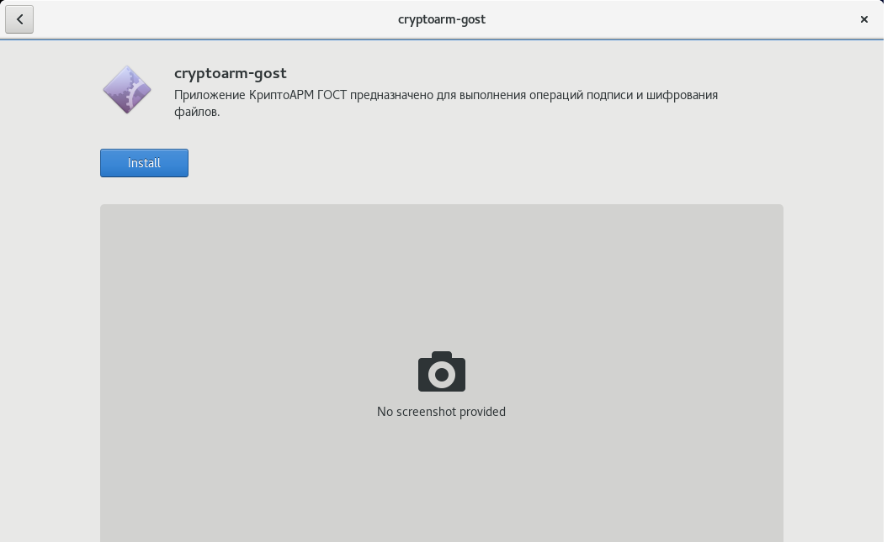

## Установка 

Установка приложения КриптоАРМ ГОСТ на операционную систему Linux может быть выполнена в графическом режиме (через мастер установки пакетов), через терминал в режиме командной строки и обычной распаковкой из архива.

По умолчанию приложение устанавливается в каталог /opt/cryptoarm_gost/.

**В режиме графической установки** нужно запустить на исполнение файл:

   -  **cryptoarm-gost-vx.x.x-x64.rpm** (где x.x.x – номер версии) для 64-разрядных ОС, основанных на RPM;

   -  **cryptoarm-gost-vx.x.x-x64.deb** (где x.x.x – номер версии) для 64-разрядных ОС, основанных на DEB.

Откроется пакетный менеджер, в котором нужно нажать **Установить**. Так как установка производится от имени администратора системы, то появится диалог ввода пароля администратора системы (Root).

**С помощью командной строки** нужно запустить терминал и ввести команду:

 - **sudo dpkg -i cryptoarm-gost-vx.x.x-x64.deb** — для ОС, основанных на Deb;

 -  **sudo rpm -i cryptoarm-gost-vx.x.x-x64.rpm** — для ОС, основанных на RPM;

После установки приложения в меню появится ярлык КриптоАРМ ГОСТ. 

В том случае, когда не поддерживается пакетный режим установки приложения, его можно установить из предоставленного архива, распаковав содержимое в каталог **/opt/cryptoarm_gost/**. Распаковку архива необходимо производить с правами администратора.

## Настройка работы КриптоАРМ ГОСТ в режиме замкнутой программной среды на Astra Linux Special Edition Смоленск 1.6

Включение режима замкнутой программной среды описано по ссылке:
<https://wiki.astralinux.ru/pages/viewpage.action?pageId=41190634>.

Для работы **КриптоАРМ ГОСТ** в режиме замкнутой программной среды надо:

-   установить подписанный дистрибутив КриптоАРМ ГОСТ (если уже установлен, то
    переустанавливать не надо);

-   скопировать ключ
    (<https://github.com/TrustedRu/CryptoARMGOST/raw/master/trusted_pub_key.gpg>) trusted_pub_key.gpg в папку /etc/digsig/keys (от имени учетной записи администратора через механизм sudo);

-   выполнить команду:

    sudo update-initramfs -u -k all

-   перезагрузить компьютер.

Для работы **КриптоПро CSP** в режиме замкнутой программной среды надо:

-   установить КриптоПро CSP (если уже установлен, то переустанавливать не надо);

-   скачать на сайте КриптоПро ключ для работы в режиме замкнутой программной среды Astra Linux SE (выложен рядом с дистрибутивом на КриптоПро CSP);

-   установить пакет astra-digsig-oldkeys;

-   поместить ключ в папку /etc/digsig/keys/legacy (нужно, чтобы с папке legacy обязательно были ещё 4 файла с ключами);

-   выполнить команду:

    sudo update-initramfs -u -k all

-   перезагрузить компьютер.

## Установка КриптоАРМ ГОСТ на операционную систему Astra Linux 
### Графическая установка

1. На скачанный установочный файл дважды нажать левой кнопкой мыши. Откроется окно **Установка пакетов**, в котором нужно нажать **Установить пакет**. 
   
2. Ввести пароль системного администратора root. Начнётся установка пакетов.
 
 
3. После успешной установки программы на операционную систему нажать на **Закрыть**. 
   
4. После установки приложения в меню появится ярлык КриптоАРМ ГОСТ.
  

### Установка через терминал
1. Для установки с помощью командной строки нужно запустить терминал и ввести команду:
**sudo dpkg -i <путь_к_файлу/название_файла.deb>**
*Указать путь к установочному файлу и его название вручную или перетащить его в поле терминала.*
  

2. Нажать **Enter**. Начинается распаковка и установка.
3. После установки приложения в меню появится ярлык КриптоАРМ ГОСТ.
     

## Установка КриптоАРМ ГОСТ на операционную систему Альт 8 
### Графическая установка
1. На скачанный установочный файл дважды нажать левой кнопкой мыши. Откроется окно **Установка RPM**, в котором нужно нажать **Установить**.
    
2. **Ввести** пароль системного администратора root и нажать **Enter**. Начнётся установка пакетов.
  
   
3. После успешной установки программы на операционную систему нажать на **Выход**. 

4. После установки приложения в меню появится ярлык КриптоАРМ ГОСТ.

### Установка через терминал
1. Для установки с помощью командной строки нужно запустить терминал и ввести команду:
**sudo rpm -i <путь_к_файлу/название_файла.rpm>**
*Указать путь к установочному файлу и его название вручную или перетащить его в поле терминала.*

2. **Ввести** пароль администратора компьютера и нажать **Enter**.
3. После установки приложения в меню появится ярлык КриптоАРМ ГОСТ.

## Установка КриптоАРМ ГОСТ на операционную систему РЕД ОС 
### Графическая установка
1. На скачанный установочный файл дважды нажать левой кнопкой мыши.
2. **Ввести** пароль системного администратора root и нажать **Аутентифицировать**.
   
3. Откроется окно **Installing local Packages**, в котором нужно нажать **Ок**. Начнётся установка.
    
      
4. Откроется окно **Yum Extender**, в котором нужно нажать **Ок**.
     
5. После установки приложения в меню появится ярлык КриптоАРМ ГОСТ.
    

### Установка через терминал
1. Для установки с помощью командной строки нужно запустить терминал и ввести команду:
**sudo rpm -i <путь_к_файлу/название_файла.rpm>**
*Указать путь к установочному файлу и его название вручную или перетащить его в поле терминала.*

2. **Ввести** пароль системного администратора root и нажать **Enter**. Начнётся установка пакетов.
3. После установки приложения в меню появится ярлык КриптоАРМ ГОСТ.

## Установка КриптоАРМ ГОСТ на операционную систему CentOS 
### Графическая установка
1. На скачанный установочный файл дважды нажать левой кнопкой мыши. В открывшемся окне нажать на **Install**.
   
2. **Ввести** пароль системного администратора root и нажать **Authenticate**. Начнётся установка.
   
3. **Закрыть** окно.
    
4. После установки приложения в меню появится ярлык КриптоАРМ ГОСТ.
  

### Установка через терминал
1. Для установки с помощью командной строки нужно запустить терминал и ввести команду:
**sudo rpm -i <путь_к_файлу/название_файла.rpm>**
*Указать путь к установочному файлу и его название вручную или перетащить его в поле терминала.*

2. **Ввести** пароль системного администратора root и нажать **Enter**. Начнётся установка пакетов.
3. После установки приложения в меню появится ярлык КриптоАРМ ГОСТ.

## Установка КриптоАРМ ГОСТ на операционную систему Ubuntu 
### Графическая установка
1. На скачанный установочный файл дважды нажать левой кнопкой мыши. В открывшемся окне нажать на **Установить**.
   
2. **Ввести** пароль системного администратора root и нажать **Подтвердить**. Начнётся установка.
   
  
3. **Закрыть** окно.
   
4. После установки приложения в меню появится ярлык КриптоАРМ ГОСТ.

### Установка через терминал
1. Для установки с помощью командной строки нужно запустить терминал и ввести команду:
**sudo dpkb -i <путь_к_файлу/название_файла.deb>**
*Указать путь к установочному файлу и его название вручную или перетащить его в поле терминала.*

2. **Ввести** пароль системного администратора root и нажать **Enter**. Начнётся установка пакетов.
3. После установки приложения в меню появится ярлык КриптоАРМ ГОСТ.
   

