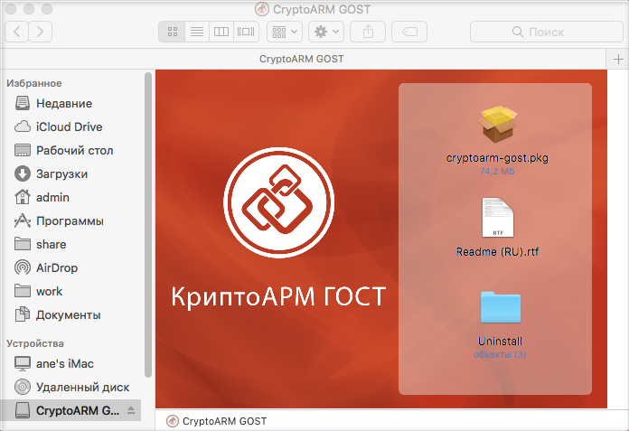
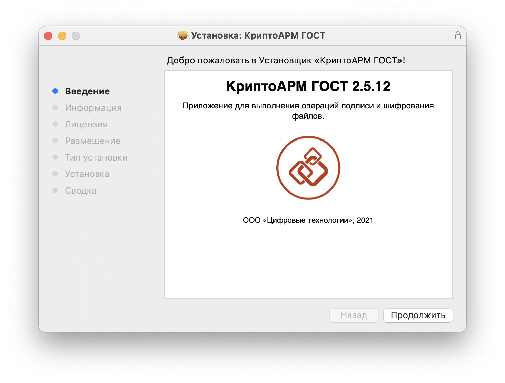
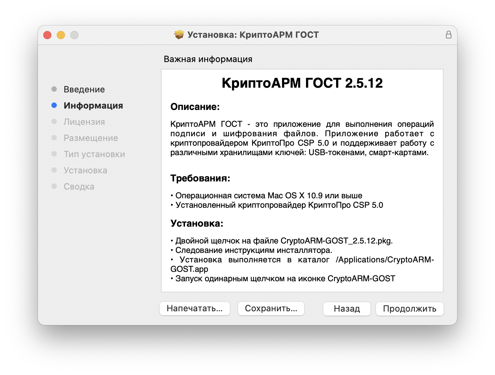
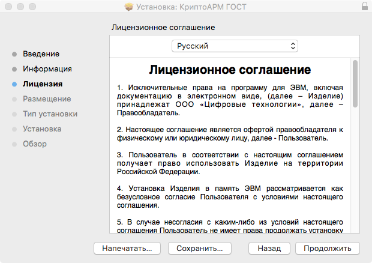
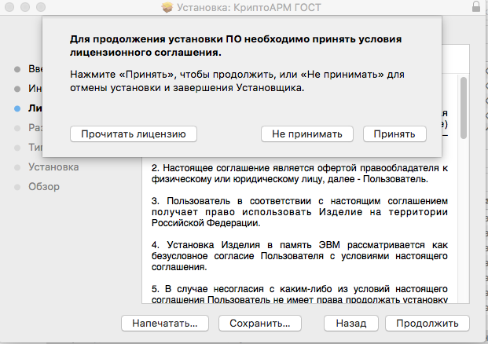
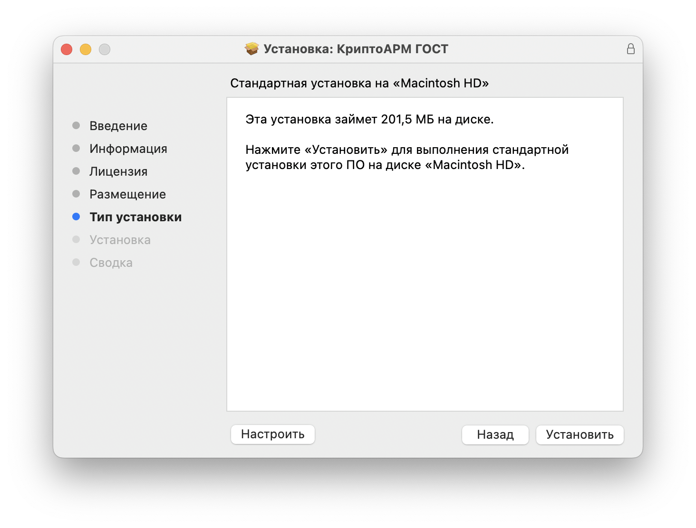
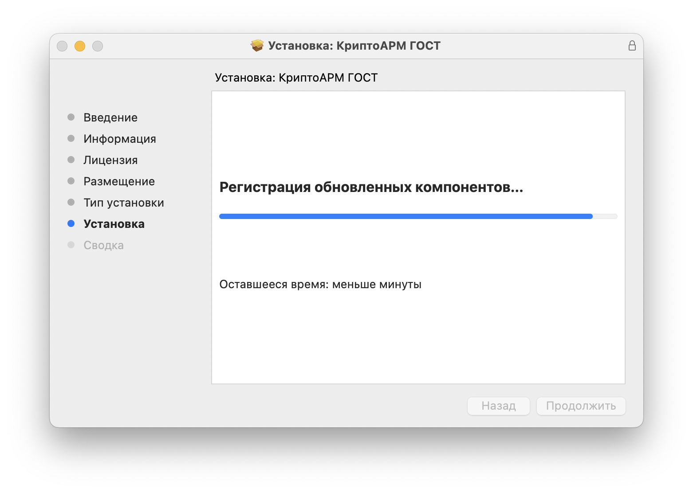
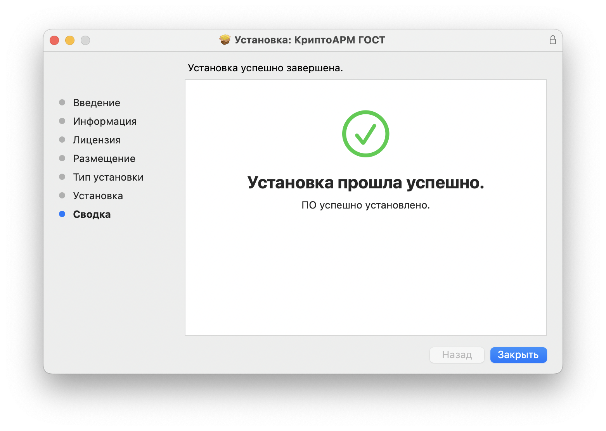

Дистрибутив приложения КриптоАРМ ГОСТ поставляется в упакованном виде, имеет формат .dmg и представляет собой образ диска, содержащий пакет установки **cryptoarm-gost-vx.x.x-x64.pkg,** описание приложения, каталог со скриптами удаления приложения.

1. Для установки пакета через графический интерфейс откройте двойным щелчком образ диска с дистрибутивом **cryptoarm-gost-vx.x.x-x64.dmg** (где x.x.x – номер версии).

2. Для установки программы КриптоАРМ ГОСТ запустите на исполнение файл **cryptoarm-gost-vx.x.x-64.pkg** (где x.x.x – номер версии).

Установочный пакет для приложения КриптоАРМ ГОСТ может поставляться вне образа диска. В таком случае нужно сразу запустить файл **cryptoarm-gost-vx.x.x-64.pkg** (где x.x.x – номер версии).

3. Откроется мастер установки КриптоАРМ ГОСТ. Для продолжения установки следует нажать кнопку **Продолжить**. На каждом шаге можно вернуться на предыдущий шаг нажатием **Назад**.

4. На следующем шаге предоставяется описание программы, которое можно распечатать или сохранить в файл. По кнопке **Продолжить** происходит переход на следующий шаг.

5. На этапе ознакомления с условиями лицензионного соглашения их можно распечатать или сохранить в файл. 

Принять условия лицензионного соглашения можно, нажав кнопку **Принять**. Установка продолжения продолжается. По кнопке **Не принимать** происходит отмена установки.

6. На последнем шаге мастера надо нажать кнопку **Установить** для завершения установки.

7. На запрос нужно **ввести** пароль администратора и нажать **Установить ПО**. Начнется установка программы на компьютер. 

8. По окончании установки нужно нажать кнопку **Закрыть**.

После установки программы в Launchpad появится ярлык приложения КриптоАРМ ГОСТ и в каталоге Applications (Программы) будут созданы подкаталоги приложения.
