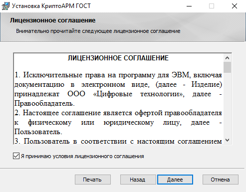
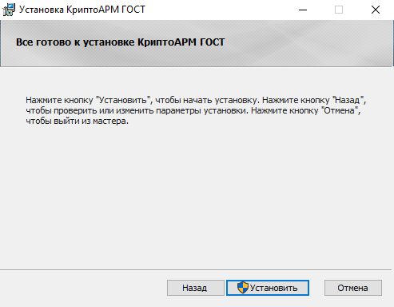

Для установки приложения КриптоАРМ ГОСТ на платформу Microsoft Windows предлагаются два дистрибутива – под 64-битную и 32-битную платформы:

 - **cryptoarm-gost-vx.x.x-x64.msi** (где x.x.x – номер версии) для 64-разрядной ОС;

 - **cryptoarm-gost-vx.x.x-x86.msi** (где x.x.x – номер версии) для 32-разрядной ОС.

1. При запуске исполняемого файла открывается мастер установки приложения КриптоАРМ ГОСТ.

2. По кнопке **Далее** происходит переход на следующий шаг, где предлагается ознакомиться с условиями лицензионного соглашения. В случае согласия нужно **принять условия** и перейти к следующему шагу мастера, нажав кнопку **Далее**.

3. На следующем шаге мастера можно выбрать каталог для установки КриптоАРМ ГОСТ (по умолчанию приложение устанавливается в каталог C:\Program Files\CryptoARM GOST\\).

4. На шаге выборочной установки можно отключить создание ярлыка на рабочем столе и установку модулей для создания усовершенствованной подписи.

5. На заключительном шаге мастера по кнопке **Установить** выполняется установка. Нужны права администратора.

6. Закрыть окно установки, нажав **Готово**.
   
После успешной установки приложения в главном меню появится новая группа КриптоАРМ ГОСТ, которая содержит ярлык запуска приложения КриптоАРМ ГОСТ и ярлык запуска мастера удаления программы. В указанном при установке каталоге (по умолчанию каталог C:\Program Files\CryptoARM GOST) будут размещаться файлы приложения КриптоАРМ ГОСТ.
