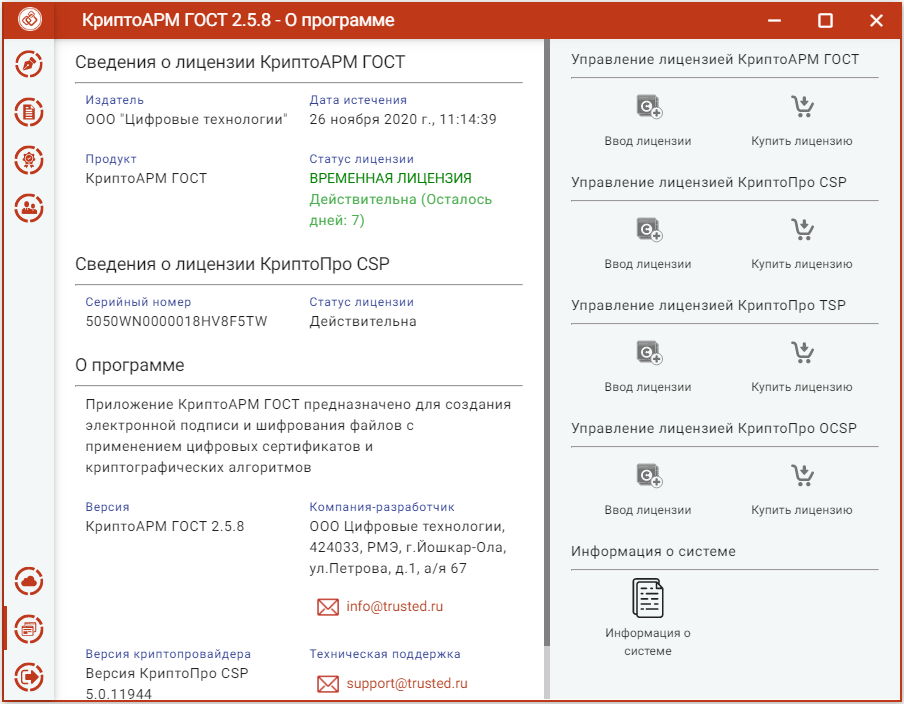
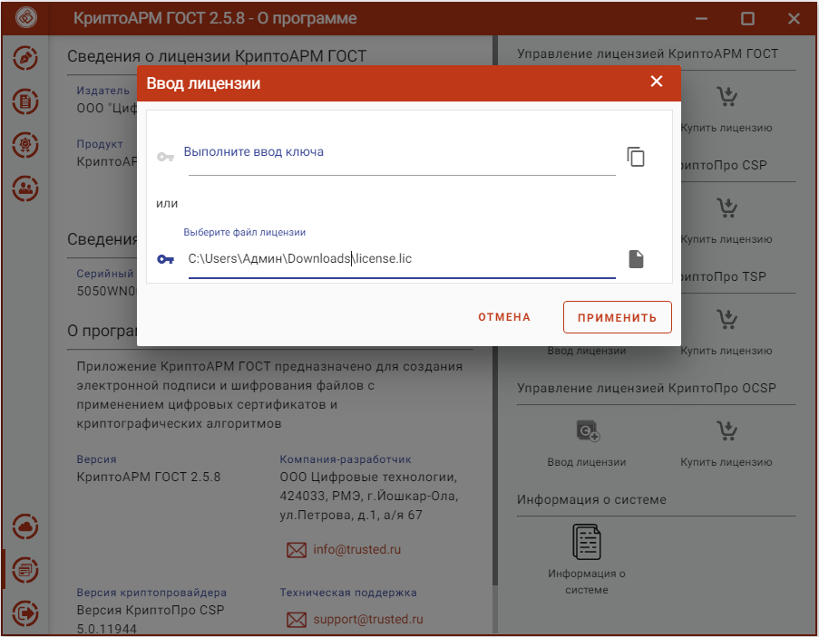
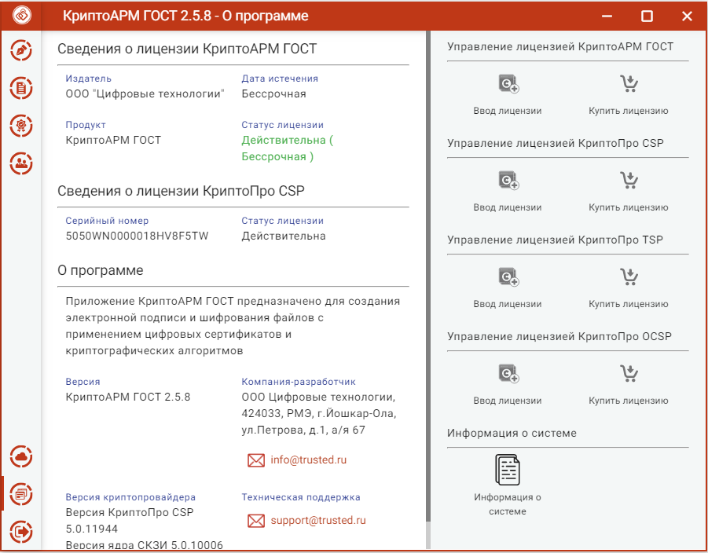

Для полноценной работы приложения КриптоАРМ ГОСТ необходима установка лицензионного ключа. Лицензионный ключ представляет собой файл, который необходимо расположить в специально созданном каталоге приложения.

Существуют два вида лицензий – постоянная и временная. Временная лицензия предоставляется с ограниченным сроком действия. Для приобретения постоянной лицензии можно обратиться в компанию разработчика.

## Установка лицензии

Для установки лицензии нужно перейти на страницу **Лицензии** через пункт **О программе** главного меню приложения. 

На открывшейся странице нажать на кнопку **Ввод лицензии** в разделе  управления лицензией КриптоАРМ ГОСТ.
В результате должно появиться всплывающее окно ввода лицензии, предполагающее выполнение действия одним из двух способов:

-   вставить содержимое файла лицензии в текстовое поле;

-   выбрать файл лицензии.

Необходимо ввести лицензию удобным способом и нажать **Применить**.

***Примечание:*** При установке лицензии будут запрошены права администратора (Root) на доступ к каталогу установки лицензии.

Если установка лицензионного ключа прошла успешно, то появляется всплывающее  cообщение с информацией об этом. На странице **Лицензии** отображается информация о введенном лицензионном ключе на приложение с данными об издателе программного продукта, продукте, владельце лицензии, дате истечения лицензии, статусе лицензии.

В том случае, если лицензия на продукт не введена или не действительна при каждом запуске приложения будет появляться всплывающее сообщение с информацией об этом.

## Установка лицензии копированием файла

***Примечание:*** Только для платформ **Linux** и **MacOS.**

Для установки лицензии необходимо скопировать файл лицензии license.lic в
каталог /etc/opt/Trusted/CryptoARM GOST/. Если каталога нет, то создать.

**Примечание.** Для последующей установки лицензии пользователями каталог КриптоАРМ ГОСТ должен иметь права на запись, а минимально необходимые права – права на чтение для пользователей на рабочем месте.
