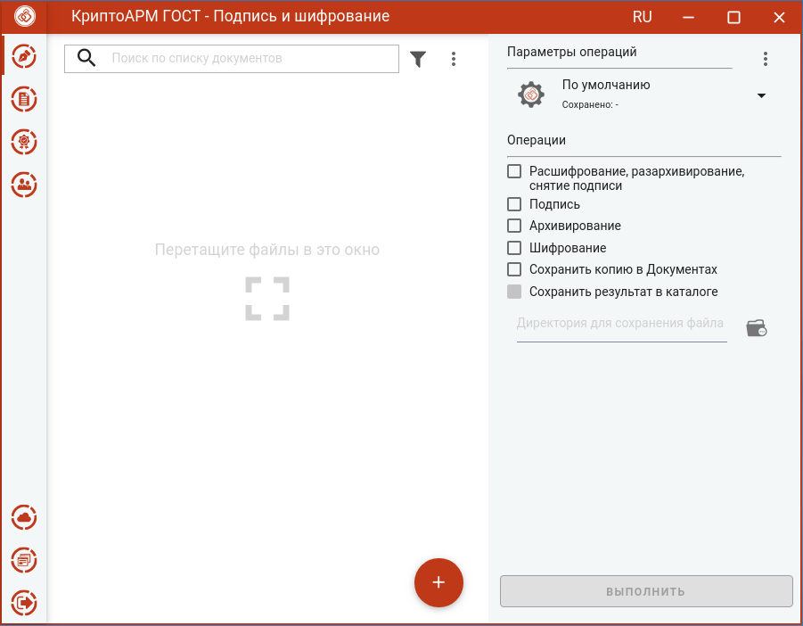
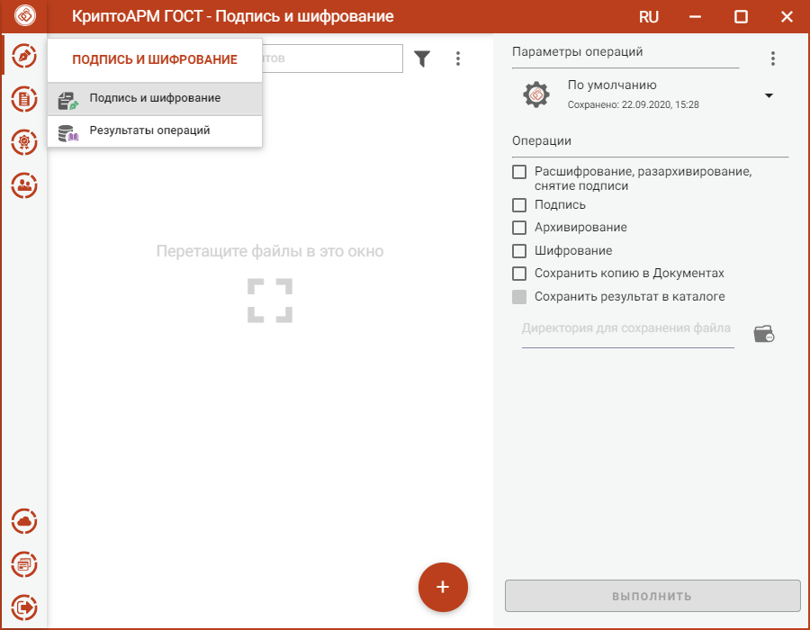

Работа с приложением КриптоАРМ ГОСТ начинается со страницы **Подпись и шифрование**.

Левая рабочая часть окна предназначена для управления списком файлов; в правой части располагается панель выбора **Параметров операций**, переключатель **Операций** и кнопка **Выполнить.**

Переключатель операций позволяет выбрать группу операций, которая будет выполняться над списком файлов:

-   **Расшифрование, разархивирование, снятие подписи** – опция для выполнения
    обратных операций. Для выполнения обратных операций не требуется установка
    дополнительных параметров.

-   **Подпись, архивирование, шифрование** – опция для выполнения прямых
    операций. Допускается выбор одной операции или группы операций. Для прямых
    операций требуется выбор дополнительных параметров подписи и шифрования.

-   **Сохранить копию в Документах, Сохранить результат в каталоге** – для
    сохранения результатов прямых операций в заданные каталоги.

Слева на панели расположены кнопки выбора пунктов меню приложения, через которые можно выполнить переход ко всем представлениям.

При первом запуске приложения в домашней папке пользователя создается подкаталог с наименованием **.Trusted**, который содержит файловые объекты, необходимые для корректного функционирования приложения. В частности, в подкаталоге размещаются файлы журнала операций и каталог с документами. В файле **settings.json** сохраняются пользовательские настройки.
