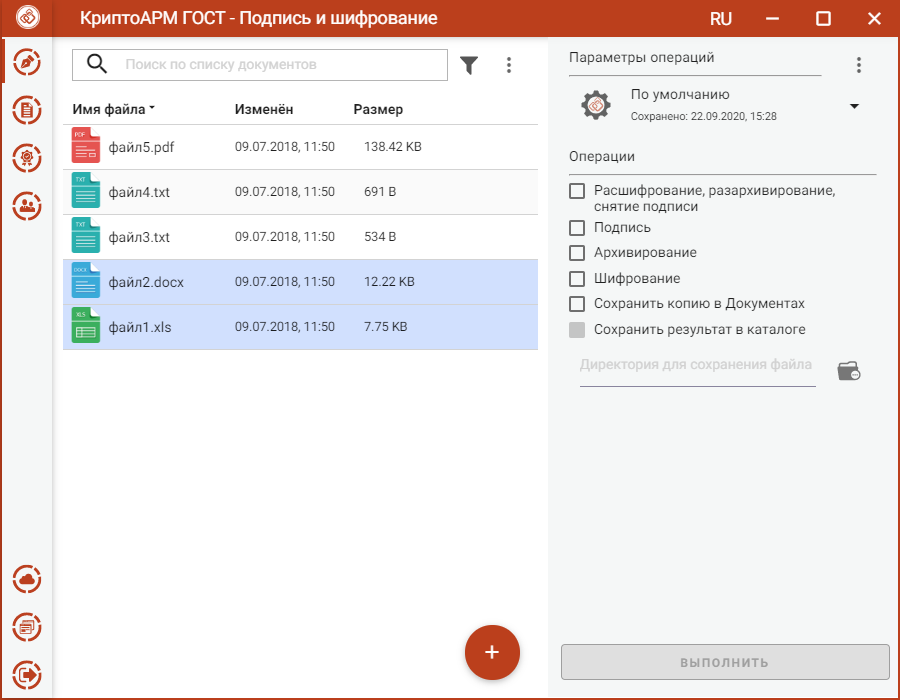
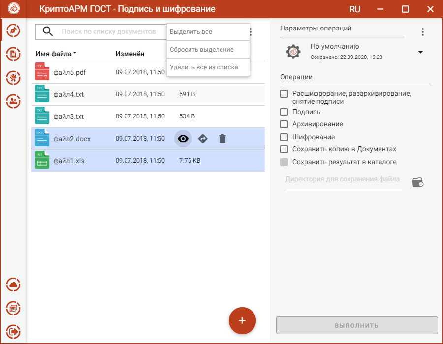

В приложении доступно создание подписи для одного или группы выбранных файлов. 

Файлы для подписи можно добавить двумя способами: через кнопку **Добавить** (+) или перетащив мышкой в область формирования списка файлов.

Выбранные файлы заносятся в левую область и представляют собой одноуровневый список.

Для данного списка доступны поиск, фильтрация, управление файлами через контекстное меню и кнопки для каждого файла.

