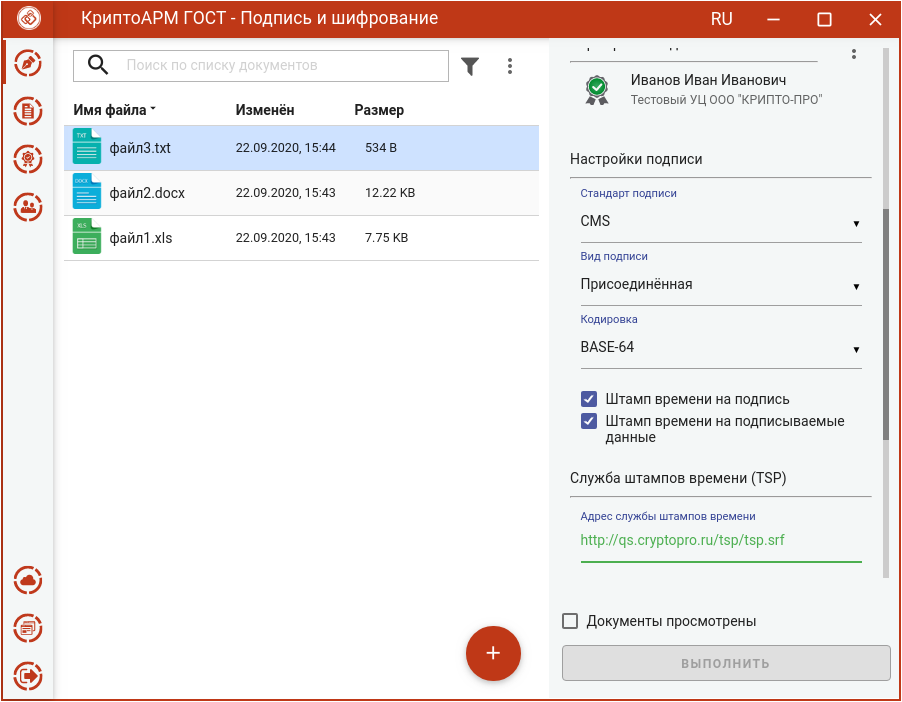
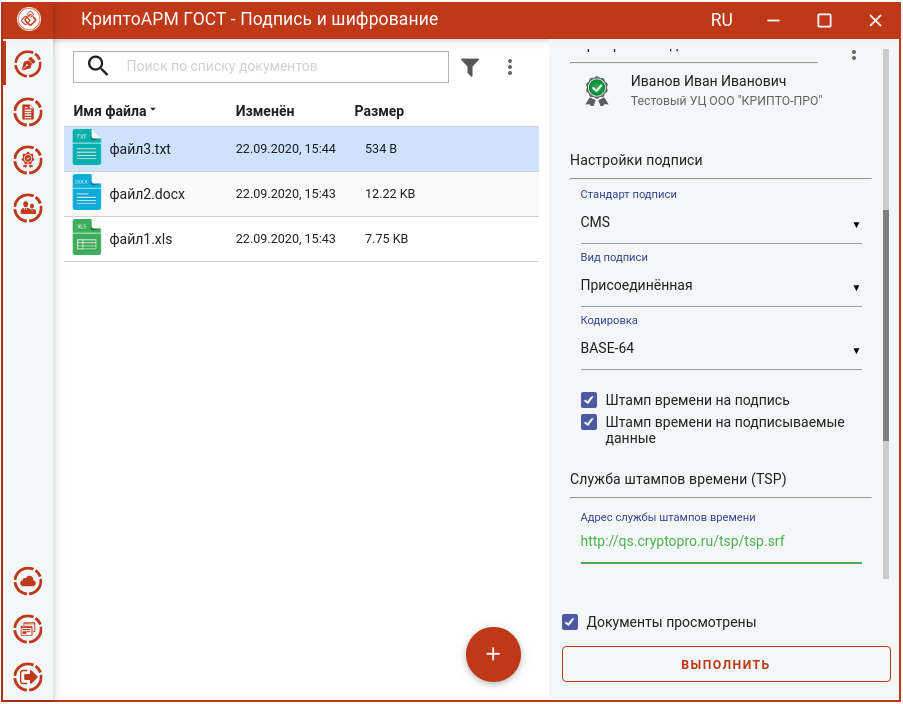
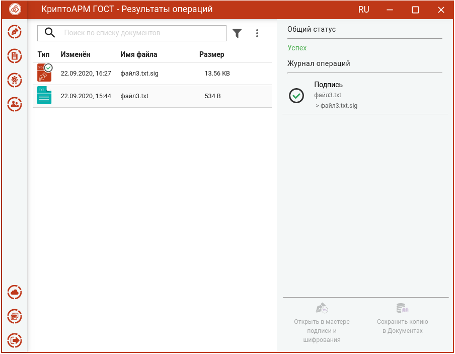
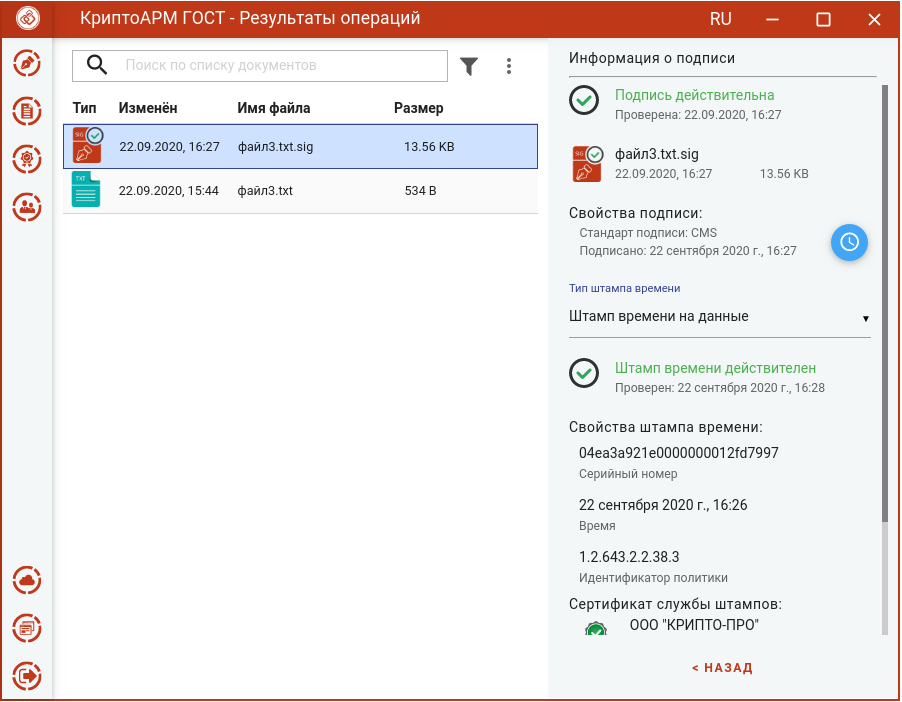

Служба штампов времени используется для простановки штампов времени на документы. Данные, защищенные электронной подписью Службы, содержат надежную информацию о времени существования электронного документа. Штампы времени используются для привязки факта существования каких-либо данных ко времени.

Создание подписи со штампом времени возможно только при установленном модуле КриптоПро TSP Client и лицензии на него.

Для создания подписи со штампом времени нужно:

-  выбрать подписываемые файлы (подробнее в разделе **Выбор подписываемых файлов**),
-  задать параметры подписи (подробнее в разделе **Установка параметров подписи**);
-  сертификат подписи (подробнее в разделе **Выбор сертификата подписи**);
-  установить флаг **Штамп времени на подпись**, если требуется поставить штамп на подпись;
-   установить флаг **Штамп времени на подписываемые данные**, если требуется поставить штамп на данные;

-   **Адрес службы штампов времени** - можно узнать у поставщика услуги. Например, услуги службы штампов времени могут предоставлять удостоверяющие центры. Формат адреса: \<протокол\>://\<сервер\>[:порт][/путь]. В качестве протокола может быть указан "http" и "https". 

-   **Использовать настройки прокси-сервера** – если при подключении к службе TSP используется прокси-сервер, то установка флага активирует его настройки: **Адрес прокси-сервера, Порт, Логин, Пароль,** которые можно узнать у системного администратора.

После заполнения параметров подписи и установки флага, что **Документы просмотрены** перед их подписанием, становится доступна кнопка **Выполнить.** 

Нажатие на кнопку **Выполнить** запускает процесс подписи.

Исходные документы (оригиналы) и результаты операции подписи отображаются в отдельном мастере **Результаты операций.**

После выполнения операции мастер **Подписи и шифрования** очищается от добавленных в него файлов.

При просмотре свойств подписи отображается информация о штампе времени. 

