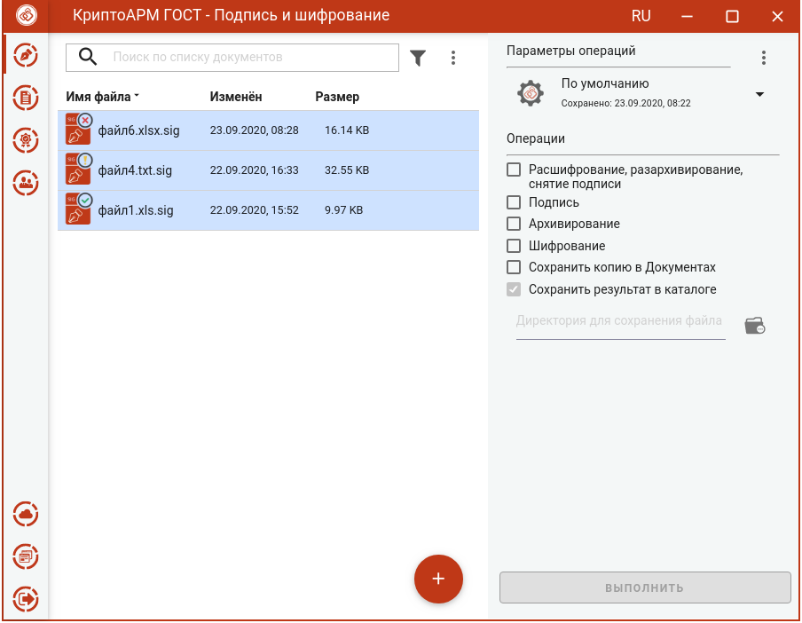
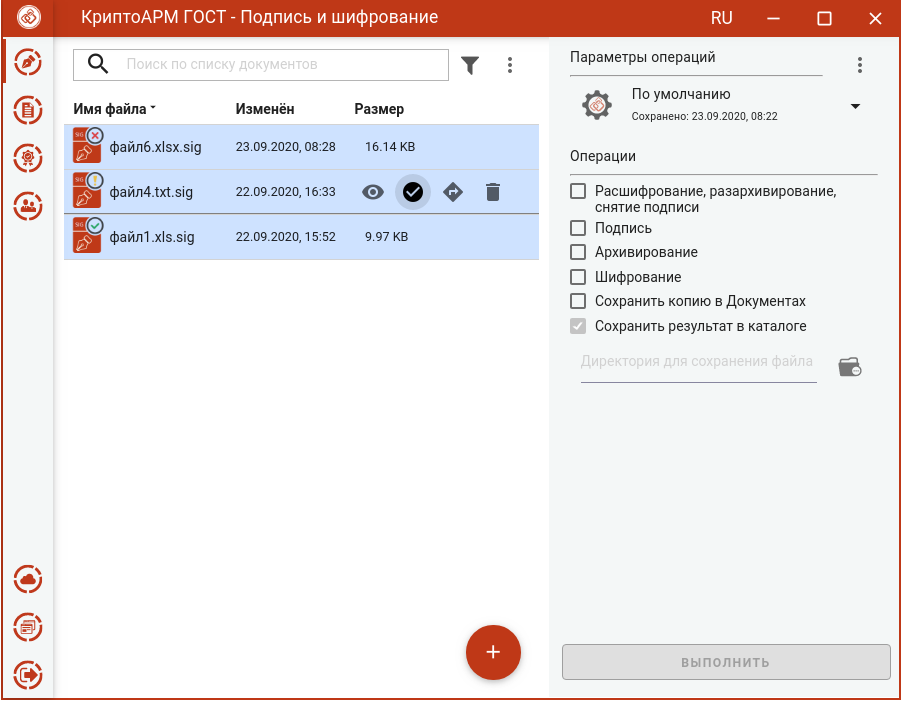
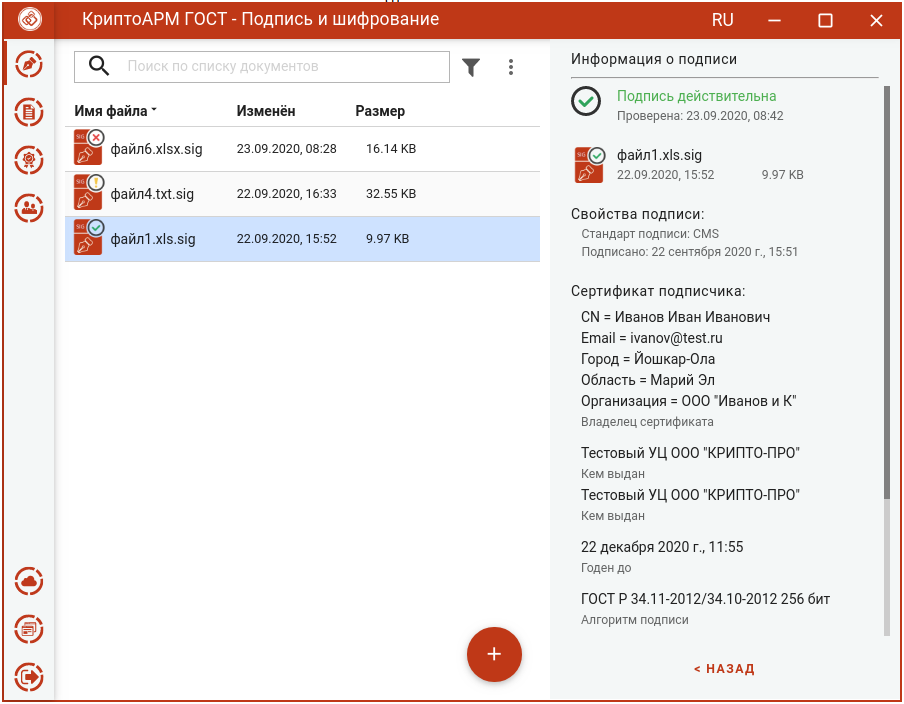
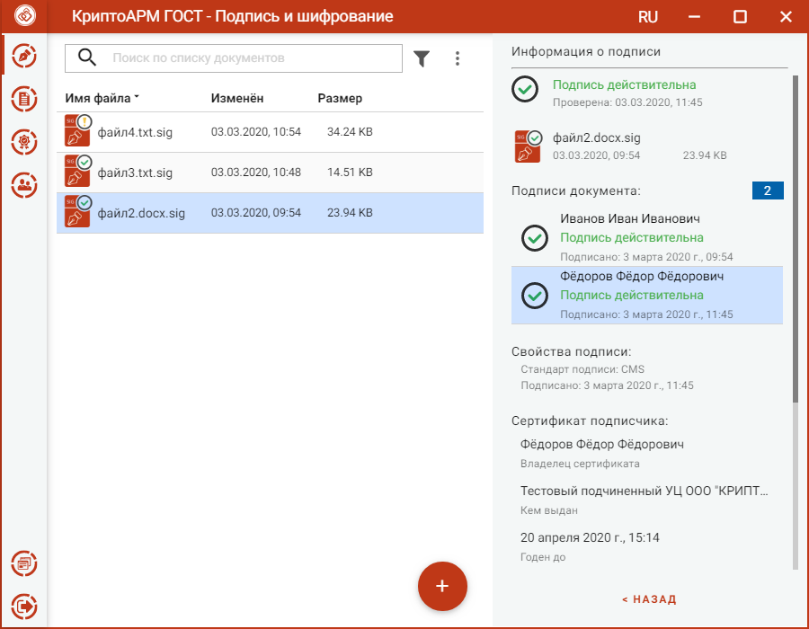
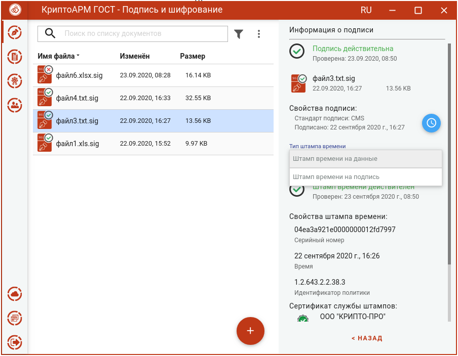
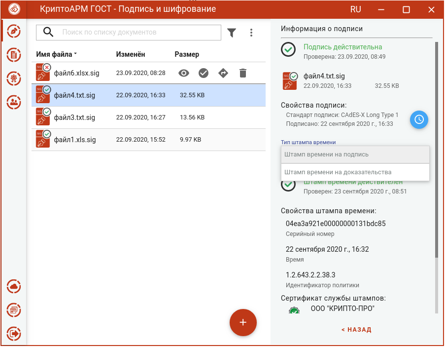
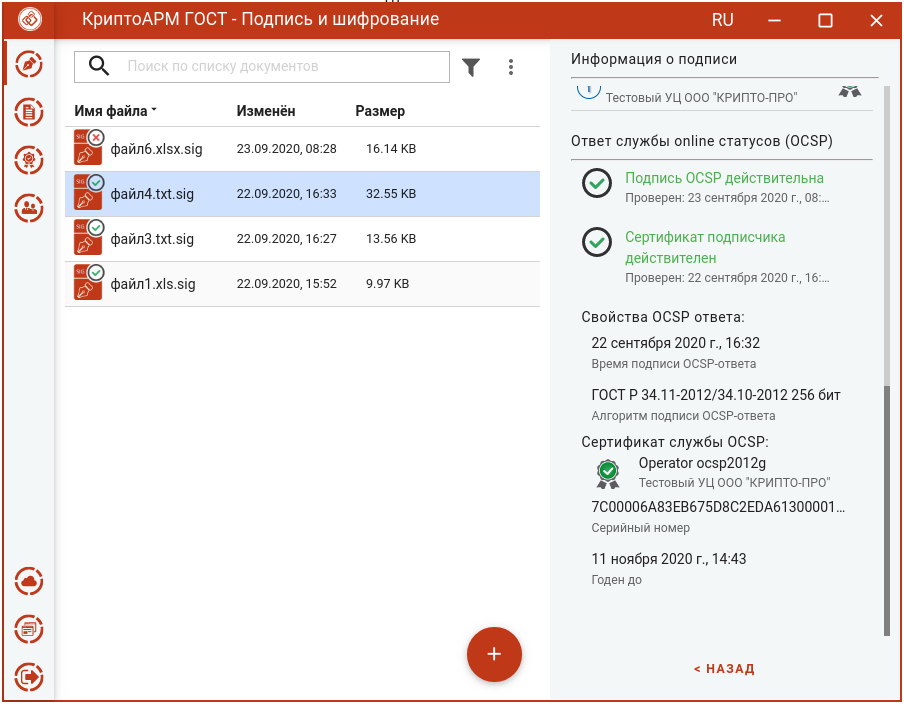

## Проверка простой подписи

Для проверки подписи достаточно выбрать файлы расширением **.sig**, которые содержат электронную подпись. Никаких дополнительных настроек при проверке подписи производить не нужно.

Результат проверки подписей отображается в виде общего сообщения и цветового индикатора на иконке для каждого файла: зеленый - подпись действительна;  красный - подпись недействительна; оранжевый – не удалось проверить подпись.

Если при проверке отделенной подписи, исходный файл не будет найден автоматически, то индикатор проверки будет оранжевого цвета. Для выбора исходного файла надо нажать иконку проверки подписи в меню файла. Откроется окно для его выбора.

При выделении одного подписанного файла в правой области отображается информация о подписи.

По кнопке **Назад** информация о подписи закрывается и происходит возврат к операциям.

## Проверка соподписей

Если документ подписан несколькими подписями (имеет соподписи), то для просмотра информации нужно выбрать подпись из списка.

## Проверка подписи со штампом времени

Если документ подписан подписью со штампом времени, то для просмотра параметров штампа нужно нажатием на иконку развернуть информацию и выбрать в выпадающем списке тип штампа времени.

## Проверка усовершенствованной подписи

Если документ подписан усовершенствованной подписью, то для просмотра сведений о штампах времени в усовершенствованной подписи, нужно нажатием на иконку развернуть информацию и выбрать в выпадающем списке тип штампа времени.

Информация о OCSP ответе усовершенствованной подписи представлена на рисунке.

