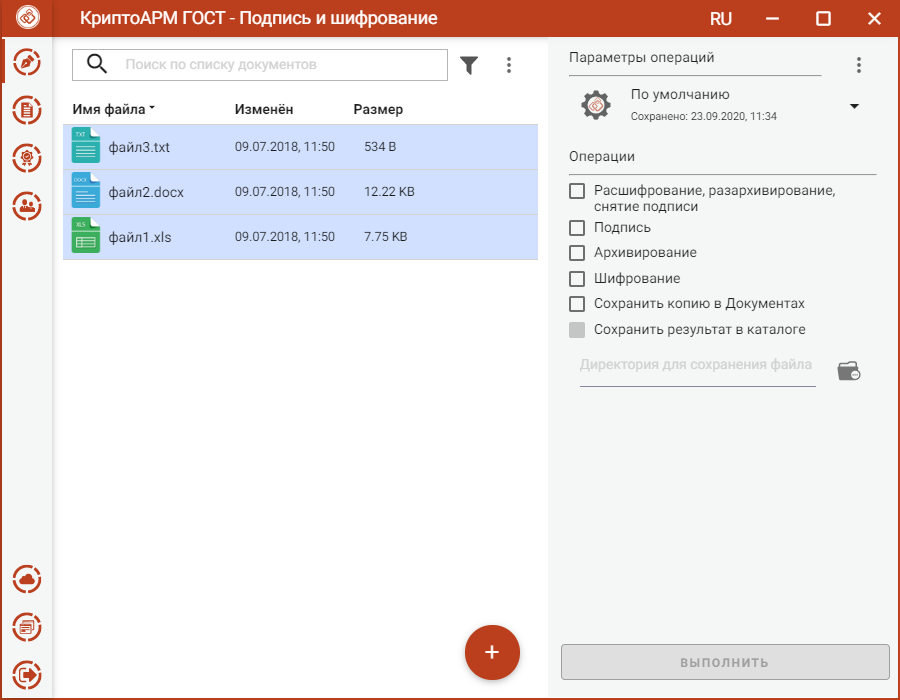

В приложении доступно шифрования одного или группы выбранных файлов. Файлы для шифрования можно добавить двумя способами: через кнопку **Добавить (+)** или перетащив их мышкой в область формирования списка файлов.

Выбранные файлы заносятся в левую область и представляют собой одноуровневый список.

Для данного списка доступны поиск, фильтрация, управление файлами через контекстное меню или кнопками для каждого файла.

