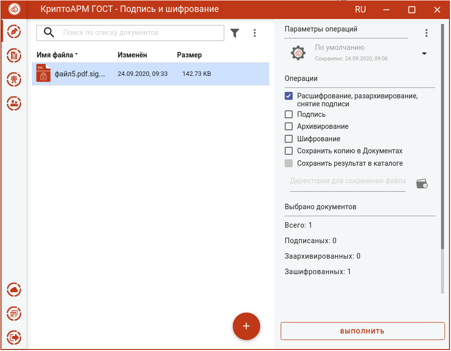
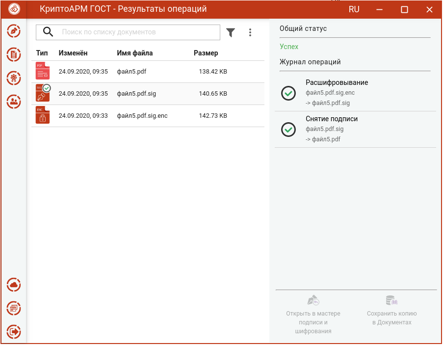

Для расшифрования и снятия подписи достаточно выбрать подписанный и зашифрованный файл (расширением **.sig.enc)**, выбрать операцию **Расшифрование, разархивирование, снятие подписи** и нажать на кнопку **Выполнить**. Настройка дополнительных параметров для операции не требуется.

Исходные зашифрованные и полученные файлы отображаются в отдельном мастере **Результаты операций**.

**Внимание!** Документы, полученные в результате обратных операций (расшифрование, разархивирование, снятие подписи), сохраняются во временную папку, расположенную в папке пользователя в каталоге ./Trusted/CryptoARM GOST/ TEMP, и остаются там до выполнения следующей операции. Далее временная папка очищается.

Документы из результатов операций можно **Открыть в мастере Подписи и шифрования** для выполнения других операций или **Сохранить копию в Документах**. Операция **Сохранить копию в Документах** служит для сохранения копии полученного после операции файла в специальный каталог Documents, расположенный в папке пользователя в каталоге ./Trusted/CryptoARM GOST/. Файлы из данного каталога доступны в пункте меню **Документы**.
