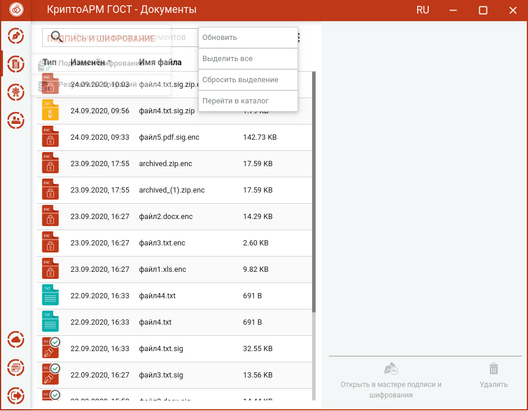
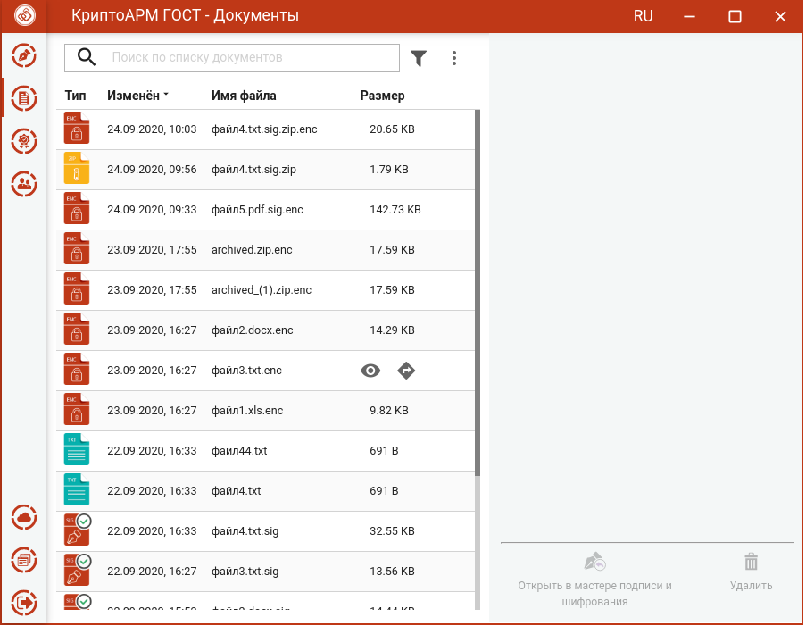
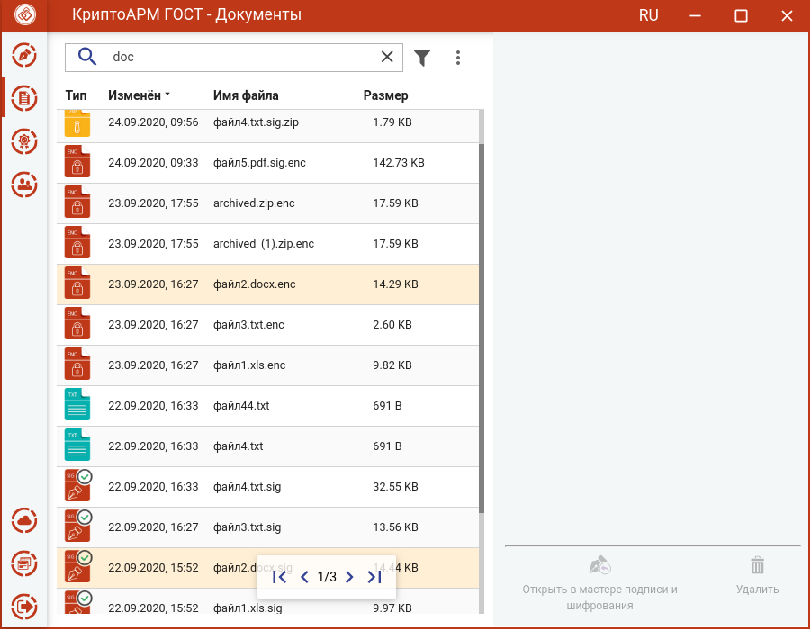
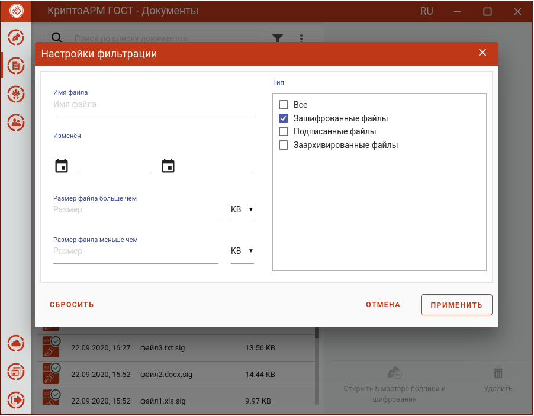
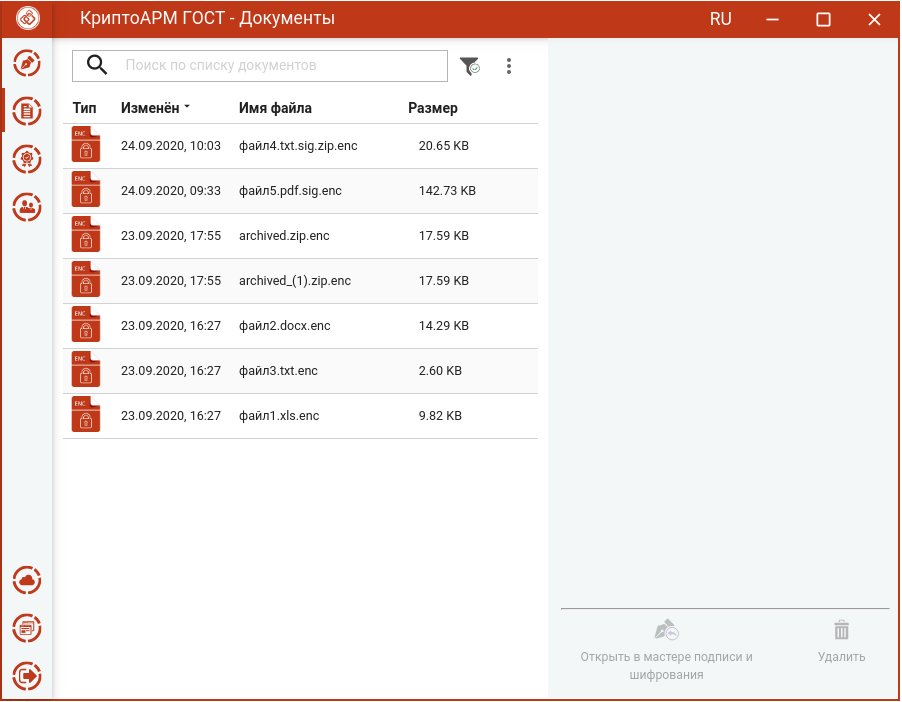
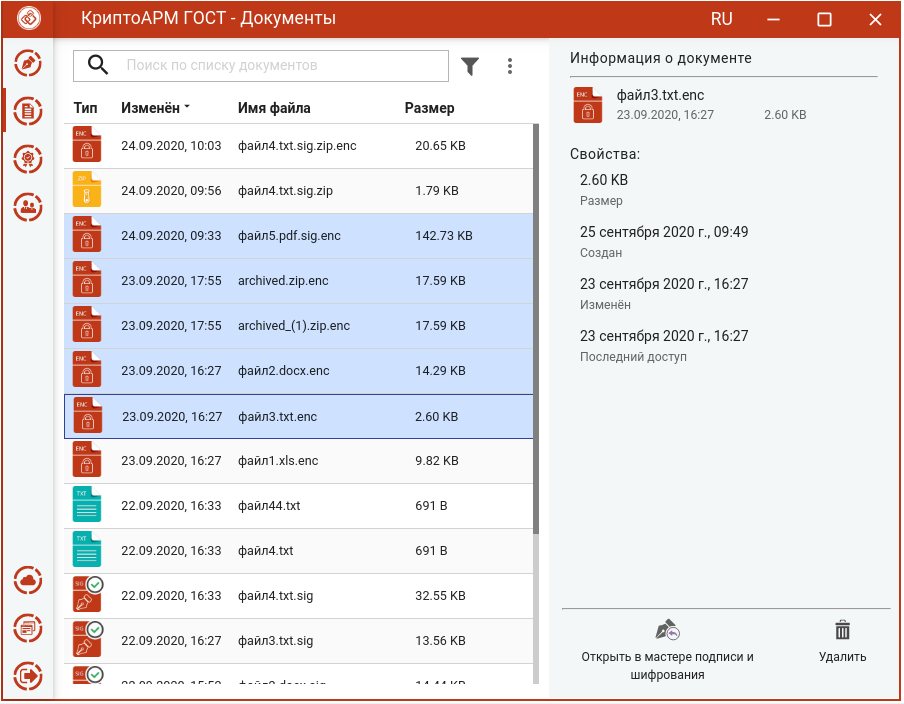

Для сохранения копии результатов выполнения операций подписи, снятия подписи, архивирования, шифрования и расшифрования используется каталог **Документы**. Файлы данного каталога располагаются в каталоге пользователя в папке \\.Trusted\\CryptoARM GOST\\Documents\\. Просмотреть документы в каталоге можно, выбрав пункт меню **Документы**.

По умолчанию файлы в списке сортируются по дате создания - от новых к старым. Отсортировать файлы можно по любому столбцу, нажав на название столбца.

Для списка доступно контекстное меню, состоящее из пунктов:

-   **Обновить** – для обновления списка;

-   **Выделить все** - выделяются все файлы в списке;

-   **Сбросить выделение** – для сброса выделения документов в списке;

-   **Перейти в каталог** - выполняется открытие каталога документов.

Для каждого файла списка доступны кнопки операции, всплывающие при наведении на файл курсором мыши:

-   **Просмотр** - выполняется открытие файла через приложение, которое ассоциировано с его расширением;

-   **Перейти к файлу** - выполняется открытие каталога, в котором располагается файл.

В приложении реализован поиск документов по символьному совпадению.

Список документов можно отфильтровать, задав настройки фильтрации.

Применение фильтрации выполняется по нажатию кнопки **Применить**. В зависимости от выставленных критериев фильтра в списке документов остаются только те записи, которые удовлетворяют (суммарно) этим критериям.

Для сброса заданных критериев фильтрации служит кнопка **Сбросить** в окне настроек фильтрации.

Для списка файлов в разделе **Документы** доступны операции:

-   **Открыть в мастере подписи и шифрования** – выбранные документы открываются в мастере **Подписи и шифрования** для выполнения других операций

-   **Удалить** – происходит физическое удаление файлов из каталога в папке пользователя \\.Trusted\\CryptoARM GOST\\Documents\\.

