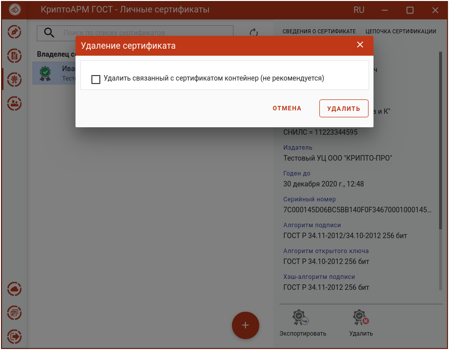
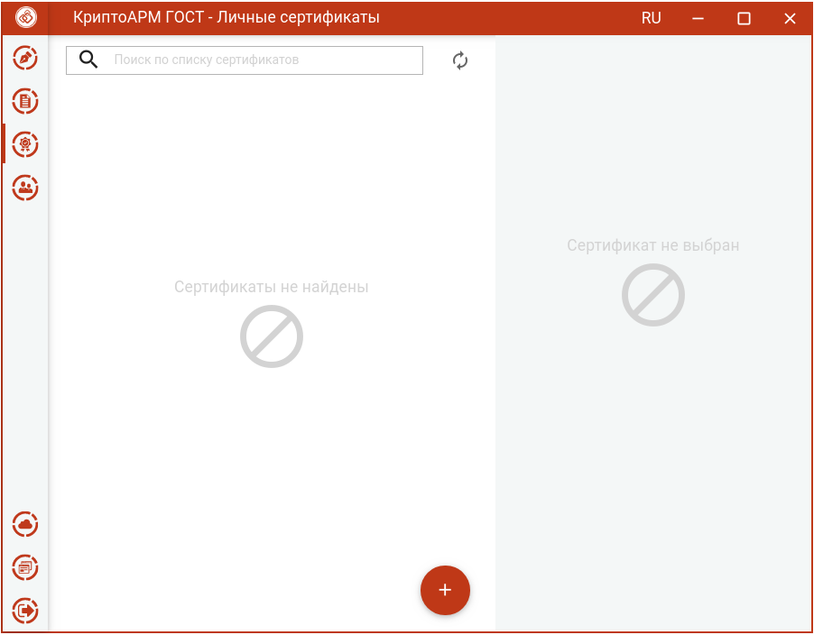

Для удаления сертификата нужно в разделе **Сертификаты** выбрать хранилище, в котором содержится удаляемый сертификат, и нажать **Удалить**.

Открывается окно подтверждения удаления.

Если у сертификата есть привязка к закрытому ключу, то при удалении сертификата
возможно удаление закрытого ключа. Для этого надо поставить флаг **Удалить
связанный с сертификатом контейнер**.

**Примечание.** Не рекомендуется удалять контейнер закрытого ключа, так как он не подлежит восстановлению.

Нажать **Удалить** для подтверждения удаления.

При успешном выполнении операции сертификат удаляется из списка.

