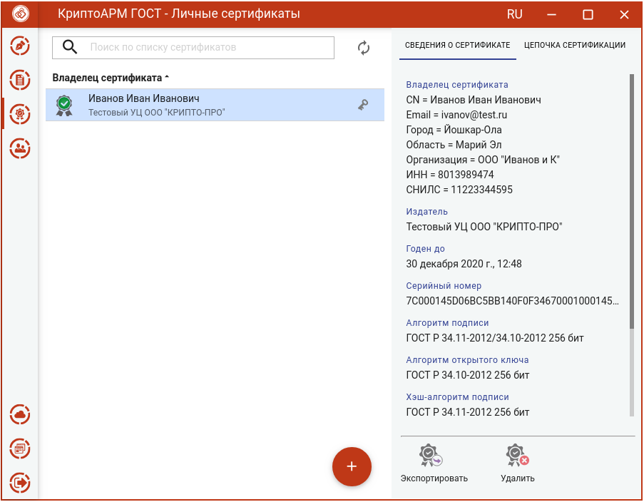
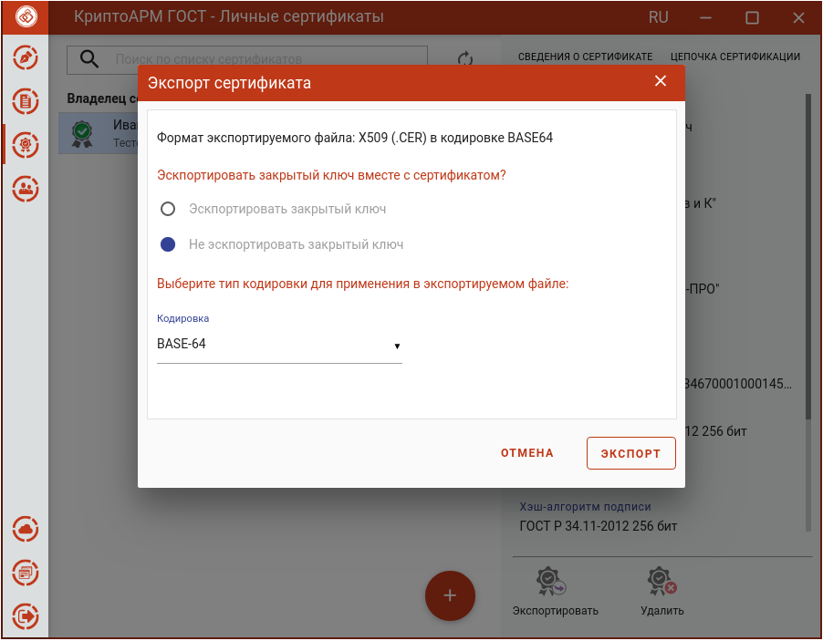
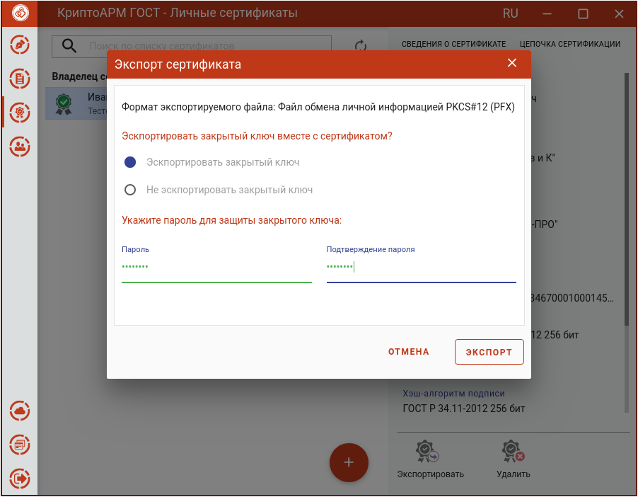

Для экспорта сертификата нужно в разделе **Сертификаты** выбрать хранилище, в котором содержится экспортируемый сертификат, и нажать кнопку **Экспортировать**.

Если у сертификата экспортируемый закрытый ключ, то такой сертификат можно экспортировать вместе с ним.

При экспорте сертификата с не экспортируемым закрытым ключом появляется окно, в котором можно выбрать только кодировку файла.

После нажатия кнопки **Экспорт** в появившемся окне указать путь и имя файла, куда будет сохранен сертификат (по умолчанию, файл export.cer).

При экспорте сертификата с экспортируемым закрытым ключом в появившемся диалоговом окне можно выбрать способ экспорта сертификата:

-   экспортировать только сертификат без закрытого ключа. В таком случае нужно только выбрать кодировку файла сертификата.

-   экспортировать сертификат вместе с закрытым ключом. В таком случае надо указать пароль для защиты закрытого ключа.

После нажатия кнопки **Экспорт** в появившемся окне указать путь и имя файла, куда будет сохранен сертификат (по умолчанию, файл export.pfx).

По окончании операции возникнет сообщение об успешном экспорте сертификата.

**Примечание**: если контейнер экспортируемого сертификата защищен паролем, то при экспорте сертификата вместе с закрытым ключом необходимо будет вводить пароль к нему.
