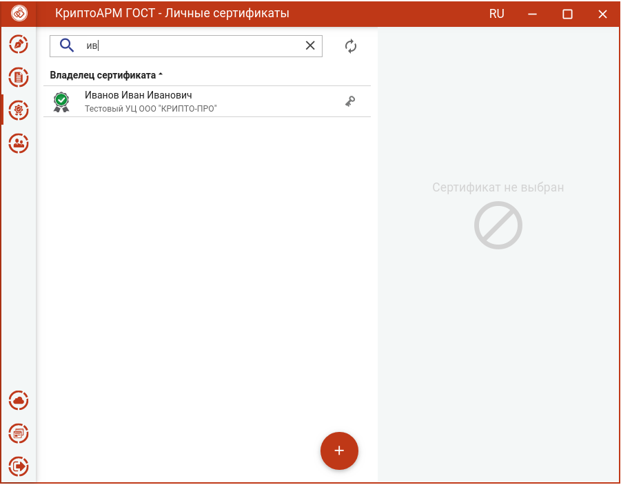
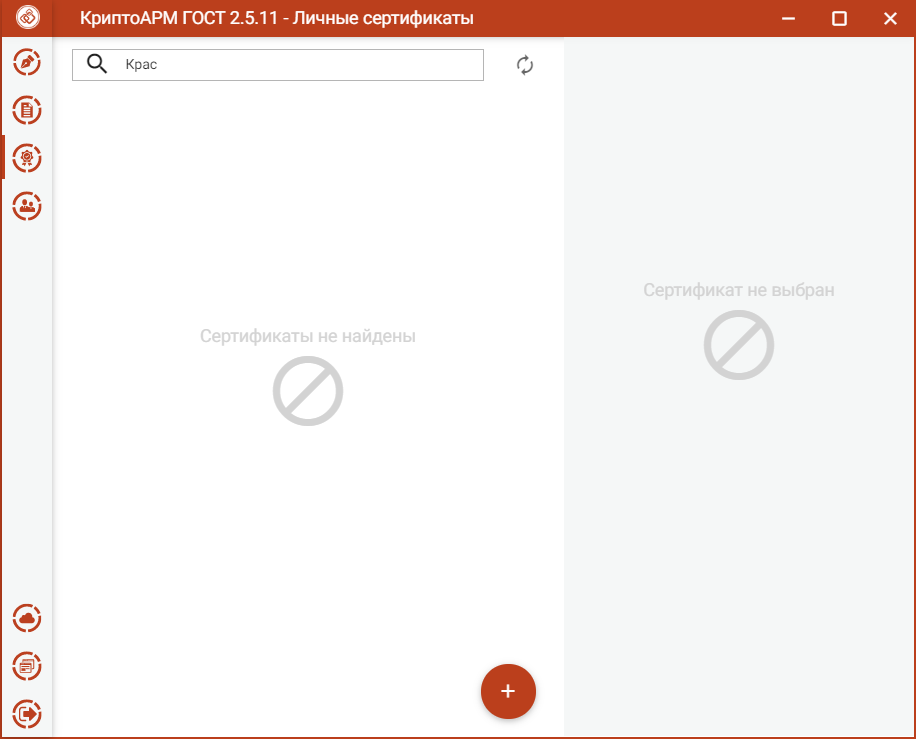

В элементах интерфейса, где процесс выполнения операции учитывает выбор сертификата из списка, реализована функция поиска сертификатов. Нужно в строке поиска ввести ключевую фразу.

оиск сертификатов реализован на основе совпадения ключевой фразы с любым текстовым свойством сертификата. В результате вместо полного списка в окне остаются только сертификаты, удовлетворяющие критерию поиска.

Чтобы отменить фильтр поиска требуется удалить ключевую фразу или нажать на кнопку **Отмена (х)**.

**Примечание.** В случае неправильно указанного критерия поиска список сертификатов может оказаться пустым, о чем будет свидетельствовать надпись - Сертификаты не найдены.

