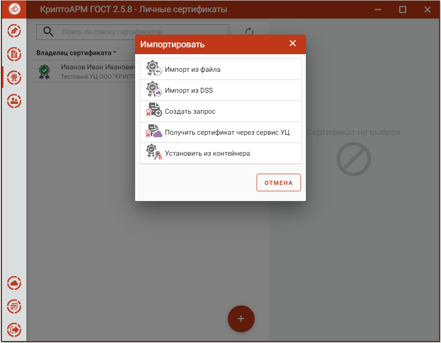
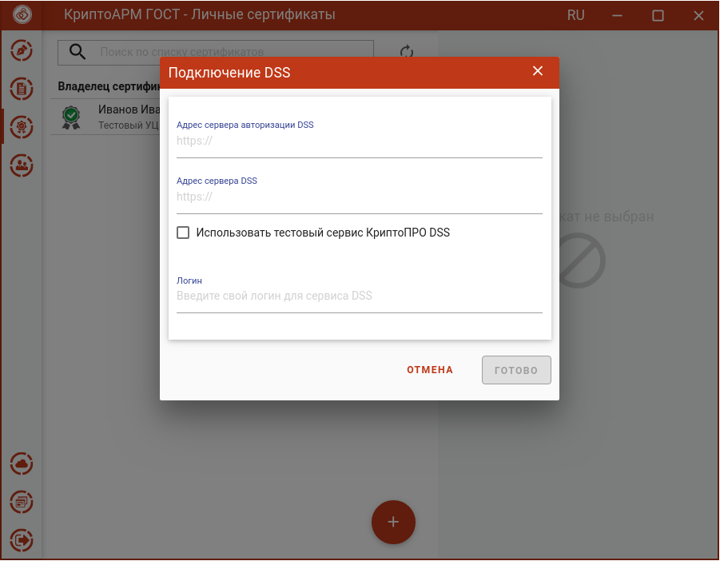
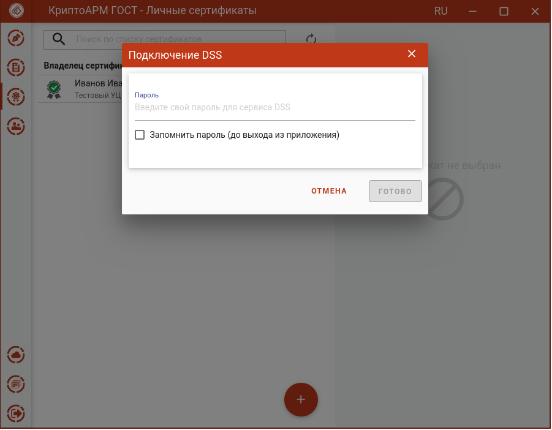
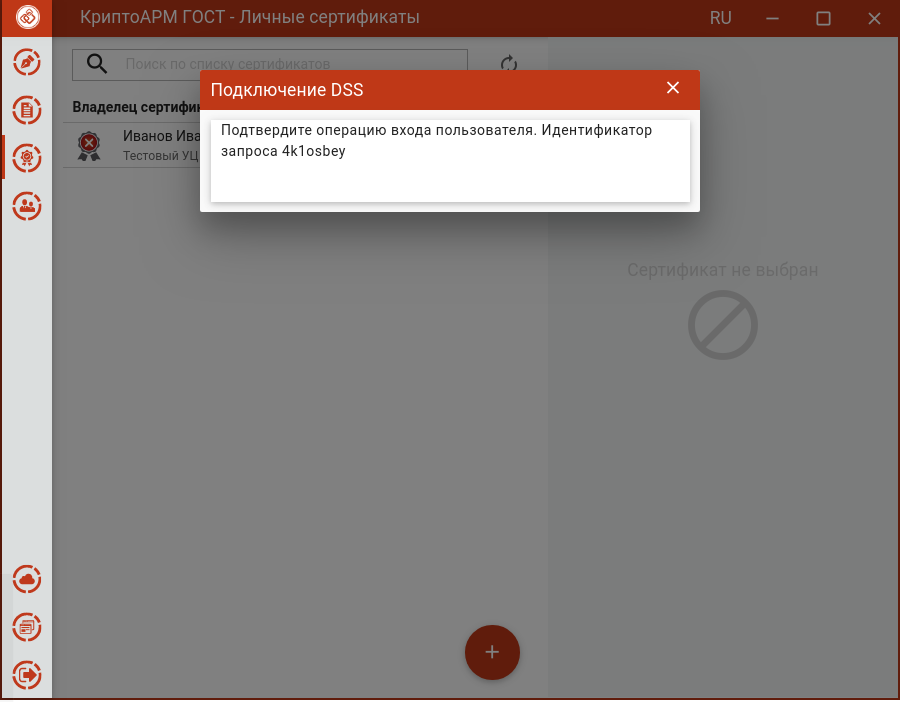
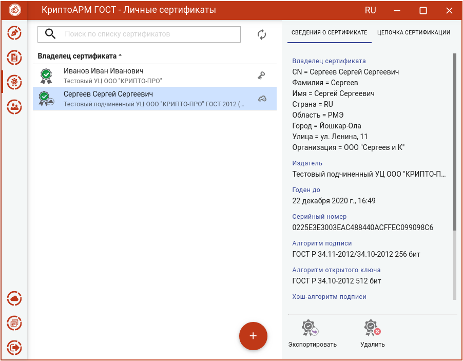

Импорт сертификата выполняется в разделе **Сертификаты** в категории **Личные**.

Для выполнения импорта сертификата из DSS в хранилище можно воспользоваться кнопкой **Добавить (+)**. В открывшемся окне нужно выбрать операцию **Импорт из DSS**. 

Открывается окно для ввода адресов серверов авторизации и логина для DSS.
Адреса сервера авторизации и сервера DSS можно получить в организации, предоставившей сертификат электронной подписи.
Логин - предоставляет организация, в оторой получен сертификат DSS. 

Если у пользователя в личном кабинете DSS в настройках стоит подтверждение по паролю, то на следующем шаге нужно ввести пароль для подключения к сервису DSS. 
Если пароль не задан, то данный шаг пропускается.

Если у пользователя в личном кабинете DSS в настройках стоит подтверждение аутентификации по сим-карте или с помощью мобильного приложения, то при нажатии на кнопку **Готово** появляется сообщение, что операцию нужно подтвердить. Если нет, то данный шаг пропускается.

При успешной аутентификации на следующем шаге сертификаты DSS автоматически помещаются в хранилище **Личных сертификатов**.

Сертификаты DSS отличаются от сертификатов, хранящихся локально, индикатором "облако".
