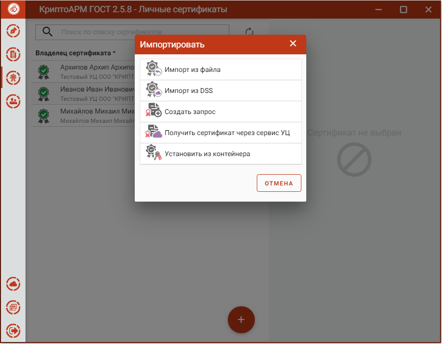
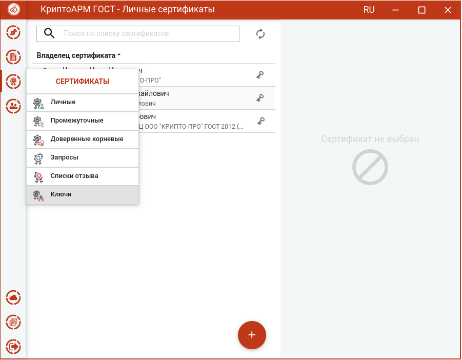
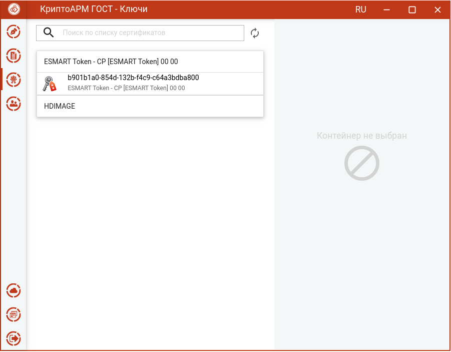
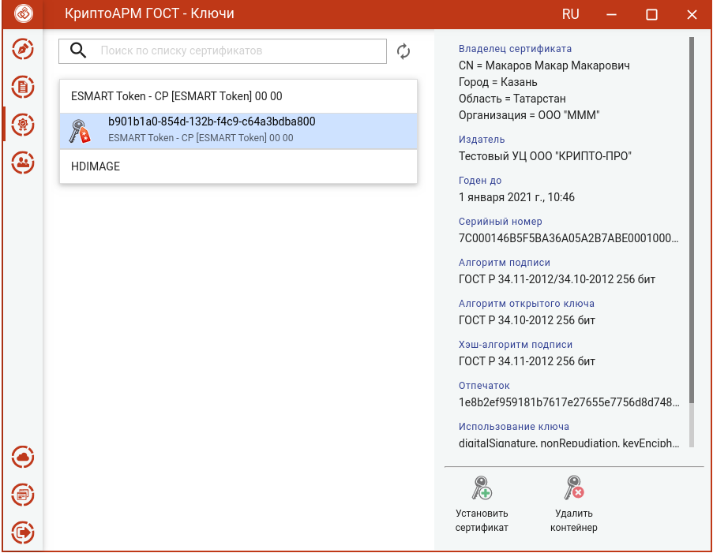
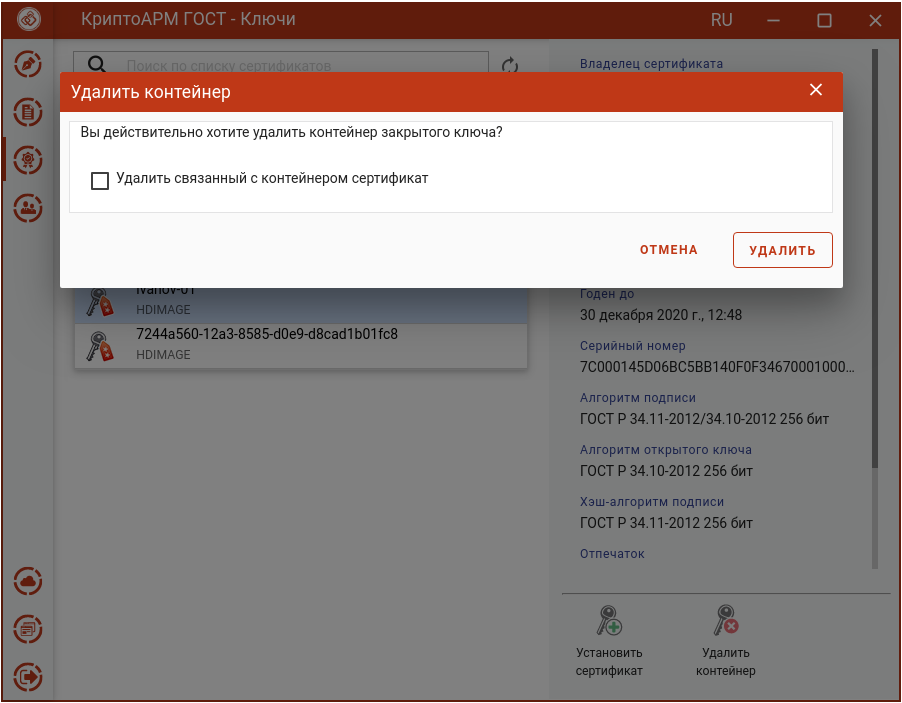
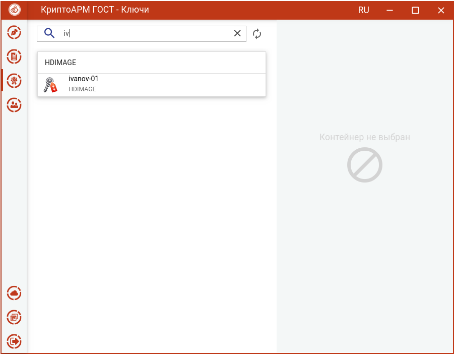

Данный раздел предназначен для управления контейнерами закрытых ключей на подключенных носителях или в реестре.

Установку сертификата из ключевого контейнера можно выполнить двумя способами.

В списке **Личных сертификатов** нажать **Добавить (+)** и выбрать операцию **Установить из контейнера.**

Или выбрать в меню **Сертификаты** подпункт **Ключи**.

В левой области представления отображаются все подключенные хранилища контейнеров закрытых ключей. В правой области отображается информация о сертификате в выделенном контейнере.

В каждом из хранилищ отображаются контейнеры закрытых ключей. В случае отсутствия контейнеров в хранилище, оно может быть скрыто как пустое.

После выбора контейнера отображается информация о находящемся в нем сертификате.

По кнопке **Установить сертификат** происходит установка сертификата в **Личное хранилище** сертификатов. Данный сертификат становится доступен для выполнения операций подписи, шифрования и расшифрования.

Для удаления контейнера нужно нажать кнопку **Удалить контейнер** и подтвердить операцию.

Если установить флаг **Удалить связанный с контейнером сертификат**, то вместе с контейнером сертификат удалится из хранилища **Личных сертификатов**.

Если флаг не установлен, сертификат останется в хранилище **Личных сертификатов** без привязки к ключевому контейнеру. Таким сертификатом нельзя выполнять операции подписи и расшифрования.

**Примечание.** Не рекомендуется удалять контейнер закрытого ключа, так как он не подлежит восстановлению.

В приложении реализован поиск контейнеров по символьному совпадению в названии контейнера.

