Для создания запроса и выпуска сертификата нужно добавить сервис подключения к КриптоПро УЦ 2.0. А потом, используя это подключение, создать запрос на сертификат.

## Добавление нового сервиса

Создать подключение можно, выбрав опцию **Получить сертификат через сервис УЦ,** в списке **Личных сертификатов** или в списке **Запросов** при добавлении сертификата.

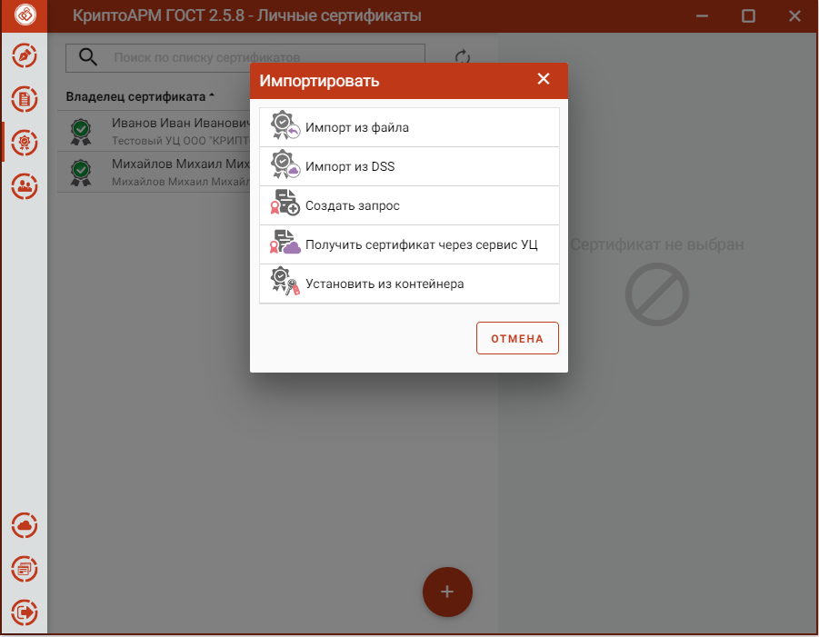

Создать подключение можно, выбрав опцию **Подключить сервис УЦ,** при добавлении сертификата в списке **Доверенных корневых сертификатов**.

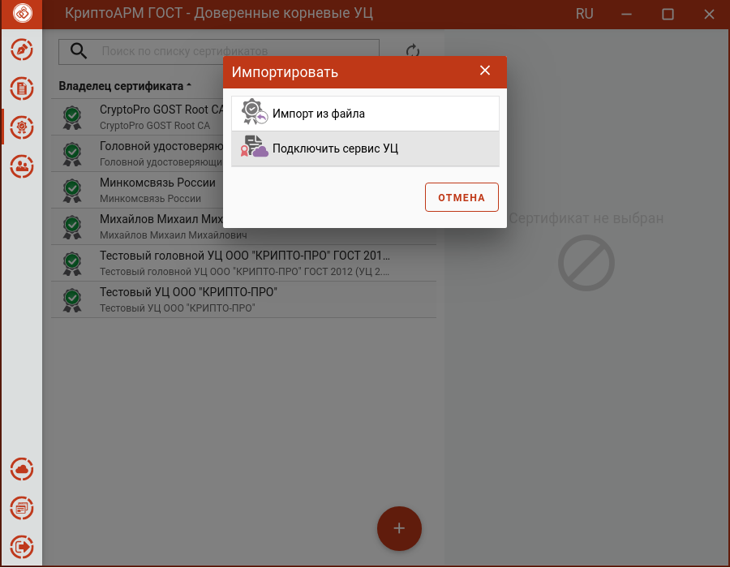

В открывшемся окне установить флаг **Добавление нового сервиса** и нажать кнопку **Готово**.

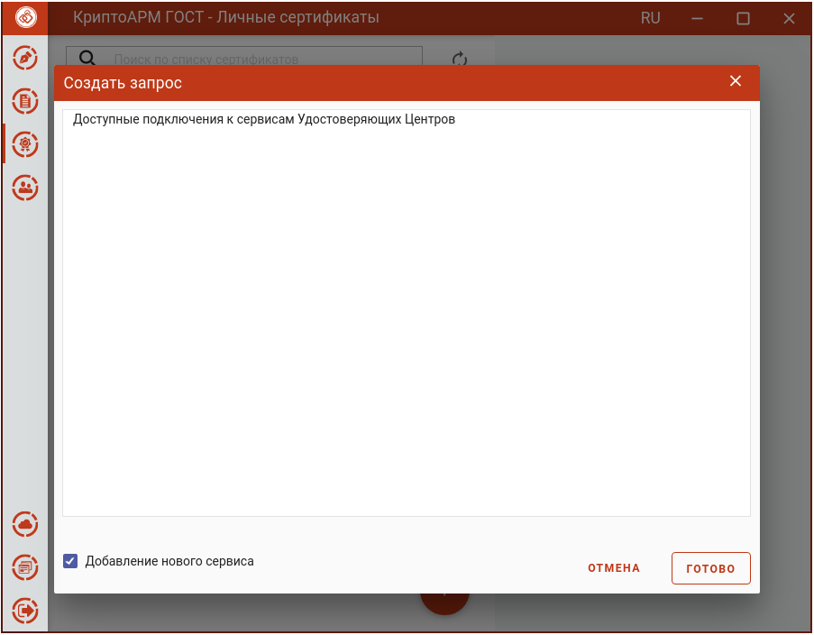

Открывается форма ввода полей для регистрации сервиса.

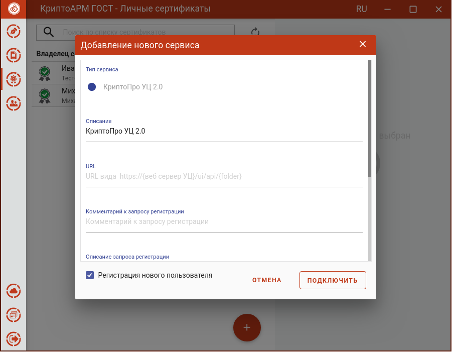

Если пользователь ранее не был не зарегистрирован в УЦ, то для добавления подключения нужно установить галку в поле **Регистрация нового пользователя** и нажать кнопку **Подключить**.

На следующем шаге нужно ввести данные для регистрации и нажать **Подключить**.

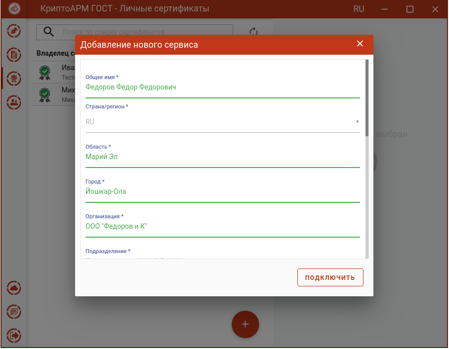

Если пользователь уже был зарегистрирован в УЦ, и у него есть логин и пароль для авторизации на сервисе, то для добавления подключения нужно снять галку в поле **Регистрация нового пользователя** и нажать кнопку **Подключить**.

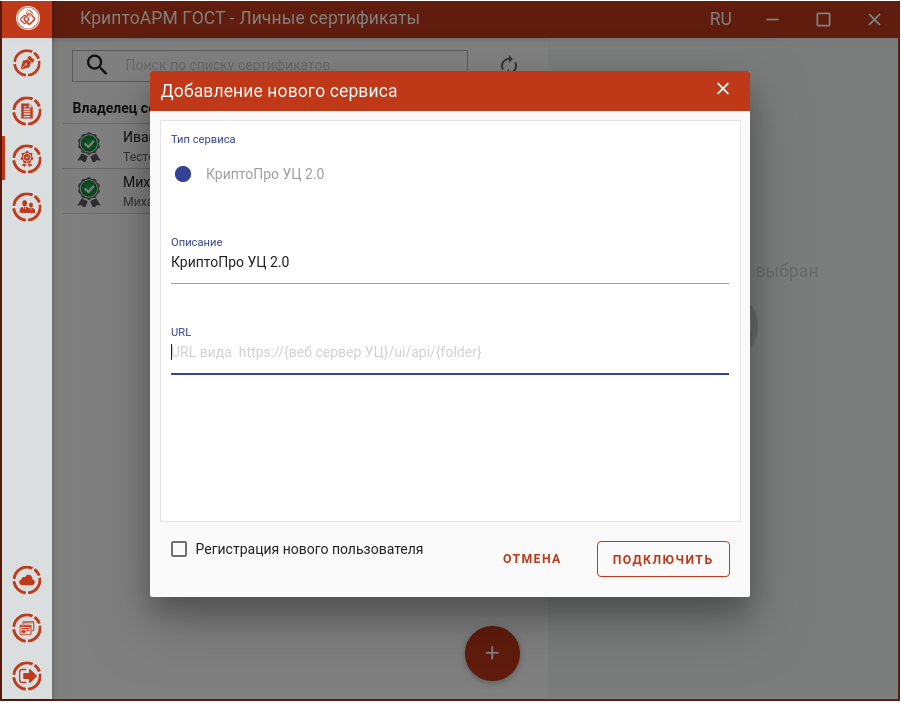

На следующем шаге нужно ввести данные для авторизации и нажать **Подключить**.

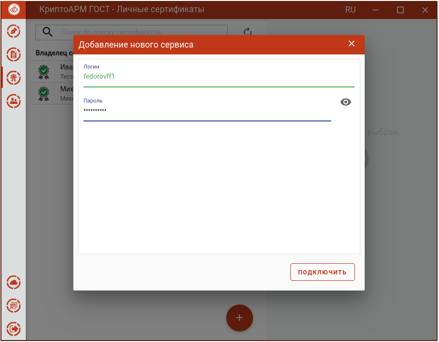

После успешной регистрации или авторизации созданное подключение УЦ появляется в списке сервисов, когда выбирается опция **Получение сертификата через сервис УЦ**.

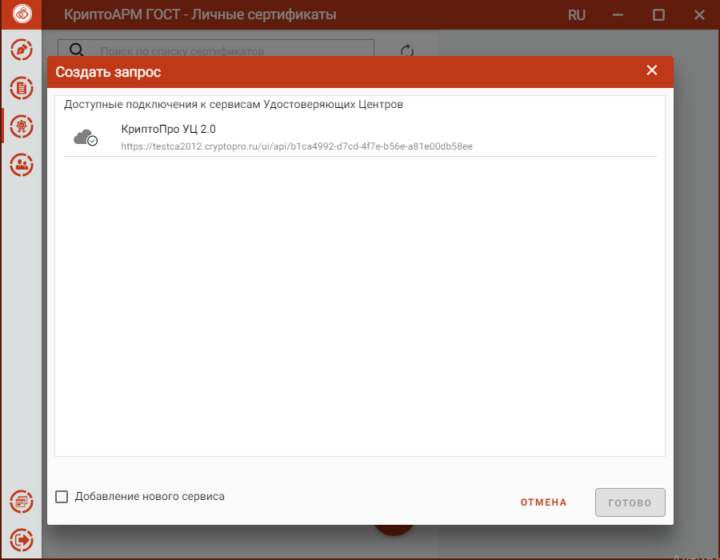

На основе созданного подключения можно создать запрос на сертификат.

Если подключение в списке с иконкой , то соединение с сервисом по указанному пользователем адресу успешно создано.

Если подключение в списке с иконкой , то соединение с сервисом по указанному пользователем адресу успешно создано, но, или нет аутентификации на сервисе, или запрос по регистрации на сервисе еще не подтвержден. Пользователю следует подождать подтверждения регистрации.

## Создание запроса на сертификат

Для создания запроса на сертификат нужно выбрав опцию **Получить сертификат через сервис УЦ** при добавлении сертификата в списке **Личных сертификатов** или в списке **Запросов**. В открывшемся окне выбрать подключение.

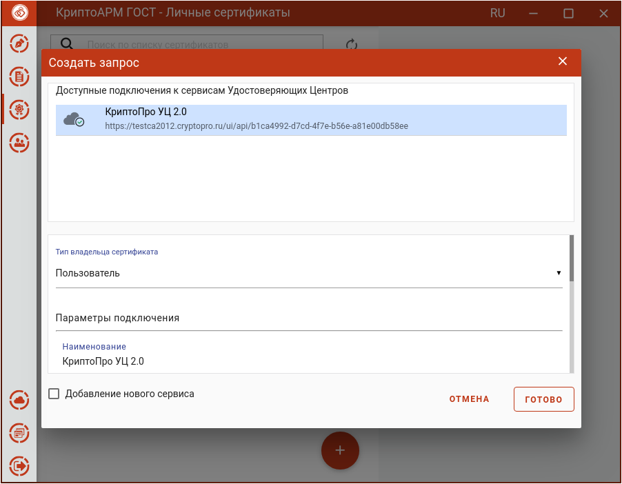

Выбрать тип владельца сертификата

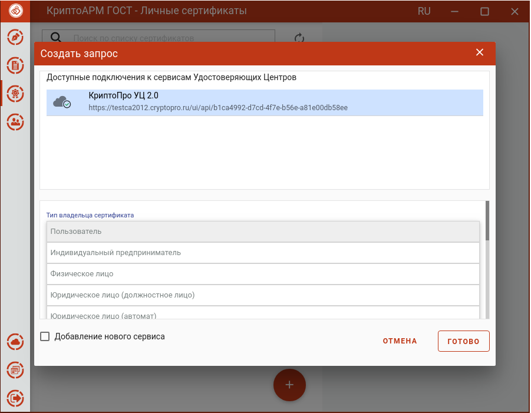

По нажатию на кнопку **Готово** открывается форма для заполнения полей запроса на сертификат, соответствующих выбранному шаблону. Поля, заполненные при регистрации пользователя на сервисе УЦ, подставляются в соответствующие поля на форме запроса.

Следует заполнить необходимые поля в запросе на вкладках **Сведения о владельце сертификата.**

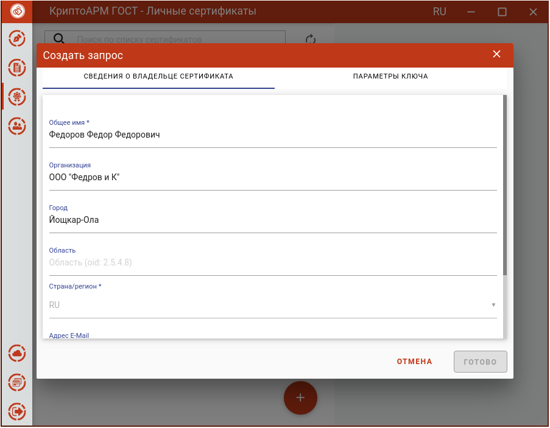

И **Параметры ключа,** выбрав **Шаблон сертификата (УЦ)**.

")

После заполнения всех обязательных полей становится доступна кнопка **Готово.**

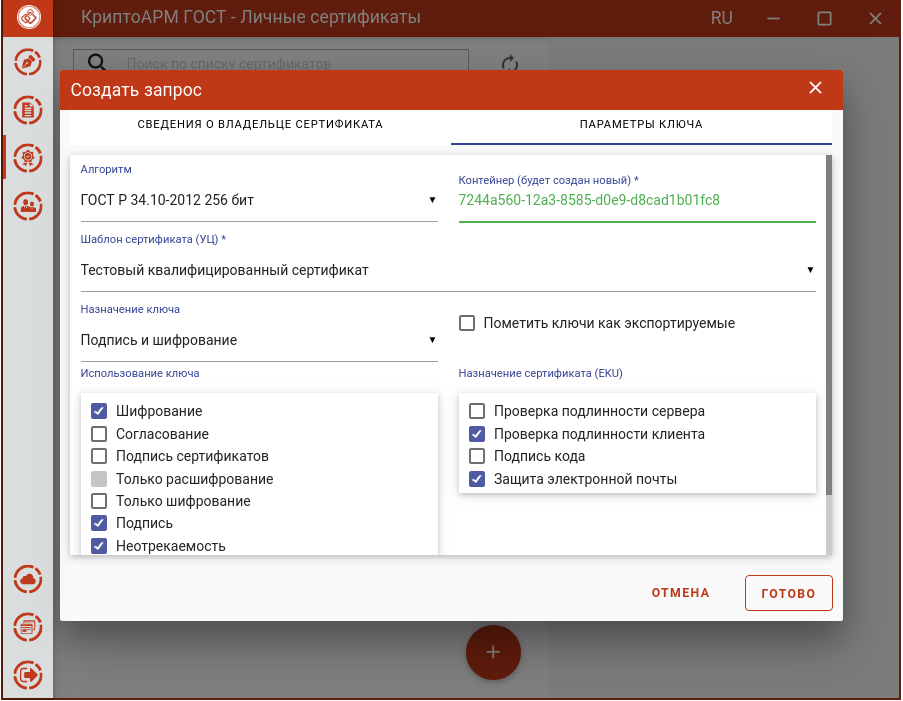

Для сертификата нужно выбрать ключевой носитель для хранения контейнера (Реестр, диск, токен). На запрос системы - установить пароль на данный контейнер и подтвердить его. После завершения операции возникнет окно с информацией об ее результатах.

Запрос сохраняется в раздел **Запросы** на вкладке управления сертификатами.

## Управление запросами на сертификат, созданными через сервис УЦ 

Запрос, созданный через подключенный сервис УЦ, сохраняется в раздел **Запросы**.

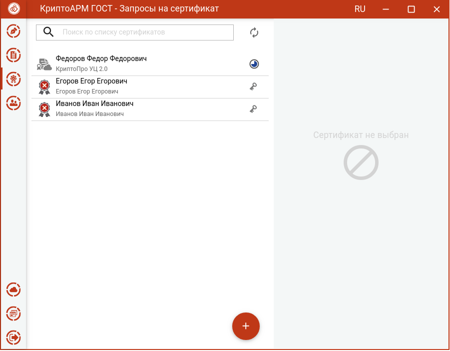

Для отображения статуса запроса применяются следующие обозначения:

  - Для данного запроса сертификат выпущен и установлен в хранилище КриптоПро. 
  - Запрос отклонен Удостоверяющим Центром.                                    
  - Запрос находится в обработке Удостоверяющим центром.                       
  - Проблемы с соединением, не позволяющие актуализировать статус запроса.     

Когда запрос будет обработан Удостоверяющим Центром и выпущен сертификат, при выделении запроса в списке, его статус измениться на .

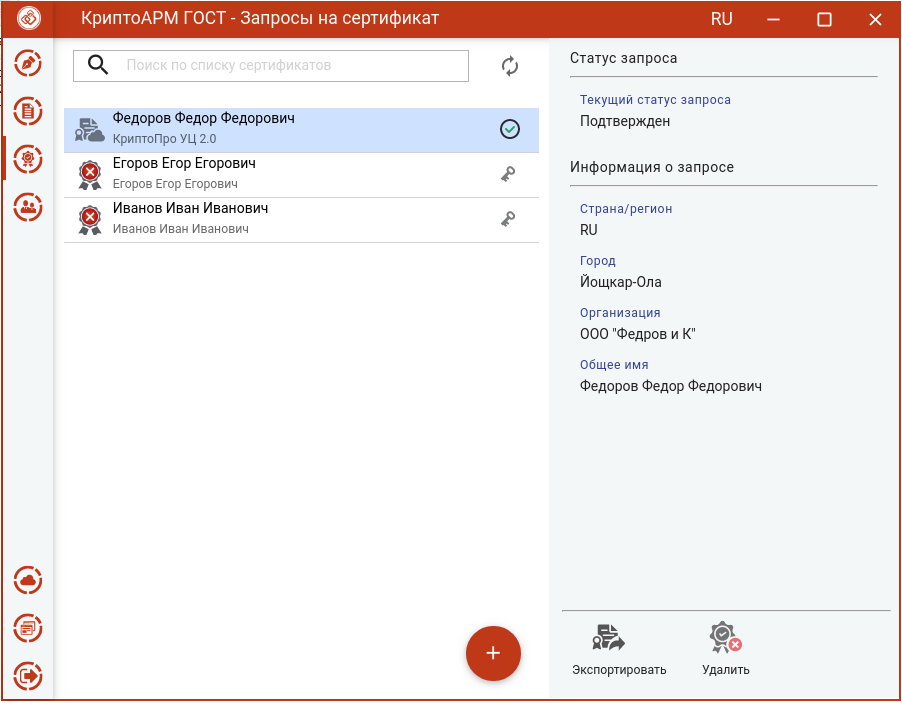

Сертификат установится в **Личное хранилище**.

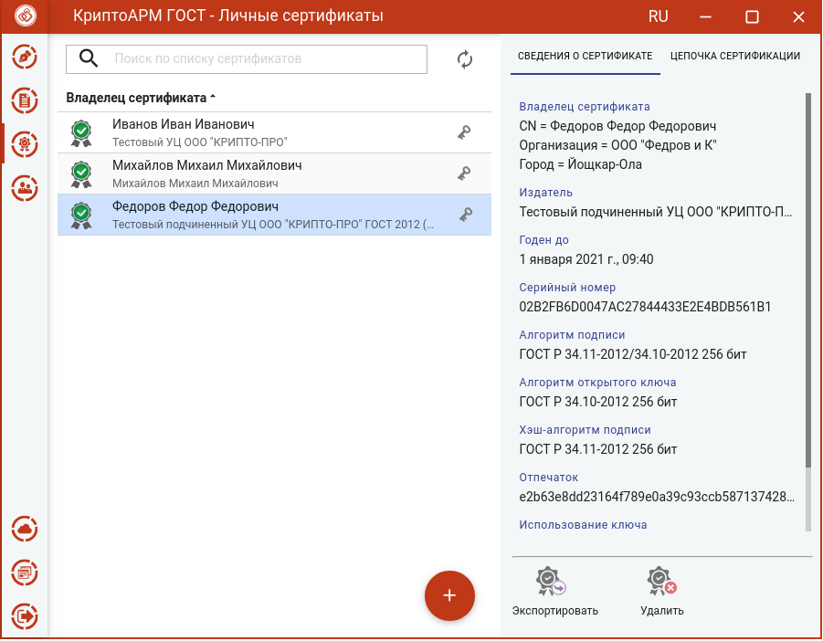
