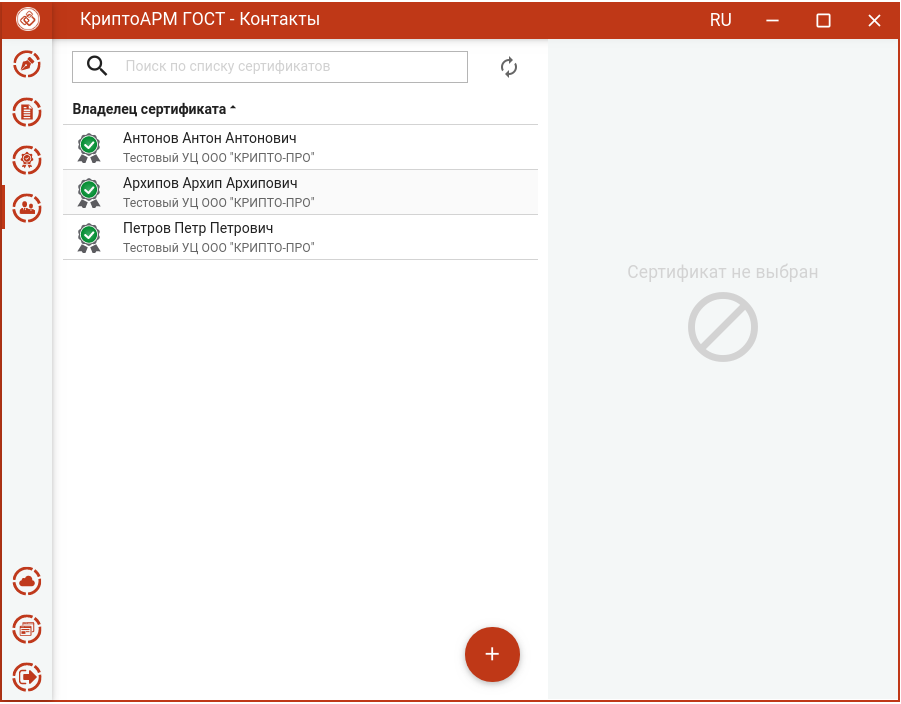

В разделе содержится описание работы с сертификатами других пользователей, в адрес которых происходит шифрование документов.

Переход в список контактов происходит при выборе пункта меню **Контакты**.

Контакты можно импортировать, экспортировать и удалять. Так же в списке контактов работает поиск.
