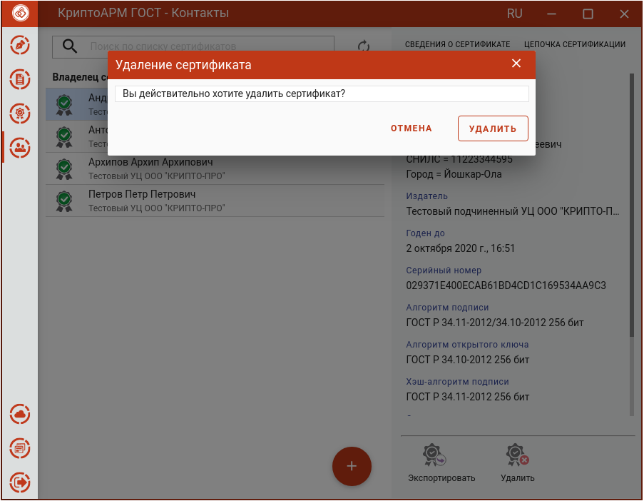

Для удаления контакта нужно в разделе **Контакты** на форме просмотра выбрать операцию **Удалить**.

В появившемся диалоговом окне нажать **Удалить** для подтверждения удаления.

При успешном удалении появляется сообщение об этом. Сертификат удаляется из списка **Контактов**.
