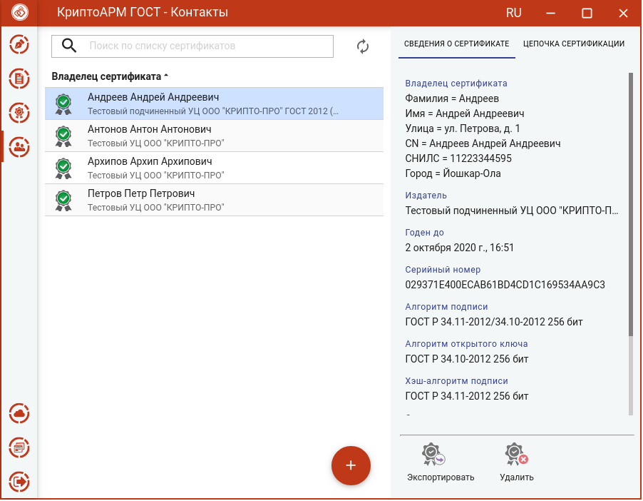

Для импорта контакта нужно в разделе **Контакты** нажать кнопку **Добавить (+)** и выбрать опцию **Импорт из файла**.

В открывшемся файловом менеджере нужно выбрать файл сертификата.

При успешном выполнении операции импорта, контакт появляется в списке, а сертификат автоматически помещается в хранилище сертификатов других пользователей.

