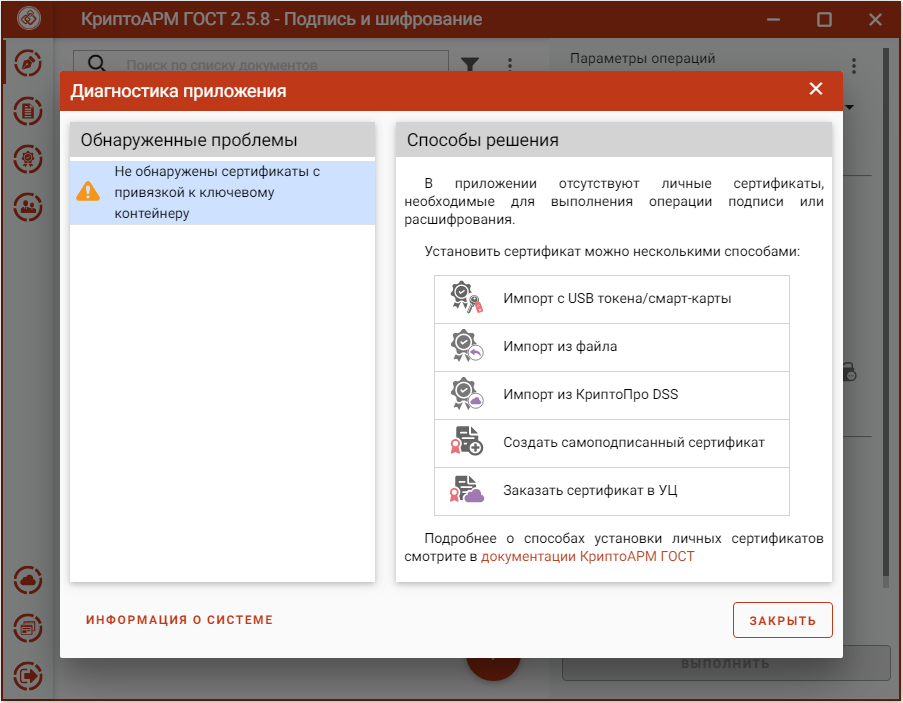

При отсутствии в личном хранилище сертификатов, с привязкой к закрытому ключу, при запуске приложения возникает предупреждающее сообщение и способы решения.

Добавить личный сертификат можно несколькими способами:

-   импортировать с USB токена/смарт-карты - при выборе открывается вкладка **Ключи**, где нужно выбрать контейнер и установить сертификат (подробнее в разделе **Ключи**);

-   импортировать из файла – открывается файловый менеджер для выбора файла сертификата (подробнее в разделе **Импорт сертификатов**);

-   импортировать из КриптоПро DSS – открывается окно ввода адресов    серверов DSS и логина пользователя (подробнее в разделе **Импорт сертификатов из DSS**);

-   создать самоподписанный сертификат – открывается форма создания запроса на сертификат (подробнее в разделе **Создание самоподписанного сертификата**);

-   заказать сертификат в УЦ – происходит переход на сайт подбора электронной подписи.

**Информация о системе** служит для копирования в буфер обмена и последующей вставки в текст обращения в техническую поддержку.
