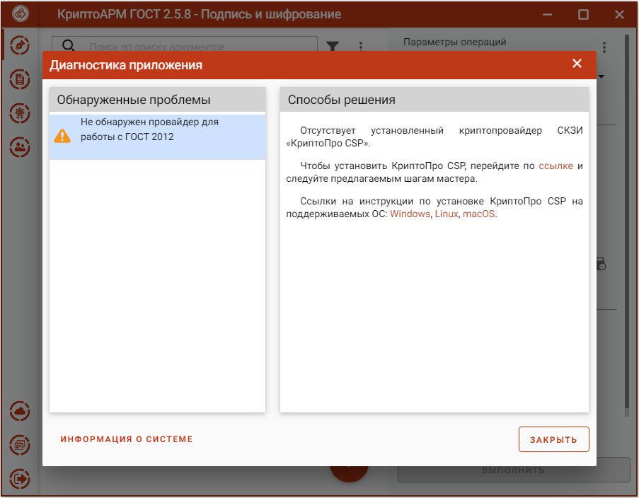

Приложение КриптоАРМ ГОСТ не работает без установленного в системе СКЗИ КриптоПро CSP. В таком случае при запуске приложения будет предупреждающее сообщение.

Дальнейшая работа приложения невозможна. Приложение можно только закрыть.

Инструкция по установке СКЗИ КриптоПро CSP описана в разделе **Установка криптопровайдера КриптоПро CSP**.

**Информация о системе** служит для копирования в буфер обмена и последующей вставки в текст обращения в техническую поддержку.
