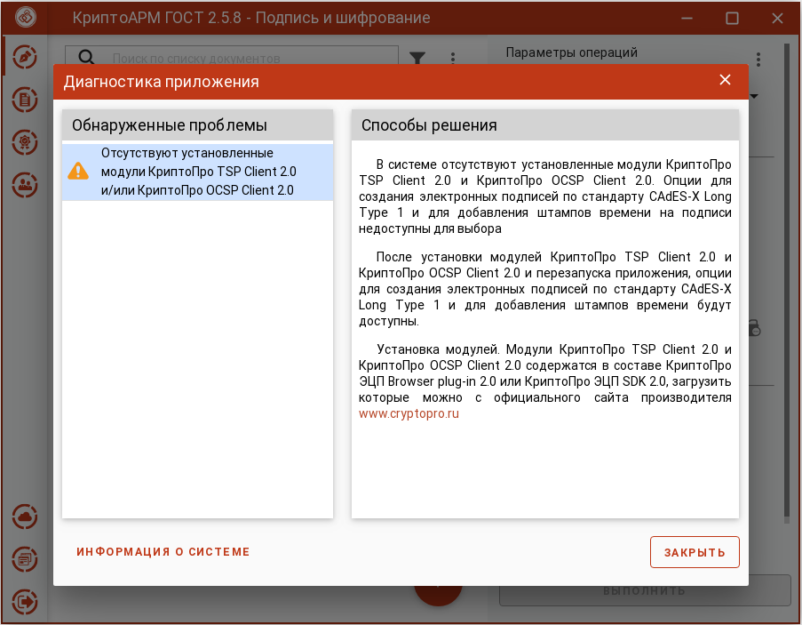

При отсутствии модулей КриптоПро TSP Client 2.0 или КриптоПро OCSP Client 2.0 возникает информационное сообщение.

Приложение остается работоспособным, но без возможности создавать
усовершенствованную подпись или подпись со штампом времени.

Как установить данные модули, описано в разделе **Установка криптопровайдера КриптоПро CSP**.

**Информация о системе** служит для копирования в буфер обмена и последующей вставки в текст обращения в техническую поддержку.