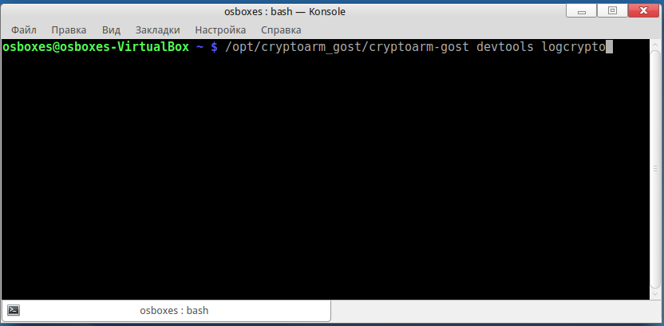

## Включение консольного режима

Ошибки, которые возникают при работе интерфейсной части приложения, связанные с проблемами подключения модулей и других компонентов можно отследить в консоли управления, которую предоставляет браузер.

Для получения доступа к консоли управления приложением и в терминале OC Linux нужно ввести команду:

/opt/cryptoarm_gost/cryptoarm-gost devtools

При выполнении операции, приводящей к ошибке, в открывшемся дополнительном окне на вкладке Console отобразится текст ошибки.

## Включение режима логирования

Для более глубокого анализа причин возникновения ошибок используется включение режима логирования, то есть сохранение служебной информации о выполненных операциях в текстовый файл. 

Данный режим включается указанием параметра **logcrypto** при запуске приложения из командной строки:

/opt/cryptoarm_gost/cryptoarm-gost logcrypto

Журнал логирования представляет собой текстовый файл cryptoarm_gost.log, который располагается в каталоге пользователя в папке .Trusted.
