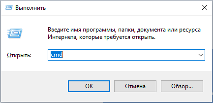
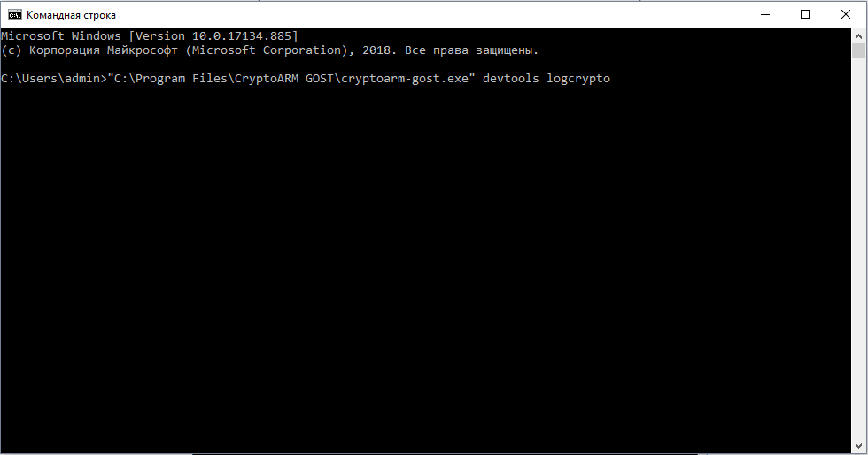
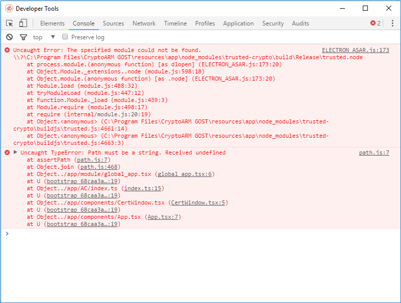

## Включение консольного режима

Ошибки, которые возникают при работе интерфейсной части приложения, связанные с проблемами подключения модулей и других компонентов можно отследить в консоли управления, которую предоставляет браузер.

Для запуска командной строки нажать Win+R. Ввести команду cmd и ОК

В открывшемся окне ввести команду запуска приложения КриптоАРМ ГОСТ:

"C:\Program Files\CryptoARM GOST\cryptoarm-gost.exe" devtools 

В результате выполнения этой команды откроется приложение КриптоАРМ ГОСТ с дополнительной панелью управления и сохранением информации об операциях в журнал логирования.

## Включение режима логирования

Для более глубокого анализа причин возникновения ошибок используется включение режима логирования, то есть сохранение служебной информации о выполненных операциях в текстовый файл. 

Данный режим включается указанием параметра **logcrypto** при запуске приложения из командной строки:

"C:\Program Files\CryptoARM GOST\cryptoarm-gost.exe" logcrypto

Журнал логирования представляет собой текстовый файл cryptoarm_gost.log, который располагается в каталоге пользователя в папке .Trusted.
