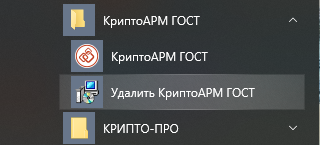

---
slug: "/post1"
title: "Удаление приложения на платформе MS Windows"
sort: "01"
--- 

Удалить приложение КриптоАРМ ГОСТ можно следующим образом:

1.  Воспользоваться стандартными средствами удаление программ в операционной системе Windows.
   Через кнопку **Пуск** открыть **Панель управления**.
   В окне **Настройка параметров** компьютера активизировать ярлык **Программы и компоненты**. Откроется одноименное окно, в котором перечислены программы, установленные на компьютере.
   Выберать в списке программу **КриптоАРМ ГОСТ**, нажать на кнопку **Удалить**, и подтвердите решение об удалении. Выполнение процесса удаления будет отображаться в виде индикатора прогресса в специальном окне. По завершении процесса программа КриптоАРМ ГОСТ будет удалена с компьютера и из списка элементов **Установленные программы**.

2.  Второй способ удаления доступен через главное меню операционной системы. В главном меню найти раздел с приложением **Пуск - Все программы - КриптоАРМ ГОСТ**. В списке выбрать **Удалить КриптоАРМ ГОСТ** (Uninstall КриптоАРМ ГОСТ).

Начнется процесс удаления приложения КриптоАРМ ГОСТ. Выполнение процесса отображается в виде индикатора прогресса. После завершения этого процесса приложение КриптоАРМ ГОСТ будет удалено из операционной системы.
