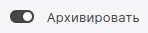
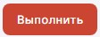

Архивировать документы вы можете в мастере **Подписи и шифрования**, перейдя из раздела **Документы**.

Вы можете архивировать любые произвольные документы, загрузив их с помощью drag-and-drop, либо выбрать документы из раздела.

Для архивирования документов дополнительные настройки не нужны, можно выбрать каталог сохранения архива и сохранение копии в раздел **Документы**.

1. Перейдите в раздел **Документы**.
2. Выберите в списке документы, которые нужно заархивировать, или ничего не выбирайте, если хотите добавить документы из системы.
3. Нажмите **Подпись и шифрование**.
4. Включите на верхней панели операцию **Архивировать** . 
5. Добавьте документы в список.
6. При необходимости, выберите каталог сохранения архива, опцию сохранения копии в **Архиве**.  
7. Нажмите кнопку **Выполнить** .

# Результат выполнения операции

При успешном выполнении операции архив отображается в мастере **Результаты оперции**.

Архив сохраняется в заданном каталоге, если выбран каталог для сохранения результатов. Или рядом с первым добавленным файлом, если каталог не задан.   Если вы добавили для архивирования документы из разных каталогов, то при выполнении операции вам надо выбрать каталог для сохранения архива.  
Если установлен флаг **Создать копию в Архиве**, то копия созданного архива сохраняется в папке пользователя. Файлы из данного каталога доступны в разделе **Документы**.

Чтобы каждый раз не задавать операцию в мастере подписи и шифрования, вы можете настроить профиль с архивированием и каталогами сохранения результатов, и выбирать его.  

**ИНСТРУКЦИИ ПО ТЕМЕ:**  
1. [Как добавить документы в мастер.](https://docs.cryptoarm.ru/05-v3.0-Beta/004-documents/add-docs)  
2. [Как создать профиль подписи.](https://docs.cryptoarm.ru/05-v3.0-Beta/004-documents/create-profile)  
3. [Как переключаться между профилями подписи.](https://docs.cryptoarm.ru/05-v3.0-Beta/004-documents/select-profile)    
5. [Как посмотреть уведомления.](https://docs.cryptoarm.ru/05-v3.0-Beta/007-cryptoarm/notifications)  
5. [Действия с результатами операций.](https://docs.cryptoarm.ru/05-v3.0-Beta/004-documents/operations-result)  