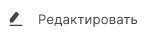

Вы можете редактировать только локальные контакты. Контакты LDAP доступны только для просмотра.

1. Перейдите в раздел **Контакты**.
2. Выделите контакт в списке, который вы хотите изменить.
3. Нажмите кнопку    в верхней панели.
4. Измените нужные поля.
5. Нажмите .

**ИНСТРУКЦИИ ПО ТЕМЕ:**  
1. [Как добавить локальный контакт.](https://docs.cryptoarm.ru/v3.0-Beta/006-contacts/add-contact)  
2. [Как привязать сертификат к контакту.](https://docs.cryptoarm.ru/v3.0-Beta/006-contacts/link-contact-cert)  
