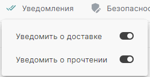
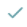
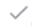

Уведомление о доставке подтверждает доставку сообщения электронной почты в почтовый ящик получателя, но не гарантирует, что оно было просмотрено или прочитано.   

Уведомление о прочтении подтверждает открытие отправленного сообщения.  

Чтобы уведомления о доставке и прочтении письма нужно  включить запрос уведомлений в настройках почты или при создании нового сообщения.

# Как настроить уведомления о доставке и прочтении в новом сообщении

1. Откройте форму создания нового сообщения.  
2. Выберите опцию **Уведомить о доставке** и/или **Уведомить о прочтении** по кнопке **Уведомления** .  

# Как настроить уведомления о доставке и прочтении в настройках аккаунта

1. Откройте форму редактирования настроек почты и выберите вкладку **Общие**.  
2. В разделе **Запрос уведомлений** установите флаг **Запрашивать уведомление о доставке для всех исходящих сообщений** и/или  **Запрашивать уведомление о прочтении для всех исходящих сообщений**.  
4. Нажмите **Сохранить** для фиксации изменений в настройках аккаунта.    
    В таком случае в новом сообщение опция **Запрашивать уведомление о доставке для всех исходящих сообщений** и/или  **Запрашивать уведомление о прочтении для всех исходящих сообщений** по кнопке **Уведомления** будет включена.  

Уведомления о доставке направляются отправителю автоматически почтовым сервисом при отправке письма на сервер адресата.

# Как посмотреть результат уведомления о доставке и прочтении

Посмотреть результат уведомлений вы можете в папке **Отправленные**. 

На панели с письмами отображается несколько статусов:
 -  Прочитано всеми/Доставлено   
 -  Прочитано не всем получателям/Не доставлено  
 -  Доставлено всем    
 -  Доставлено не всем получателям.  
  
Вы можете посмотреть детальную информацию о доставке/прочтении писем, кликнув курсором мыши на статусы.

**ИНСТРУКЦИИ ПО ТЕМЕ:**  
1. [Как отправлять электронные письма.](https://docs.cryptoarm.ru/06-v3.1-Beta/003-mail/send-mail)  
2. [Как редактировать настройки почты.](https://docs.cryptoarm.ru/06-v3.1-Beta/003-mail/edit-account)  