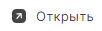

# Быстрый просмотр  

1. Перейдите в раздел **Почта**.  
2. Выделите письмо в списке нажатием курсора.  
3. Нажмите иконку **Просмотр** .

Область просмотра письма отображается на боковой панели справа.

# Просмотр в новой вкладке  

1. Перейдите в раздел **Почта**.
2. Выделите письмо в списке нажатием курсора.
3. На верхней панели нажмите кнопку .  

Письмо открывается для просмотра в новой вкладке.  

При просмотре письма оно помечается как прочитанное.

