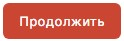
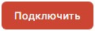

Для установки сертификата из DSS надо сначала создать подключение к DSS.

# Как создать подключение к сервису DSS

1. Перейдите в раздел **Сертификаты**.
2. Откройте правую боковую панель, нажав на активное хранилище в правом верхнем углу .
3. Выберите **Подключить сервис DSS**.
4. Заполните поля:
     - **Название подключения** - любое название (может состоять из латинских букв, цифр и знака подчеркивания);
     - **Сервер авторизации DSS** и **Сервер DSS** - данные адреса необходимо получить в организации, предоставившей вам сертификат электронной подписи;
     - **Использовать подтверждения КриптоПро DSS 2.0**  - нужно включить данную опцию, если используется КриптоПро DSS 2.0;
     - **Логин** пользователя  для доступа к сертификату.
4. Нажмите .
5. Если у вас в личном кабинете DSS в настройках стоит подтверждение по паролю, то на следующем шаге введите пароль для подключения к сервису DSS и нажмите .   
Вы можете установить флаг **Запоминать пароль до выхода из приложения**, чтобы каждый раз не вводить  пароль для подключения  при работе с сертификатом DSS.  
    Если пароль не задан, то данный шаг пропускается.
6. Если у вас в личном кабинете DSS в настройках стоит подтверждение аутентификации по сим карте или с помощью мобильного приложения, то на следующем шаге появляется информационное окно с ожиданием подтверждения операции на телефоне.  
Подтвердите операцию на телефоне.  
    Если идентификация настроена не с помощью телефона, то данный шаг пропускается.

При успешной аутентификации сертификат DSS автоматически помещается в хранилище **Личных сертификатов**.

Чтобы посмотреть установленный сертификат выберите раздел **Все личные**, в котором отображаются все установленные сертификаты с закрытым ключом. 
Или в правой боковой панели  выберите созданное подключение к DSS и перейдите в раздел **Личные**. В этом случае отобразится сертификат DSS выбранного подключения.

Сертификаты DSS в списке отличаются иконкой ключевого контейнера .

***Важно!*** Для того, чтобы сертификат был действительный, у вас должны быть должны быть установлены корневые сертификаты УЦ и актуальный список отзыва сертификатов (СОС).

Если при подключении к сервису возникают ошибки, они выводятся как уведомления. Вы можете их посмотерть, нажав на иконку . Для просмотра подробного описания ошибки или отправки в техническую поддержку нажмите  в правой боковой панели списка уведомлений.

**ВОЗМОЖНЫЕ УВЕДОМЛЕНИЯ:**  
1. Не удалось подключиться к серверу DSS: неверный логин или пароль - проверьте правильность заполнения данных.  
2. Не удалось подключиться к серверу DSS - проверьте правильность ввода адресов серверов, доступ к сети Интернет.  

**ИНСТРУКЦИИ ПО ТЕМЕ:**   
1. [Как установить корневой и промежуточный сертификаты.](https://docs.cryptoarm.ru/05-v3.0-Beta/005-certs/import-UC-certs)  
3. [Как импортировать список отзыва сертификатов (СОС).](https://docs.cryptoarm.ru/05-v3.0-Beta/005-certs/import-crl)  