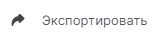

Для обмена шифрованными или подписанными данными с другими пользователями экспортируйте сертификат без закрытого ключа.

Экспортируйте сертификат с закрытым ключом, если вам нужно:
- сохранить копию сертификата и связанного с ним закрытого ключа;
- удалить сертификат и его закрытый ключ с устройства и установить на другое устройство.

# Как экспортировать сертификат без закрытого ключа

1. Выберите в **Меню** раздел **Сертификаты**.
2. В списке выделите личный сертификат.
3. Нажмите  в дополнительной панели действий.
4. Введите пароль к ключевому контейнеру или нажмите **Отмена**.
     Если пароль не задан, то данный шаг пропускается.
5. Вы выпадающем списке выберите **Не экспортировать закрытый ключ**. Выбор может быть заблокирован, если ключ не экспортируемый.
6. Выберите тип кодировки base64 или der.
7. Нажмите .
8. В файловом менеджере задайте путь к файлу сертификата и имя файла.

# Как экспортировать сертификат с закрытым ключом в контейнер pfx

***Внимание!*** Вы можете экспортировать сертификат вместе с закрытым ключом, если ключ имеет флаг "экспортируемый". В противном случае, эта функция недоступна.

1. Выберите в **Меню** раздел **Сертификаты**.
2. В списке выделите личный сертификат.
3. Нажмите  в дополнительной панели действий.
4. Введите пароль к ключевому контейнеру.
     Если пароль не задан, то данный шаг пропускается.
5. Вы выпадающем списке выберите **Экспортировать закрытый ключ**. Выбор заблокирован, если ключ не экспортируемый.
6. Задайте пароль к файлу pfx.
7. Нажмите .
8. В файловом менеджере задайте путь к файлу сертификата и имя файла.

При успешном выполнении операции сертификат экспортируется в файл.

Если при экспорте возникает ошибка, она выводится как уведомление в правом верхнем углу. Вы можете посмотерть уведомления, нажав на иконку . Для просмотра подробного описания ошибки или отправки в техническую поддержку нажмите  в правой боковой панели списка уведомлений.