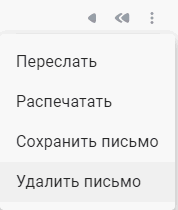
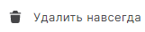
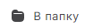

Удаленные сообщения хранятся в корзине.

# Как удалить отдельное письмо  

1. Перейдите в раздел **Почта**.  
2. Выделите письмо в списке нажатием курсора.  
3. В верхней панели нажмите на кнопку .  

# Как удалить одно письмо из цепочки

1. Откройте письмо.
2. Нажмите на значок **Ещё** и нажмите **Удалить письмо** .

#  Как удалить несколько писем сразу

1. Перейдите в раздел **Почта**.
2. Установите флажки слева от писем.
3. В верхней панели нажмите на кнопку .

# Как удалить все письма 

1. Перейдите в раздел **Почта**.
2. Выберите все письма, установив флажок в левом верхнем углу. Если нужно выбрать письма на всех страницах, а не только на текущей, нажмите Выбрать все цепочки писем.
3. В верхней панели нажмите на кнопку .

# Как посмотреть содержимое корзины
1. Перейдите в раздел **Почта**.
2. В левом боковом меню  выберите  **Корзина**.

# Как очистить корзину

1. Перейдите в раздел **Почта**.
2. В левом боковом меню  выберите  **Корзина**.
3. Установите флажки напротив писем, которые хотите навсегда удалить, и нажмите   

***Примечание:*** параметр **Удалить навсегда** доступен только в корзине. 
Чтобы удалить все сообщения в корзине, выделите все письма в корзине и нажмите на кнопку  на панели действий.

# Как восстановить удаленные письма

После переноса письма в корзину его можно восстановить.  

1. Перейдите в раздел **Почта**.
2. В левом боковом меню  выберите  **Корзина**.
3. Установите флажки напротив писем, которые нужно восстановить.
4. В верхней панели нажмите на кнопку .
5. В правом боковом меню выберите нужную папку.  

**ИНСТРУКЦИИ ПО ТЕМЕ:**  
1. [Как открыть письмо.](https://docs.cryptoarm.ru/06-v3.2-Beta/003-mail/view-mail)   