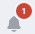

Вы можете настроить шифрование и электронную подпись сообщений, системные уведомления и изменить многие другие параметры почты.

# Как перейти в настройки почты

1. Перейдите в раздел **Почта**.
2. Откройте правую боковую панель и в списке наведите курсор на почтовый аккаунт, настройки которого надо изменить.  
3. Нажмите всплывающую иконку **Настройки** .

На боковой панели открывается форма просмотра настроек аккаунта.  

Настройки почты состоят из разделов:
- **Безопасность** - для редактирования параметров для управления подписанными и зашифрованными сообщениями.
- **Подключение** - содержит настройки подключения почтового аккаунта.
- **Общие** - используется для настройки действий с входящими сообщениями и уведомлениями о доставке и прочтении.

# Как редактировать настройки  

1. В форме просмотра настроек аккаунта нажмите кнопку **Редактировать** .  
    Форма редактирования открывается в новой вкладке.
2. Выберите одну из вкладок **Безопасность**, **Подключение**, **Подписи** или **Общие**.
3. Внесите изменения.
4. После редактирования нужных параметров нажмите . 

# Описание настроек безопасности

На форме редактирования настроек аккаунта выберите вкладку **Безопасность**.

**Безопасность электронной почты**  
   - Шифровать содержимое и вложения исходящих сообщений - при включенной настройке исходящие письма будут шифроваться в адрес получателей, при условии, что у получателя привязан сертификат.     
   - Добавлять электронную подпись к исходящим сообщениям - при включенной настройке исходящие письма будут подписываться электронной подписью, при условии, что в настройках почты выбран сертификат подписи

**Сертификат подписи**  

   Привязанный сертификат используется по умолчанию при подписи писем.
   Вы может выбрать только один сертификат подписи из хранилища личных сертификатов.
   Если у вас нет личного сертификата, вы можете установить его, создать или импортировать.  

**Получение электронной почты**    
   - Хранить входящие сообщения в расшифрованном виде - выбор параметра означает, что все полученные зашифрованные сообщения, которые были хотя бы один раз прочитаны, будут храниться в расшифрованном виде.
   - Хранить входящие сообщения в зашифрованном виде - выбор параметра означает, что все полученные зашифрованные сообщения, даже прочитанные, будут храниться в зашифрованном виде.    
**Важно!** не реализовано в этой версии. Все письма, для которых был найден сертификат расшифрования, хранятся в расшифрованном виде.

**Соответствие e-mail**    
   - Включить для своего почтового аккаунта - при включенной настройке производится проверка соответствия e-mail в личном почтовом аккаунте и в личных сертификатах.  
   - Включить для входящих писем - при включенной настройке производится проверка соответствия e-mail во всех входящих письмах и при привязке сертификата к контакту.   
  
  При включенном флаге, если вы привязываете сертификат, электронный адрес в котором не соответствует электронному адресу в почтовой аккаунте, выводится уведомление **Электронный адрес почтового аккаунта не соответствует адресу, указанному в личном сертификате**. Настройки не сохраняются, пока не будет соответствия e-mail или пока не будет отключена проверка.  
**Важно!** не реализовано в этой версии.

# Описание настроек подключения почтового аккаунта

На форме редактирования настроек аккаунта выберите вкладку **Подключение**.

Вы можете редактировать все поля **Ваше имя**, **Электронная почта**, **Пароль**, **Сервер входящей почты**, **Сервер исходящей почты**.   
Редактирование имени не влияет на подключение.   
При изменении адреса электронной почты список писем обновляется для нового адреса.  
После смены пароля вы автоматически выйдете из аккаунта. Если вы ввели правильный пароль, письма аккаунта обновятся.   
При редактировании параметров **Сервер входящей почты**, **Сервер исходящей почты** письма подключенного аккаунта останутся в списке, но не будет синхронизации с почтовым сервером. Вы не увидите новых писем и не отправите свои.  

# Описание настроек подписи писем

На форме редактирования настроек аккаунта выберите вкладку **Подписи**.

Вы можете создать подпись, которая будет автоматически подставляться в новое письмо, а также при ответе или пересылке.  
По умолчанию в приложении задана дефолтная подпись с текстовкой **Отправлено из КриптоАРМ ГОСТ 3** и ссылкой на магазин cryptoarm.ru.

**Создание подписи**  

Создание новой подписи доступно по кнопке .  
Укажите имя и содержимое подписи.  
При установке флага **По умолчанию** данная подпись будет добавлена  в новое сообщение.  
Флаг **Добавлять перед цитируемым текстом в ответных письмах** позволит добавить подпись сразу после текста ответа, а не в конце всех писем в цепочке.   

**Оформление подписи**  

Содержимое текста можно редактировать:  выбрать стиль и размер шрифта, выделить текст курсивом, жирным, подчеркнутым, зачеркнутым.  
Помимо текста, вы можете вставить в подпись:
-  Изображение.
   Формат изображения может быть .jpeg, .jpg, .png, .gif, максимальный размер - 1024х1024 пикселей, максимальный объем: 2 МБ. 
- Ссылку.  
   Для добавления ссылки выделите текст, нажмите кнопку , в появившемся окне укажите адрес ссылки.  
   Вы можете удалить ссылку из подписи, выделив текст и нажав кнопку .

**Удаление подписи**  

Для удаления подписи наведите курсор мыши на название подписи и нажмите на всплывающую иконку **Удалить** .

# Описание общих настроек  

На форме редактирования настроек аккаунта выберите вкладку **Общие**.

**Обработка сообщений**
- Группировать письма в цепочки - при включенной опции письма группируются в цепочки по теме письма.
- Отображение изображений в письмах - если у вас низкая скорость интернет-соединения или вы хотите сэкономить трафик, отключите показ картинок по умолчанию.  
  ***Примечание:*** чтобы посмотреть изображения в письме,  нажмите **Показать один раз** для отображения изображений в текущем письме или **Всегда показывать от ...** для постоянного отображения изображений от этого пользователя.  
  **Важно!** не реализовано в текущей версии. Изображения в письмах отображаются всегда.  
- Отмечать как прочитанное при просмотре в области чтения - при установленном флаге при быстром просмотре сообщения, оно помечается как прочитанное.

**Запрос уведомлений**
- Запрашивать уведомление о доставке для всех исходящих сообщений  
- Запрашивать уведомление о прочтении для всех исходящих сообщений.  
При выборе данных опций кнопки с запросом уведомлений при написании нового сообщения будут всегда активны.

**Отправка уведомлений о прочтении**  
- Всегда отправлять уведомления о прочтении для любого полученного сообщения,
- Никогда не отправлять уведомления о прочтении,
- Каждый раз спрашивать, следует ли отправить уведомление о прочтении.  
Вы можете выбрать только одну опцию, настроив отправку/запрет на отправку уведомлений  о прочтении письма. 

Если при сохранении аккаунта возникает ошибка, она выводится как уведомление в правом верхнем углу. Вы можете посмотреть уведомления, нажав на иконку . Для просмотра подробного описания ошибки или отправки в техническую поддержку нажмите  в правой боковой панели списка уведомлений.

**ВОЗМОЖНЫЕ УВЕДОМЛЕНИЯ:**   

1. Ошибка аутентификации - проверьте корректность пароля в настройках почты.
2. Ошибка синхронизации аккаунта - в настройках почты проверьте корректность адреса электронной почты, настройки сервера входящей и исходящей почты.  

**ИНСТРУКЦИИ ПО ТЕМЕ:**  
1. [Как добавить почтовый аккаунт.](https://docs.cryptoarm.ru/06-v3.2-Beta/003-mail/add-account)  
2. [Как отправить подписанное и зашифрованное сообщение.](https://docs.cryptoarm.ru/06-v3.2-Beta/003-mail/send-sign-mail)  
3. [Как привязать сертификат к контакту.](https://docs.cryptoarm.ru/06-v3.2-Beta/006-contacts/link-contact-cert)  
4. [Как установить личный сертификат.](https://docs.cryptoarm.ru/06-v3.2-Beta/008-certs/import-my-cert)  
5. [Как отправлять электронные письма.](https://docs.cryptoarm.ru/06-v3.2-Beta/003-mail/send-mail)  
6. [Группировка сообщений в цепочки.](https://docs.cryptoarm.ru/06-v3.2-Beta/003-mail/chain-mail)  
7. [Как просматривать письма.](https://docs.cryptoarm.ru/06-v3.2-Beta/003-mail/view-mail)  
8. [Как посмотреть уведомления.](https://docs.cryptoarm.ru/06-v3.2-Beta/007-cryptoarm/notifications)  