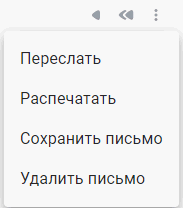

# Начало работы c приложением

Работа с приложением КриптоАРМ ГОСТ начинается со вкладки **Почта**.

Чтобы начать работать с почтой, надо добавить почтовый аккаунт. Данная функция доступна в верхнем правом углу раздела. 

После добавления в почтовом ящике доступны следующие стандартные папки:
- **Все входящие** - все входящие письма добавленных почтовых аккаунтов.
- **Входящие** - все входящие письма, исключая спам.
- **Отправленные** - все отправленные письма.
- **Черновики** - все сохраненные черновики писем.
- **Корзина** - все письма удаленные вручную или с помощью автоматической сортировки.
- **Спам**.

Если у вас в почтовом аккаунте есть внутренние папки с письмами, то они тоже отображаются с писке.

Вы можете:
-  создать новое сообщение;
-  **Открыть** выделенное в списке письмо для просмотра в отдельной вкладке;
-  открыть выделенное письмо для быстрого просмотра в правой боковой панели;
-  **Удалить** выделенные письма, письма перемещаются в корзину;
-  отметить **Прочитано/Не прочитано** выделенные письма;
-  переместить **В папку** выделенные письма;
-  обновить список писем по кнопке ;
-  поиском найти или отфильтровать список писем по заданным критериям.

Для отдельного письма вам доступны следующие действия:  
-  ответить;
-  ответить всем - если письмо было направлено нескольким адресатам;
-  переслать;
-  распечатать;
-  сохранить письмо;
-  удалить письмо;
-  проверить подпись - для подписанных электронной подписью писем;
-  расшифровать - для зашифрованных писем.
    

В верхнем правом углу раздела доступен выбор почтового аккаунта. 

Через основное меню приложения осуществляется переход на вкладки:

- **Почта** - предназначена для управления почтовыми сообщениями.
- **Документы** - осуществляется переход к мастерам операций и работа с архивными копиями документов.
- **Контакты** - используется для ведения списка контактов, в адрес которых имеется возможность шифровать документы.
- **Настройки** - содержит информацию о приложении, журнал событий и управление сертификатами. 

 **ИНСТРУКЦИИ ПО ТЕМЕ:**  
1. [Как добавить почтовый аккаунт.](https://docs.cryptoarm.ru/06-v3.2-Beta/003-mail/add-account)  
2. [Как открыть письмо.](https://docs.cryptoarm.ru/06-v3.2-Beta/003-mail/view-mail)  
3. [Как удалять и восстанавливать удаленные письма.](https://docs.cryptoarm.ru/06-v3.2-Beta/003-mail/delete-mail)  
4. [Действия с электронными письмами.](https://docs.cryptoarm.ru/06-v3.2-Beta/003-mail/answer-mail)  