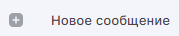
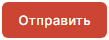
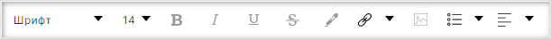
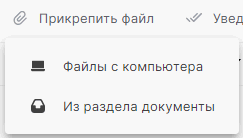
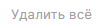

# Как написать и отправить письмо
 
1. Перейдите в раздел **Почта**.  
2. Подключите почтовый аккаунт, если он не был подключен.  
3. На левой боковой панели нажмите кнопку . 
    Форма создания сообщения открывается в новой вкладке.  
4. Укажите тему.   
5. Выберите получателей ("Кому", "Копия" или "Скрытая копия").   
    В поле установите курсор или начните вводить первые буквы имени/фамилии/адреса электронной почты. Открывается выпадающий список с контактами. Если подходящих контактов нет в списке, нажмите **Показать все контакты**.  Открывается  правая боковая панель со списком всех контактов, имеющих e-mail. Выберите контакт, нажав на него.  
    Адреса получателей вводятся через запятую или точку с запятой. 
6. Заполните содержимое письма.
7. Для отправки сообщения нажмите  кнопку . 
   
# Как оформить сообщение

Для оформления сообщения вы можете воспользоваться инструментами: 
- выбор стиля шрифта, 
- размер шрифта,
- выделение текста курсивом, жирным, подчеркнутым, зачеркнутым,
- изменение цвета шрифта текста, фона,
- формирование ссылки в тексте;
- добавление изображения в тело письма,
- маркированный список и отступы,
- выравнивание шрифта (слева, справа, посередине).
  
.

# Как работать с вложениями

Вы можете прикрепить один или несколько файлов с локального диска или выбрать из раздела документы.

Для добавления вложений нажмите кнопку  и в выпадающем списке выберите место расположения вложения.  
**Файлы с компьютера** - добавляет любые файлы с локального диска. **Из раздела документы**  - позволяет выбрать файлы с локального диска из папки **Документы**.  

Добавить файлы можно, перетащив их в область создания сообщения. Если перетащить папку с документами, то файлы добавляются списком.  

Для удаления ошибочно добавленного вложения нажмите кнопку  **Удалить** . Или для удаления всех вложений нажмите **Удалить все** .

Для просмотра содержимого добавленного документа нажмите на него, он открывается в приложении, ассоциируемом с расширением документа.

# Сохранение черновика

Все изменения в новом сообщении автоматически сохраняются каждые 10 секунд в виде черновика.  

# Выбор подписи письма

Вы можете создать подпись, которая будет автоматически подставляться в новое письмо, а также при ответе или пересылке.  

Подписи создаются в настройках почты.

По умолчанию в приложении задана дефолтная подпись с текстовкой **Отправлено из КриптоАРМ ГОСТ 3** и ссылкой на магазин cryptoarm.ru.

Если у вас одна подпись, то она автоматически добавляется при создании сообщения.
Если у вас несколько подписей, то на форме нового письма вам доступна возможность выбора подписи с помощью кнопки . Открывается список с подписями.

 При выборе **Настроить подписи** открывается новая вкладка с настройками почты, где вы можете редактировать подписи.

Если при отправке письма возникает ошибка, она выводится как уведомление в правом верхнем углу. Вы можете посмотреть уведомления, нажав на иконку . Для просмотра подробного описания ошибки или отправки в техническую поддержку нажмите  в правой боковой панели списка уведомлений.

**ВОЗМОЖНЫЕ УВЕДОМЛЕНИЯ:**   

1. Укажите получателей письма в полях Кому, Копия или Скрытая копия  - проверьте заполнение указанных полей. 
2. Адреса user@aa не распознаны. Проверьте правильность ввода адресов - проверьте электронные адреса получателей на корректность.
3. Не удалось отправить сообщение - проверьте подключение к Интернету.
4. Ошибка при отправке - проверьте, включены ли уведомления о доставке/прочтении письма и все ли почтовые сервера получателей поддерживают автоматические уведомления о доставке.
5. Ошибка соединения - проверьте настройки сервера исходящей почты.

**ИНСТРУКЦИИ ПО ТЕМЕ:**  
1. [Как добавить почтовый аккаунт.](https://docs.cryptoarm.ru/06-v3.2-Beta/003-mail/add-account)  
2. [Как отправить подписанное и зашифрованное сообщение.](https://docs.cryptoarm.ru/06-v3.2-Beta/003-mail/send-sign-mail)    
3. [Как настроить отправку писем с уведомлениями о доставке и прочтении.](https://docs.cryptoarm.ru/06-v3.2-Beta/003-mail/send-mail-notify)  
5. [Как редактировать настройки почты.](https://docs.cryptoarm.ru/06-v3.2-Beta/003-mail/edit-account)  
6. [Группировка сообщений в цепочки.](https://docs.cryptoarm.ru/06-v3.2-Beta/003-mail/chain-mail)  
7. [Как посмотреть уведомления.](https://docs.cryptoarm.ru/06-v3.2-Beta/007-cryptoarm/notifications)  

