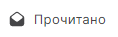

Чтобы не забыть прочитать сообщение позже, отметьте его как непрочитанное. Либо наоборот, если письмо не требует вашего внимания, отметьте его как прочитанное.

# Как отметить письмо как прочитанное или непрочитанное  

1. Перейдите в раздел **Почта**.
2. Выделите письмо в списке нажатием курсора.
3. В верхней панели нажмите кнопку **Прочитано** или **Не прочитано** .

# Как отметить выделенные письма как прочитанные  

1. Перейдите в раздел **Почта**.
2. Выберите письма, установив флаг для каждого письма, или выделите все письма, установив флаг в  левом верхнем углу списка.
3. На верхней панели нажмите .

