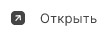

Документ для просмотра открывается в программе, которая ассоциирована с его расширением.
Для подписанных или зашифрованных документов открывается оригинал. 

**ВАЖНО!**  Чтобы просматривать подписанные и зашифрованные документы, у вас на рабочем месте должен быть установлен криптопровайдер КриптоПро CSP.
При открытии зашифрованного документа происходит расшифрование, поэтому в хранилище личных сертификатов должен быть сертификат с закрытым ключом, в адрес которого производилось шифрование.

Открыть документ вы можете в разделе **Документы**, в мастере прямых или обратных операций.

1. Перейдите в раздел **Документы**.
2. Выделите документ в списке.
3. Нажмите на кнопку .  

Если при открытии документа возникла ошибка, она выводится как уведомление в правом верхнем углу. Вы можете ее посмотреть, нажав на иконку .  
Для просмотра подробного описания ошибки или отправки в техническую поддержку нажмите  в правой боковой панели списка уведомлений. 

**ВОЗМОЖНЫЕ УВЕДОМЛЕНИЯ:**

**Нельзя снять откреплённую подпись с файла** - данное сообщение возникает, если при отделенной подписи не найден исходный документ. Скопируйте исходный документ в папку с файлом подписи. В таком случае необходимо, чтобы названия исходного файла и файла подписи совпадали.  
**Не удалось найти исходный файл для подписи** - данное сообщение возникает, если при отделенной подписи не найден исходный документ. На правой боковой панели нажмите **Указать путь к файлу** для выбора исходного документа. Или скопируйте исходный документ в папку с файлом подписи. В таком случае необходимо, чтобы названия исходного файла и файла подписи совпадали. 
**Не удалось расшифровать файл** - данное сообщение возникает, если при просмотре документа не найден сертификат расшифрования.   

**ИНСТРУКЦИИ ПО ТЕМЕ:**  
1. [Как посмотреть информацию о документе.](https://docs.cryptoarm.ru/06-v3.2-Beta/004-documents/view-docs-info)  
2. [Как посмотреть уведомления.](https://docs.cryptoarm.ru/06-v3.2-Beta/007-cryptoarm/notifications)  
