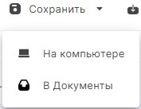

Для снятия подписи достаточно выбрать файлы расширением .sig, которые содержат электронную подпись. Никаких дополнительных настроек производить не нужно.

1. Перейдите в раздел **Документы**.
2. Выберите в списке файлы, подпись с которых нужно снять, или ничего не выбирайте, если хотите добавить файлы из системы.
3. Перейдите в мастер **Проверка и расшифрование** через левое боковое меню  или с помощью кнопки .
4. При необходимости? добавьте документы в список.
5. Нажмите кнопку . 

На вкладке **Проверка и расшифрование** отображаются ход и результаты выполнения операции.

При успешном снятии подписи полученные оригиналы документов сохраняются во временной папке и удаляются после выполнения другой операции. Вы можете сохранить полученные документы в специальный каталог, выбрав кнопку .

Если с каких-то документов не удалось снять подпись, то операция считается выполненной с ошибками. Вы можете посмотреть с каких документов подпись снята успешно, а с каких - с ошибками. 
Ошибки при операции выводятся как уведомления. Вы можете их посмотреть, нажав на иконку . Для просмотра подробного описания ошибки или отправки в техническую поддержку нажмите  в правой боковой панели списка уведомлений.

**ВОЗМОЖНЫЕ УВЕДОМЛЕНИЯ:**

1. Нельзя снять откреплённую подпись с файла - при открепленной подписи оригинал документа и так находится в отдельном файле.
2. Не удалось открыть файл - добавленные в мастер документы были удалены или по какой-то причине доступны.

**ИНСТРУКЦИИ ПО ТЕМЕ:**  

1. [Как добавить документы в мастер.](https://docs.cryptoarm.ru/06-v3.2-Beta/004-documents/add-docs)  
2.  [Как посмотреть уведомления.](https://docs.cryptoarm.ru/06-v3.2-Beta/007-cryptoarm/notifications)  
3. [Действия с результатами операций.](https://docs.cryptoarm.ru/06-v3.2-Beta/004-documents/operations-result)  
