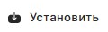
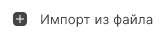

Если у вас сертификат на токене, флешке или в локальном хранилище устройства, то воспользуйтесь инструкцией по установке сертификата из ключевого контейнера.

Если у вас сертификат и закрытый ключ находятся в контейнере pfx, то воспользуйтесь инструкцией по установке сертификата из файла .pfx.

Если у вас есть сгенерированный закрытый ключ, и вы получили сертификат в Удостоверяющем центре, то для установки сертификата воспольльзуйтесь инструкцией по установке сертификата с привызкой к ключевому контейнеру.

Перед импортом личного сертификата убедитесь, что у вас установлен СКЗИ «КриптоПро CSP».

***Важно!*** Для того, чтобы сертификат был действительный, у вас должны быть установлены корневые сертификаты УЦ и актуальный список отзыва сертификатов (СОС).

# Как установить сертификат из ключевого контейнера

***Внимание!*** Возможно, понадобится установка драйверов для токена.

1. Подключите токен к устройству.
2. Выберите в **Меню** раздел **Сертификаты**.
3. Откройте правую боковую панель, нажав на активное хранилище в правом верхнем углу .
4. Выберите  пункт **Подключить из ключевого контейнера**.
5. В списке выделите контейнер. Чтобы посмотреть сертификат в контейнере нажмите на иконку просмотра .
6. Нажмите .

Сертификат установлен в личное хранилище и отображается в списке. Теперь вы можете подписывать и расшифровывать документы этим сертификатом.

# Как установить сертификат с закрытым ключом из файла .pfx

1. Выберите в **Меню** раздел **Сертификаты**.
2. Нажмите .
3. В файловом менеджере выберите файл сертификата .pfx.
4. Введите пароль к контейнеру pfx.
5. Задайте новый пароль к ключевому контейнеру.

Сертификат установлен в личное хранилище и отображается в списке. Теперь вы можете подписывать и расшифровывать документы этим сертификатом.

# Как установить сертификат с  привязкой к ключевому контейнеру

1. Выберите в **Меню** раздел **Сертификаты**.
2. Нажмите .
3. В файловом менеджере выберите файл сертификата .cer или .crt.
4. Введите пароль к ключевому контейнеру, если требуется.

Сертификат установлен в личное хранилище и отображается в списке. Теперь вы можете подписывать и расшифровывать документы этим сертификатом.

Если при импорте возникает ошибка, она выводится как уведомление в правом верхнем углу. Вы можете посмотерть уведомления, нажав на иконку . Для просмотра подробного описания ошибки или отправки в техническую поддержку нажмите  в правой боковой панели списка уведомлений.

**ИНСТРУКЦИИ ПО ТЕМЕ:**  

1. [Как установить корневой и промежуточный сертификаты.](https://docs.cryptoarm.ru/05-v3.0-Beta/005-certs/import-UC-certs)  
2. [Как импортировать список отзыва сертификатов (СОС).](https://docs.cryptoarm.ru/05-v3.0-Beta/005-certs/import-crl)  
3. [Как посмотреть уведомления.](https://docs.cryptoarm.ru/05-v3.0-Beta/007-cryptoarm/notifications)  