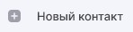

Вы можете создавать контакты для хранения имен, адресов электронной почты, номеров телефонов и других данных. При вводе получателя нового письма этот контакт появиться в списке для выбора.

Вы можете привязать сертификат к контакту для шифрования писем в его адрес.

# Создание контакта из раздела контактов

1. Перейдите в раздел **Контакты**.
2. Нажмите кнопку .
3. Заполните поля.
4. Нажмите .

# Создание контакта из раздела сертификатов

1. Перейдите в раздел **Настройки**, вкладка **Сертификаты**.
2. Выберите категорию **Другие пользователи**.
3. Выделите сертификат в списке.
4. На верхней панели действий нажмите кнопку .
   Форма создания контакта открывается в новой вкладке. Данные контакта заполнены доступными данными из сертификата.
5. Заполните необходимые поля.
6. Нажмите кнопку .

При успешном выполнении операции созданный контакт появляется в списке контактов.

Вы можете редактировать и удалять контакты.

# Описание полей формы добавления контакта
Поля сгруппированы по вкладкам **Данные контакта** и **Сертификат**.

Поля раздела **Данные контакта**:
- ФИО
- Название организации, отдел, должность
- Городской номер телефона, мобильный номер телефона, электронная почта.
- Дополнительная информация: день рождения, адрес, примечание.
Кнопка **Добавить**  добавляет дополнительное поле. Доступна для полей: городской номер телефона, мобильный номер телефона, адрес электронной почты и адрес. 

В разделе **Сертификат**  отображается список привязанных к контакту сертификатов.

**ИНСТРУКЦИИ ПО ТЕМЕ:**  
1. [Как привязать сертификат к контакту.](https://docs.cryptoarm.ru/06-v3.2-Beta/006-contacts/link-contact-cert)  
2. [Как удалять локальные контакты.](https://docs.cryptoarm.ru/06-v3.2-Beta/006-contacts/delete-contact)  
3. [Как редактировать локальные контакты.](https://docs.cryptoarm.ru/06-v3.2-Beta/006-contacts/edit-contact)  
4. [Как добавить адресную книгу LDAP.](https://docs.cryptoarm.ru/06-v3.2-Beta/006-contacts/add-ldap)  
