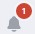

Вы можете подключить несколько адресных книг LDAP для работы с контактами.

1. Перейдите в раздел **Контакты**.
2. Откройте правую боковую панель, нажав в правом верхнем углу на выбранную адресную книгу .
3. Выберите **Добавить подключение LDAP**.
4. Заполните поля.
5. Нажмите .  
6. 
При успешном подключении в список **Все контакты** добавляются контакты адресной книги LDAP.  

При выборе активной адресной книги LDAP в левом боковом меню отображаются папки LDAP.

# Описание полей формы подключения адресной книги 
- Название каталога LDAP - произвольное название для адресной книги.
- Сведения сервера - имя сервера и порт.
- Данные для входа в систему - имя пользователя и пароль.
- База поиска - по умолчанию или другая.
- Параметры сервера - время ожидания, не возвращать более чем и фильтр поиска.
- Параметры синхронизации - частота обновления каталога.
   
Если при подключении адресной книги возникает ошибка, она выводится как уведомление в правом верхнем углу. Вы можете посмотреть уведомления, нажав на иконку . Для просмотра подробного описания ошибки или отправки в техническую поддержку нажмите  в правой боковой панели списка уведомлений.

**ВОЗМОЖНЫЕ УВЕДОМЛЕНИЯ:**  
1. Не удалось подключиться к LDAP - проверьте правильность заполнения полей имя сервера и порт. Проверьте имя пользователя и пароль.

**ИНСТРУКЦИИ ПО ТЕМЕ:**  
1. [Как переключаться между адресными книгами.](https://docs.cryptoarm.ru/05-v3.2-Beta/006-contacts/select-books)  
2. [Как редактировать адресную книгу LDAP.](https://docs.cryptoarm.ru/05-v3.2-Beta/006-contacts/edit-ldap)  
3. [Как удалить адресную книгу LDAP.](https://docs.cryptoarm.ru/05-v3.2-Beta/006-contacts/delete-ldap)  
4. [Как посмотреть информацию о контакте.](https://docs.cryptoarm.ru/05-v3.2-Beta/006-contacts/view-contact)  
5. [Как посмотреть уведомления.](https://docs.cryptoarm.ru/05-v3.2-Beta/007-cryptoarm/notifications)  