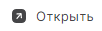

# Быстрый просмотр

1. Перейдите в раздел **Контакты**.
2. Выделите контакт в списке нажатием курсора.
3. Нажмите кнопку **Просмотреть** .

Область просмотра контакта отображается на боковой панели справа.

# Просмотр в новой вкладке  

1. Перейдите в раздел **Контакты**.
2. Выделите контакт в списке нажатием курсора.
3. На верхней панели нажмите кнопку .  

Информация о контакте открывается для просмотра в новой вкладке. 
Вы можете написать письмо контакту и удалить контакт.   

**ИНСТРУКЦИИ ПО ТЕМЕ:**  
1. [Как редактировать локальный контакт.](https://docs.cryptoarm.ru/06-v3.2-Beta/006-contacts/edit-contact)  
2. [Как переключаться между адресными книгами.](https://docs.cryptoarm.ru/06-v3.2-Beta/006-contacts/select-books)  

