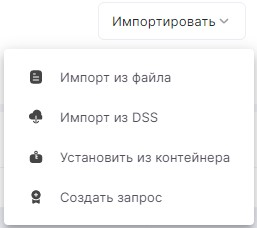

Перейти на вкладку **Сертификаты** вы можете в разделе **Настройки** основного меню.

Для сертификатов доступны следующие категории:
- **Личные** - содержит ваши личные сертификаты с привязкой к закрытому ключу;
- **Других пользователей** - содержит все сертификаты других пользователей и контактов, предназначены для шифрования в адрес этих сертификатов; 
- **Удостоверяющие центры** - содержит доверенные корневые и промежуточные сертификаты;
- **Списки отзыва**; 
- **Запросы** - содержит созданные пользователем запросы на сертификат;
- **Ключи** - содержит список доступных ключевых контейнеров, расположенных в системе и на отчуждаемых носителях.

Обновление списка сертификатов происходит по нажатию иконки **Обновить** .

На верхней панели вы можете выбрать действия с сертификатом, которые зависят от выбранной категории.

Кнопка **Импортировать** в правой части окна содержит действия для установки сертификата и дублирует некоторые кнопки панели действий.

# Действия с Личными сертификатами

Для личных сертификатов вы можете выполнить следующие действия:
- **Создать запрос** - для генерации запроса на сертификат или самоподписанного сертификата;
- **Импортировать** - содержит меню дополнительных действий:
  - **Импорт из файла** - для установки сертификата из файла;
  - **Импорт из DSS** - для установки облачных сертификатов;
  - **Установить из контейнера** - для установки их ключевого контейнера.
- **Экспортировать** - для экспорта сертификата в файл;
- **Удалить** - для удаления сертификата;
- **Привязать к аккаунту** - для добавление личного сертификата в настройки почтового аккаунта для отправки подписанных писем;
- **Создать профиль подписи** - позволяет создать профиль подписи, в котором в настройках будет выбрана операция подписи и сертификат подписи;
- просмотреть сведения о сертификате в правой боковой панели.

# Действия с сертификатами Других пользователей

Для сертификатов других пользователей вы можете выполнить следующие действия:
- **Импорт из файла** - для установки сертификата из файла;
- **Экспортировать** - для экспорта сертификата в файл;
- **Привязать к контакту** - позволяет добавлять сертификат к контакту для шифрования почтовых сообщений, отправляемых в адрес контакта;
- **Создать контакт** - для создания контакта, у которого будет привязан выбранный сертификат;
- **Удалить** - для удаления сертификата;
- просмотреть сведения о сертификате в правой боковой панели. 

# Действия с сертификатами Удостоверяющих центров

Для сертификатов удостоверяющих центров вы можете выполнить следующие действия:
- **Импорт из файла** - для установки сертификата из файла;
- **Экспортировать** - для экспорта сертификата в файл;
- **Удалить** - для удаления сертификата;
- просмотреть сведения о сертификате в правой боковой панели.

# Действия со списками отзыва сертификатов (СОС)

Для списков отзыва сертификатов вы можете выполнить следующие действия:
- **Импорт из файла** - для установки СОС из файла;
- **Экспортировать** - для экспорта СОС в файл;
- **Удалить** - для удаления СОС;
- просмотреть сведения о списке отзыва в правой боковой панели.

# Действия с запросами на сертификат

Для запросов на сертификат вы можете выполнить следующие действия:
- **Создать запрос** - для генерации запроса на сертификат или самоподписанного сертификата;
- **Показать в папке** - открывается файловый менеджер с расположением файла запроса;
- **Отправить** - для отправки файла запроса в новом почтовом сообщении;
- **Экспортировать** - для экспорта запроса в файл. Запрос экспортируется как сертификат;
- **Удалить** - для удаления запроса;
- просмотреть сведения о запросе в правой боковой панели.

# Действия с ключами

Для ключевых контейнеров вы можете выполнить следующие действия:
- **Установить** - для установки сертификата из контейнера в категорию Личных 
- **Удалить** - для удаления контейнера ( ***Удаленный контейнер восстановлению не подлежит!*** );
- просмотреть сведения о сертификате в контейнере в правой боковой панели.

# Действия при просмотре информации о сертификате

При просмотре сведений о сертификате или запросе в правой боковой панели доступны действия:
- **Печать** - для печати информации о сертификате.
- **Протестировать** - для тестирования контейнера закрытого ключа. Данная функция доступна только для сертификатов или запросов, у которых есть привязка к закрытому ключу.
- **Обновить** - для обновления информации о сертификате.
  

**ИНСТРУКЦИИ ПО ТЕМЕ:**   
1. [Как установить личный сертификат.](https://docs.cryptoarm.ru/06-v3.2-Beta/008-certs/import-my-cert)  
2. [Как установить сертификат из DSS.](https://docs.cryptoarm.ru/06-v3.2-Beta/008-certs/add-dss)  
3. [Как создать запрос на сертификат.](https://docs.cryptoarm.ru/06-v3.2-Beta/008-certs/request)  
4. [Как установить корневой и промежуточный сертификаты.](https://docs.cryptoarm.ru/06-v3.2-Beta/008-certs/import-UC-certs)  
5. [Как работать с ключевыми контейнерами.](https://docs.cryptoarm.ru/06-v3.2-Beta/008-certs/container)  
