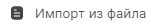

Список отзыва сертификатов (СОС/CRL) – документ с электронной подписью уполномоченного лица Удостоверяющего центра, включающий в себя список серийных номеров сертификатов, которые на определенный момент времени были отозваны или действие которых было временно приостановлено.

1. Выберите раздел **Настройки**, вкладка **Сертификаты**.
2. Выберите подраздел **Списки отзыва**.
3. На панели действий нажмите кнопку .
4. В файловом менеджере выберите файл списка отзыва (файл с расширением .crl).

При успешном импорте СОС отображается в разделе **Списки отзыва**.

Если при импорте возникает ошибка, она выводится как уведомление в правом верхнем углу. Вы можете посмотреть уведомления, нажав на иконку . Для просмотра подробного описания ошибки или отправки в техническую поддержку нажмите  в правой боковой панели списка уведомлений.

Чтобы список отзыва был действительный, нужно в раздел **Удостоверяющие центры** установить сертификат, выпустивший СОС.

**ИНСТРУКЦИИ ПО ТЕМЕ:**   
1. [Как установить корневой и промежуточный сертификаты.](https://docs.cryptoarm.ru/06-v3.2-Beta/008-certs/import-UC-certs)  
2. [Как посмотреть уведомления.](https://docs.cryptoarm.ru/06-v3.2-Beta/007-cryptoarm/notifications)  
