Установка приложения КриптоАРМ ГОСТ Почта на операционную систему Linux может быть выполнена в графическом режиме (через мастер установки пакетов), через терминал в режиме командной строки и обычной распаковкой из архива.

По умолчанию приложение устанавливается в каталог /opt/cryptoarm_gost_3/.

**В режиме графической установки** запустите на исполнение файл:

-  **cryptoarm-gost-vx.x.x-x64.rpm** (где x.x.x – номер версии) для 64-разрядных ОС, основанных на RPM;
   
-  **cryptoarm-gost-vx.x.x-x64.deb** (где x.x.x – номер версии) для 64-разрядных ОС, основанных на DEB.

Откроется пакетный менеджер, в котором нужно нажать **Установить**. Так как установка производится от имени администратора системы, то появится диалог ввода пароля администратора системы (Root).

**С помощью командной строки** нужно запустить терминал и ввести команду:

- **sudo dpkg -i cryptoarm-gost-vx.x.x-x64.deb** - для ОС, основанных на Debian (Debian/Ubuntu);

- **sudo rpm -i cryptoarm-gost-vx.x.x-x64.rpm** - для ОС, основанных на RPM;

После установки приложения в меню появится ярлык КриптоАРМ ГОСТ Почта. 

## Установка КриптоАРМ ГОСТ Почта на операционную систему Astra Linux
### Графическая установка
1. На скачанный установочный файл дважды нажать левой кнопкой мыши. Откроется окно **Установка пакетов**, в котором нужно нажать **Установить пакет**.
    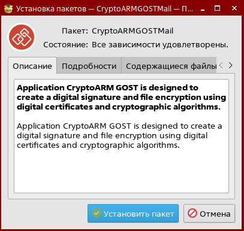
2. **Ввести** пароль системного администратора root. Начнётся установка пакетов.
    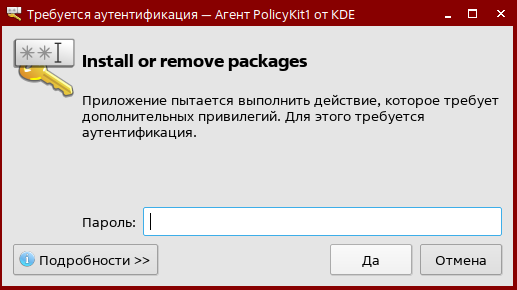
  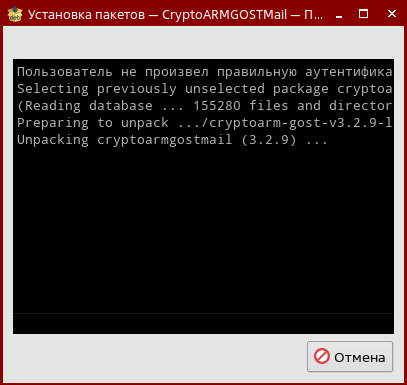
3. После успешной установки программы на операционную систему нажать на **Закрыть**.
   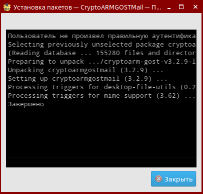
4. После установки приложения в меню появится ярлык КриптоАРМ ГОСТ.

### Установка через терминал

1. Для установки с помощью командной строки нужно запустить терминал и ввести команду: 
**sudo dpkb -i <путь\_к\_файлу/название_файла.deb>**

*Указать путь к установочному файлу и его название вручную или перетащить его в поле терминала.*
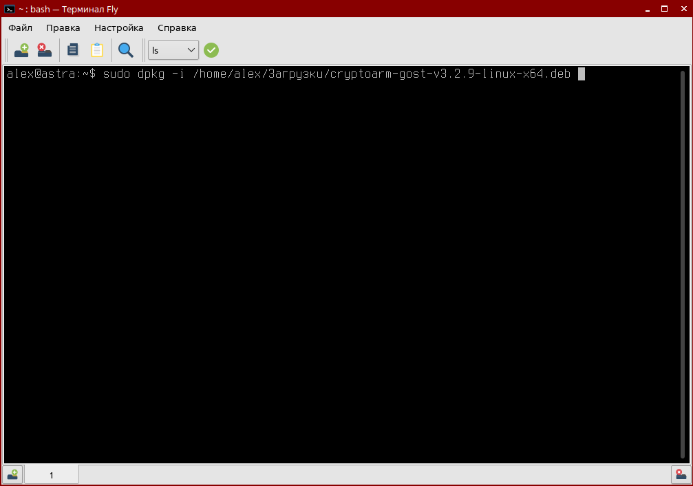
2. Нажать Enter. Начинается распаковка и установка.
  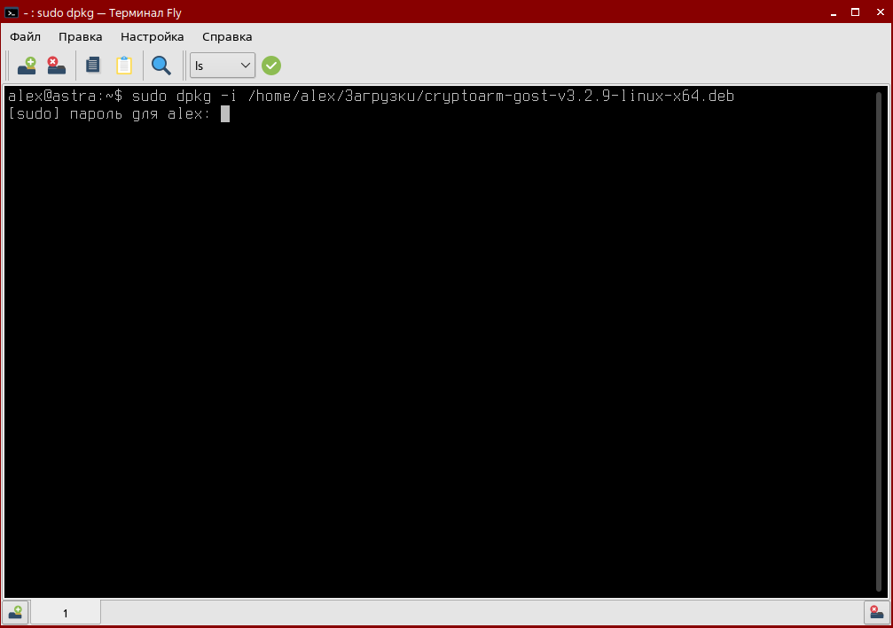 
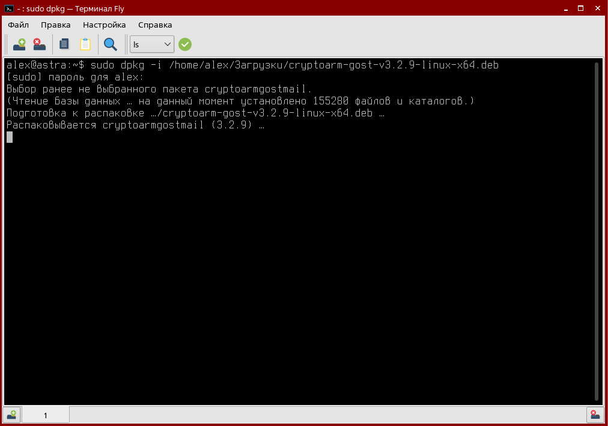
3. После установки приложения в меню появится ярлык КриптоАРМ ГОСТ.

## Установка КриптоАРМ ГОСТ Почта на операционную систему Ubuntu

***Важно!*** Для Ubuntu 20 требуется установить дополнительно:  
sudo apt install libtidy-dev  
sudo apt install libctemplate-dev  
### Графическая установка
1. На скачанный установочный файл дважды нажать левой кнопкой мыши. В открывшемся окне нажать на **Установить**.
  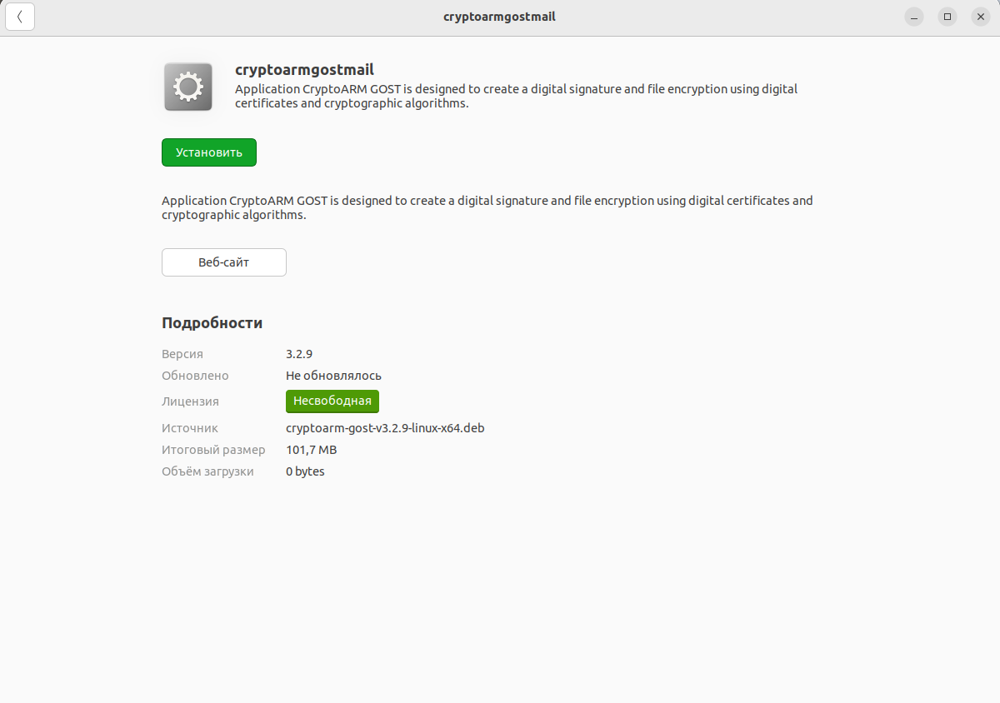
2. Ввести пароль системного администратора root и нажать **Подтвердить**. Начнётся установка.
  
  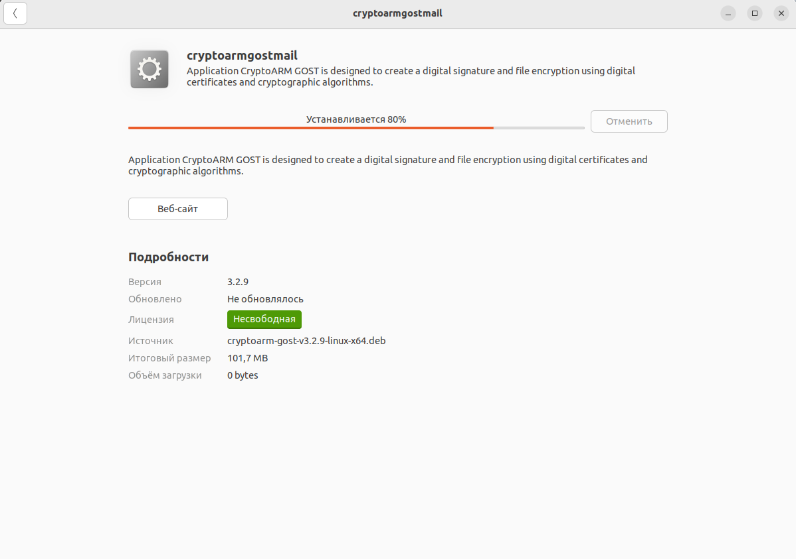
3. Закрыть окно.
  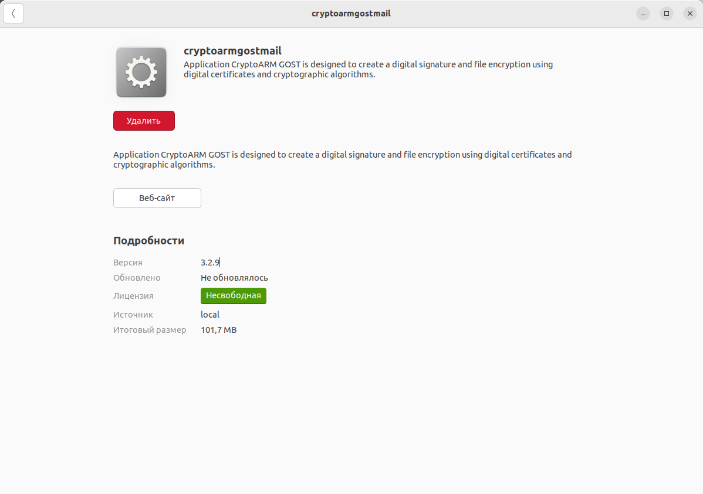
4. После установки приложения в меню появится ярлык КриптоАРМ ГОСТ Почта.
  

### Установка через терминал

1. Для установки с помощью командной строки нужно запустить терминал и ввести команду: 
**sudo dpkb -i <путь\_к\_файлу/название_файла.deb>**

*Указать путь к установочному файлу и его название вручную или перетащить его в поле терминала.*
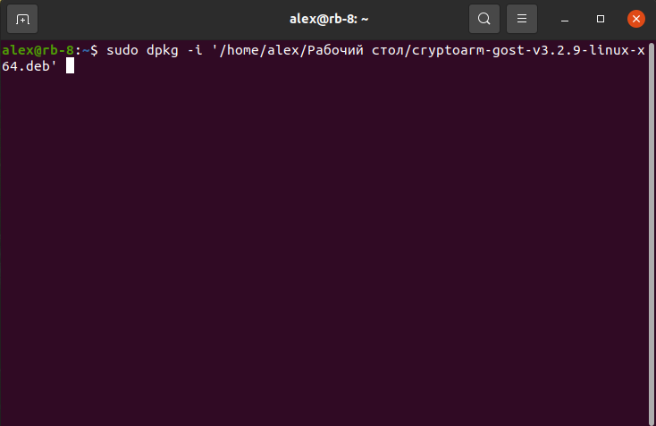
2. **Ввести** пароль системного администратора root и нажать **Enter**. Начнётся установка пакетов.  
   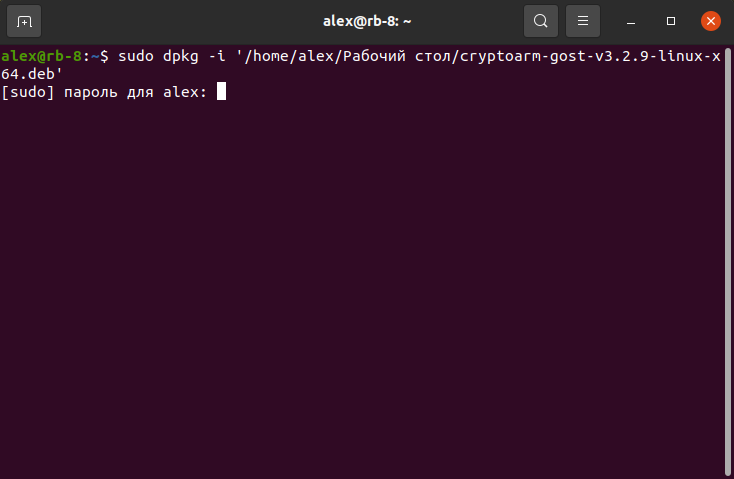
3. После установки приложения в меню появится ярлык КриптоАРМ ГОСТ Почта.
   

