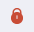

# Как отвечать на письма  и пересылать их

1. Перейдите в раздел **Почта**.
2. Откройте письмо.
3. В правом верхнем углу нажмите на кнопку **Ответить** или **Ответить всем**.  

Чтобы переслать письмо в правом верхнем углу нажмите на значок  **Ещё**  и выберите действие **Переслать**.

Форма письма открывается в новой вкладке.  

# Как просмотреть участников переписки

При чтении письма отображается информация с именем отправителя.  
Участники переписки отображаются в поле **Кому**: 
- если письмо пришло только вам, то отображается ваш e-mail адрес;
- если письмо пришло вам и кому-то еще, то для просмотра участников переписки нажмите кнопку **Еще**. 
 
Для того чтобы скрыть список получателей, нажмите на кнопку **Скрыть**.

В поле CC отображаются все получатели поля Скрытая копия. 

# Как работать с вложениями во входящих письмах

Если в письме есть вложение, то в списке писем оно отображается в виде значка **Скрепка**.  

1. Перейдите в раздел **Почта**.
2. Откройте письмо с вложениями.   

Вы можете:
- Скачать все вложения одним архивом с помощью кнопки **Скачать все**.  
- Открыть все вложения в одном из мастеров с помощью выпадающего меню **Открыть в**.

Вы можете посмотреть содержимое вложения, кликнув на него мышью. Документ открывается в программе по умолчанию. Если документ подписан электронной подписью и/или зашифрован, то открывается мастер обратных операций.  

Открыв дополнительное меню, вы можете скачать вложение и открыть в мастерах.  

# Просмотр подписанных электронной подписью писем  

**ВАЖНО!**  Чтобы просматривать подписанные электронной подписью почтовые сообщения, у вас на рабочем месте должен быть установлен криптопровайдер КриптоПро CSP.

Входящие письма, подписанные электронной подписью, отмечены иконкой:

- , если сертификат подписи действительный;
- , если сертификат недействительный.

Чтобы просмотреть детальную информацию о подписи сообщения и сертификате, наведите на иконку указатель мыши. Информация открывается во всплывающем окне. 

Для недействительной подписи возможны причины:
- Срок действия сертификата истек — в таком случае подпись будет недействительной, такую ситуацию невозможно исправить, только попросить отправителя подписать письмо действительным сертификатом и отправить снова;  
- Письмо было изменено с момента подписи — такую ситуацию невозможно исправить, только попросить отправителя подписать письмо снова и переслать;   
- Нет доверия к сертификату подписи. Не установлен корневой сертификат — вы можете импортировать корневой сертификат для сертификата отправителя; 
- Нет полного доверия к сертификату. Не удалось найти актуальный список отзыва — вы можете  импортировать список отзыва сертификатов для сертификата отправителя.
  
Вы можете обновить информацию о проверке подписи, если на форме просмотра письма в меню **Еще** выберите действие **Проверить подпись**.

# Просмотр зашифрованных писем  

**ВАЖНО!**  Чтобы просматривать зашифрованные почтовые сообщения, у вас на рабочем месте должен быть установлен криптопровайдер КриптоПро CSP.  

Чтобы расшифровать письмо, нужно чтобы в Личном хранилище сертификатов у вас был установлен сертификат с закрытым ключом, которым будет осуществляться расшифрование. 

Письма, зашифрованные отправителем, отмечены иконкой:

- , если письмо расшифровано;
- , если зашифровано, но невозможно расшифровать.

При наведении на иконку указателя мыши всплывает информация, что письмо зашифровано. 

При открытии зашифрованного письма оно расшифровывается автоматически, если найден сертификат расшифрования и введен пароль к закрытому ключу.

Вы можете повторить расшифрование, если на форме просмотра письма в меню **Еще** выберите действие **Расшифровать** во всплывающем списке, которое отображается для зашифрованных писем.    

# Просмотр подписанных и зашифрованных писем  

**ВАЖНО!**  Чтобы просматривать подписанные и зашифрованные почтовые сообщения, у вас на рабочем месте должен быть установлен криптопровайдер КриптоПро CSP.  

Чтобы расшифровать письмо, нужно чтобы в Личном хранилище сертификатов у вас был установлен сертификат с закрытым ключом, которым будет осуществляться расшифрование.  

Письма, подписанные и зашифрованные отправителем, отмечены иконкой:

- , если письмо расшифровано;
- , если зашифровано, но невозможно расшифровать.

При наведении на иконку указателя мыши всплывает информация, что письмо зашифровано. 

При открытии зашифрованного письма оно расшифровывается автоматически, если найден сертификат расшифрования и введен пароль к закрытому ключу.

При наведении на иконку расшифрованного и подписанного письма отображается информация о подписи.

# Как скачать письмо на компьютер
​
Письма можно скачивать на компьютер. Скачанное письмо можно прикрепить в виде файла к другому письму и отправить.

1. Перейдите в раздел **Почта**.
2. Откройте письмо.
3. Нажмите на значок **Еще** и выберите действие **Сохранить письмо** во всплывающем списке.

Письмо скачивается в формате EML.

# Как распечатать письмо 

1. Перейдите в раздел **Почта**.
2. Откройте письмо.
3. Нажмите на значок **Еще** и выберите действие **Распечатать** во всплывающем списке.  

# Просмотр цепочек писем 

Если вы ведете активную переписку, включите группировку писем в цепочки.    

В списке у таких писем отображается индикатор количества писем в цепочке.  

Чтобы посмотреть любое письмо из цепочки, нажмите на строку с этим письмом в области просмотра письма.   

Вы можете **Переслать все**, **Раскрыть все** письма цепочки (раскрывает или скрывает все письма в цепочке), **Распечатать**, выбрав в строке с темой действие  .   

**ИНСТРУКЦИИ ПО ТЕМЕ:**  
1. [Как открыть письмо.](https://docs.cryptoarm.ru/06-v3.2/003-mail/04-view-mail)  
2. [Как отправлять электронные письма.](https://docs.cryptoarm.ru/06-v3.2/003-mail/03-send-mail)  
3. [Как расшифровать документ.](https://docs.cryptoarm.ru/06-v3.2/004-documents/17-decrypt)   
4. [Как снять подпись с документа.](https://docs.cryptoarm.ru/06-v3.2/004-documents/20-remove-sign)   
5. [Как проверить подпись документа.](https://docs.cryptoarm.ru/06-v3.2/004-documents/18-verify)   
6. [Как установить корневой и промежуточный сертификаты.](https://docs.cryptoarm.ru/06-v3.2/008-certs/05-import-UC-certs)  
7. [Как импортировать список отзыва сертификатов (СОС).](https://docs.cryptoarm.ru/06-v3.2/008-certs/07-import-crl)  
8. [Как установить личный сертификат.](https://docs.cryptoarm.ru/06-v3.2/008-certs/01-import-my-cert)  
9. [Как удалять и восстанавливать удаленные письма.](https://docs.cryptoarm.ru/06-v3.2/003-mail/11-delete-mail)  
10. [Группировка сообщений в цепочки.](https://docs.cryptoarm.ru/06-v3.2/003-mail/09-chain-mail)  