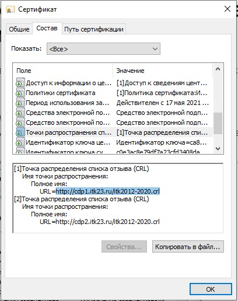

Нужно установить корневой и/или промежуточные сертификаты для сертификата подписи.  

Может понадобиться установка списка отзыва.

# Как получить корневой и промежуточный сертификаты

Обратиться в Удостоверяющий центр, который выпустил сертификат.  

Или    
1. На ОС Windows открыть сертификат на вкладке "Состав".
2. Выбрать в составе строку "Доступ к информации о центрах сертификации".
4. Скопировать ссылку для скачивания сертификата (это ссылка с окончанием crt или cer). 

5. Установить сертификат в хранилище корневых ли промежуточных сертификатов, в зависимости от того, какой сертификат был скачан.
   

# Как получить список отзыва сертификатов (СОС)

Обратиться в Удостоверяющий центр, который выпустил сертификат.  

Или    
1. На ОС Windows открыть сертификат на вкладке "Состав".
2. Выбрать в составе строку "Точка распределения списка отзыва (CRL)
".
4. Скопировать ссылку для скачивания сертификата (это ссылка с окончанием .crl). 

5. Установить сертификат в раздел списков отзыва сертификатов.
