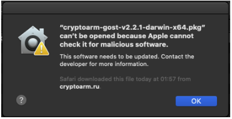

## Сертификат недействительный (иконка красная)

Нужно установить в хранилище сертификатов корневой сертификат. Если статус сертификата не изменился, то нужно импортировать все промежуточные сертификаты.

Установка сертификата описана в разделе **Импорт сертификата из файла**.

Если после установки корневого и промежуточных сертификатов статус сертификата не изменился, то нужно импортировать еще список отзыва (подробнее в разделе **Импорт СОС**).

## Подпись недействительная

Нужно установить корневой и/или промежуточные сертификаты для сертификата подписи (подробнее в разделе **Импорт сертификата из файла**).
Может понадобиться установка списка отзыва (подробнее в разделе **Импорт СОС**).

## При переустановке пакета приложения на новую версию для ОС Linux возникает конфликт

Нужно в команду установки пакета добавить флаг **--force**.

## Не загружен модуль trusted-crypto. ОС Windows

Установить "Распространяемый пакет Visual C++ для Visual Studio 2015-2019" (https://support.microsoft.com/ru-ru/topic/%D0%BF%D0%BE%D1%81%D0%BB%D0%B5%D0%B4%D0%BD%D0%B8%D0%B5-%D0%BF%D0%BE%D0%B4%D0%B4%D0%B5%D1%80%D0%B6%D0%B8%D0%B2%D0%B0%D0%B5%D0%BC%D1%8B%D0%B5-%D0%B2%D0%B5%D1%80%D1%81%D0%B8%D0%B8-visual-c-%D0%B4%D0%BB%D1%8F-%D1%81%D0%BA%D0%B0%D1%87%D0%B8%D0%B2%D0%B0%D0%BD%D0%B8%D1%8F-2647da03-1eea-4433-9aff-95f26a218cc0)

## Не запускается приложение на Ubuntu 18.04, или другой deb системе (Astra Linux)

Надо установить библиотеку libgconf-2.s:o.4

sudo apt-get install libgconf-2-4

## Не запускается КриптоАРМ ГОСТ на Windows

Возможно, одновременно стоит КрипПро CSP и Лисси. Нужно оставить только КрипПро CSP.

## Не запускается КриптоАРМ ГОСТ на Windows

Возможно, версия КрипПро CSP ниже 4.

## Если раньше работало и перестало

Лицензии действительные, ошибка типа при попытке доступа к разделам **Подписать**, **Зашифровать, Сертификаты, Контейнеры** программа зависает на статусе **Пожалуйста, подождите…**

Возможно установили (потом удалили или нет) другой криптопровайдер (например, VipNet) - будет конфликт. Нужно удалить другой криптопровайдер. Или в настройках VipNet установить флаг "Поддержка работы ViPNet CSP через Microsoft CryptoAPI"

Потом удалить файл настроек. Для этого нужно закрыть программу (**Выход** в меню или в трее), перейти в каталог пользователя в папку \.Trusted\CryptoARM GOST\ и удалить файл settings.json.

## КриптоАРМ ГОСТ 2.0 на unix системах не работает с КриптоПро 4

Признак - нет никаких сертификатов на вкладке **Сертификаты**.

Для решения проблемы надо:

1. Доустановить пакет КриптоПро cprocsp-rsa.

2. MacOS: скачать скрипт https://drive.google.com/file/d/11Ts3wshs0-Fy7mc5NACKEb1x7fEu9oAy/view?usp=sharing,
в терминале ввести команду chmod u+x <путь к скрипту>/script.sh

sudo ./script.sh

Linux: скачать скрипт (https://drive.google.com/file/d/11Ts3wshs0-Fy7mc5NACKEb1x7fEu9oAy/view?usp=sharing),
в терминале ввести команду chmod u+x <путь к скрипту>/script.sh
sudo bash ./script.sh

Или:

2. В конфигурационном файле КриптоПро (/etc/opt/cprocsp/config.ini) от администратора добавить блоки:

-   **Для Linux:**

    (этот после блока [Defaults\\Provider\\"Crypto-Pro RSA CSP"])

    [Defaults\\Provider\\"Crypto-Pro Enhanced RSA and AES CSP"]

    "Image Path" = "/opt/cprocsp/lib/amd64/librsaenh.so"

    "Function Table Name" = "CPRSA_GetFunctionTable"

    Type = 24

    (Этот после блока [Defaults\\"Provider Types"\\"Type 001"])

    [Defaults\\"Provider Types"\\"Type 024"]

    Name = "Crypto-Pro Enhanced RSA and AES CSP"

    TypeName = "RSA Full and AES"

-   **Для MacOS:**

    (этот после блока [Defaults\\Provider\\"Crypto-Pro RSA CSP"])

    [Defaults\\Provider\\"Crypto-Pro RSA CSP and AES CSP"]

    "Image Path" = "/opt/cprocsp/lib/librsaenh.dylib"

    "Function Table Name" = "CPRSA_GetFunctionTable"

    type = 24

    (Этот после блока [Defaults\\"Provider Types"\\"Type 001"])

    [Defaults\\"Provider Types"\\"Type 024"]

    Name = "Crypto-Pro RSA CSP and AES CSP"

    TypeName = "RSA Full (Signature and Key Exchange)"

    Для редактирования конфигурационного файла можно запросить скрипт в
    технической поддержке.

## Не создается запрос на сертификат на линукс при КриптоПро CSP 4 

Нужно на форме запроса на сертификат перед названием ключевого контейнера писать \\\\.\\HDIMAGE\\

Например, имя может быть таким
\\\\.\\HDIMAGE\\9f5e1bed-a31e-bc4d-a66c-7a95f943dcc7

## Не импортируются корневые, промежуточные сертификаты, СОС на линукс.

1.  **Если пользователь не в группе sudo**

    Надо его добавить в группу sudo или установить сертификаты через команды
    КриптоПро.

2.  **Особенность для пользователей ОС на платформе Альт** 64bit- Альт Рабочая Станция 8/9, Альт Рабочая Станция К 8/9, . Альт 8/9 СП, Альт Образование 8/9.

Нужно установить сертификаты через команды КриптоПро.

## Если при открытии КриптоАРМ ГОСТ по ссылке с внешнего сервиса не удалось получить сертификат сервиса

Необходимо импортировать корневой сертификат сайта (сервиса), с которого происходит открытие КриптоАРМ ГОСТ в хранилище **Доверенных корневых сертификатов**.

## Не устанавливается КриптоАРМ ГОСТ на MacOS

Или "Файл cryptoarm-gost-v2.2.1-darwin-x64.pkg невозможно открыть, так как Apple не может проверить его на наличие вредоносного ПО".

Решение: 
- Перейти в "Настройки" -> "Защита и безопасность".  
- Разблокировать настройки (замок внизу экрана должен быть открыт).
- Будет информация о приложении КриптоАРМ ГОСТ. Нажать "Всегда открывать".

## На макбуках с M1 чипом, которые вышли недавно не работает приложение

Будет работать в режиме совместимости через rosetta 2.
Это решится в будущем.

Надо установить rosetta https://support.apple.com/ru-ru/HT211861

## Если в полях сертификата вместо букв знаки вопроса

Нужно установить русский языковой пакет, и в настройках ОС в языковых параметрах на вкладке дополнительно выставить Язык программ, не поддерживающих юникод- русский (https://remontka.pro/fix-cyrillic-windows-10/#:~:text=%D0%9D%D0%B0%20%D0%B2%D0%BA%D0%BB%D0%B0%D0%B4%D0%BA%D0%B5%20%C2%AB%D0%94%D0%BE%D0%BF%D0%BE%D0%BB%D0%BD%D0%B8%D1%82%D0%B5%D0%BB%D1%8C%D0%BD%D0%BE%C2%BB%20(Administrative,%D0%9E%D0%BA%C2%BB%20%D0%B8%20%D0%BF%D0%BE%D0%B4%D1%82%D0%B2%D0%B5%D1%80%D0%B4%D0%B8%D1%82%D0%B5%20%D0%BF%D0%B5%D1%80%D0%B5%D0%B7%D0%B0%D0%B3%D1%80%D1%83%D0%B7%D0%BA%D1%83%20%D0%BA%D0%BE%D0%BC%D0%BF%D1%8C%D1%8E%D1%82%D0%B5%D1%80%D0%B0.)

