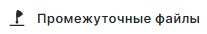

При нажатии на кнопку  в мастере **Подпись и шифрование** или **Проверка и расшифрование** на соотвертсвующей вкладке происходит переход к ходу выполнения операций.

Во время выполнения операции на верхней панели отображается прогресс-бар и название операции, которая должна быть в итоге выполнена.

По итогу выполнения операций отображается общий статус:
- **Операция выполнена успешно** и прогресс-бар залит зеленым цветом - при успешном выполнении операций;
- **Операция выполнена с ошибками** и прогресс-бар залит красным цветом - при возникновении ошибок.

# Действия с документами результатов

Для результатов операций доступны действия на панели инструментов:
- **Открыть** - файл открывается с помощью программы по умолчанию. Кнопка доступна для одного выбранного документа из списка. Если выбрано несколько элементов кнопка заблокирована.  
- **Сохранить в Архив** - позволяет вам сохранить документ в специальную папку. Файлы данной папки доступны на вклдаке **Документы** в разделе **Архив**. Если в данной папке файл с таким именем уже существует, то он не заменяется на новый.
- **Добавить в** -  вы можете выбрать мастер, в который будут добалены выделенные в списке документы, для выполнения дополнительных операций. 
**Промежуточные файлы** - по кнопке отображаются промежуточные файлы, которые были созданы во время операции. Данные файлы располагаются во временной папке. При отображении промежуточных файлов название кнопки меняется на **Скрыть промежуточные**, при нажатии на которую файлы скрываются, в списке остаются только полученные после операций документы. 
**Показать в папке** - открывается папка расположения документа. Кнопка доступна для одного выбранного файла из списка. Если выбрано несколько элементов кнопка заблокирована.

Вы можете посмотреть информацию о выделенном цветом документе, нажав иконку просмотра .

# Отображение результатов проверки подписи

В результатах операции мастера **Подписи и шифрования** в списке не отображается общий статус проверки подписи документов. Вы можете посмотреть только информацию о подписи, выделив один подписанный документ.

Чтобы в списке отображался общий статус проверки подписанных документов, нужно добавить их в мастер **Проверки и расшифрования**. В таком случае в списке в виде иконок отображается общий статус проверки подписи: подпись действительна,  подпись недействительна, не удалось проверить подпись.

# Отображение результатов при возникновении ошибок операций 

Если не выполнены какие-либо операции с документами, то уведомления об ошибках отображаются в верхнем правом углу экрана. Вы можете их посмотреть, нажав иконку , где цифрой обозначается количество ошибок.

Если по каким-то причинам операция не выполнилась для всех файлов, то в списке остануться оригиналы документов, сгруппированные в раздел **Не успешно**. 
Если для документов выполнилась часть операций, то для просмотра полученных промежуточных файлов нажмите .

Если операция выполнилась частично, то результаты разделяются на выполненные **Успешно** и **Не успешно**. 
Для просмотра полученных промежуточных файлов нажмите .

**ИНСТРУКЦИИ ПО ТЕМЕ:**

1. [Как посмотреть уведомления.](docs\v3.0-Beta\007-cryptoarm\notifications.md)
5. [Как проверить подпись.](docs\v3.0-Beta\004-documents\verify.md)
6. [Как открыть документ для просмотра.](docs\v3.0-Beta\004-documents\open-doc.md)
7. 